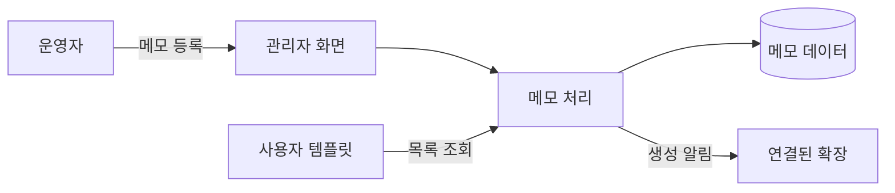

# 그누보드7 Hello 모듈

**그누보드7 모듈 · gnuboard7-hello_module**
학습용 최소 샘플 모듈 (Memo CRUD)

<!-- @generated:badges START — ext:docgen 이 갱신. 이 블록 안은 직접 수정하지 않는다 -->
<p align="center">
  
  
  
  
</p>
<!-- @generated:badges END -->

---

[소개](#소개) · [주요 기능](#주요-기능) · [동작 방식](#동작-방식) · [요구 사항](#요구-사항) · [설치](#설치) · [관리자 설정](#관리자-설정) · [사용 방법](#사용-방법) · [다른 확장과의 연동](#다른-확장과의-연동) · [문서](#문서) · [트러블슈팅](#트러블슈팅) · [변경 이력](#변경-이력) · [라이선스](#라이선스)

---

## 소개

<!-- @intent START -->
그누보드7 **모듈이 어떻게 생겼는지 보여주는 학습용 샘플**입니다. 실제 업무에 쓰는 기능은
없고, 메모를 등록·수정·삭제하는 가장 단순한 화면 하나가 전부입니다.

모듈을 처음 만들어 보는 개발자가 "무엇을 어디에 두어야 하는가" 를 파악하는 데 쓰거나, 새
모듈을 시작할 때 **복제해서 이름만 바꾸는 출발점**으로 씁니다.

관리자 화면의 모듈 목록에는 나타나지 않습니다(학습용이 운영 목록에 섞이지 않도록). 명령줄로는
정상적으로 설치·활성화할 수 있으며, 설치하면 관리자에 "Hello 메모" 메뉴가 생깁니다.

이 샘플은 짧게 유지하는 것이 원칙입니다 — 기능이 늘어나면 구조를 보러 온 사람이 읽어야 할
코드가 함께 늘어나기 때문입니다.
<!-- @intent END -->

## 주요 기능

<!-- @intent START -->
| 영역 | 설명 |
|---|---|
| 메모 관리 | 제목·내용으로 메모를 등록·수정·삭제하는 관리자 화면 |
| 메모 목록 | 방문자 화면용 목록 레이아웃 1개 (사용자 템플릿 연동 예시) |
| 권한 | 메모 관리 권한 4종(읽기·생성·수정·삭제) |
| 다국어 | 한국어·영어 (관리자 문구와 화면 문구 각각) |
| 확장 지점 | 메모 생성 시점 알림용 연결점 1개 |
| 테스트 | 기능 테스트와 단위 테스트 예시 |
<!-- @intent END -->

## 동작 방식

<!-- @intent START -->


운영자가 메모를 등록하면 저장과 함께 "메모가 생성되었다" 는 신호가 나갑니다. 다른 확장은 그
신호를 받아 자기 일을 할 수 있습니다 — 같이 제공되는 학습용 플러그인이 그 예입니다.

실제 모듈도 구조는 같고, 다루는 대상과 규모만 다릅니다.
<!-- @intent END -->

## 요구 사항

<!-- @generated:requirements START — ext:docgen 이 갱신. 이 블록 안은 직접 수정하지 않는다 -->
| 항목 | 값 |
|---|---|
| 그누보드7 코어 | `>=7.0.0` |
| PHP | `^8.2` |
<!-- @generated:requirements END -->

## 설치

<!-- @generated:install START — ext:docgen 이 갱신. 이 블록 안은 직접 수정하지 않는다 -->
```bash
# 번들 설치 (코어에 동봉된 소스에서 설치)
php artisan module:install gnuboard7-hello_module

# 활성화
php artisan module:activate gnuboard7-hello_module

# 업데이트 (번들 소스 기준 강제 반영)
php artisan module:update gnuboard7-hello_module --force
```
<!-- @generated:install END -->

## 관리자 설정

<!-- @generated:settings-summary START — ext:docgen 이 갱신. 이 블록 안은 직접 수정하지 않는다 -->
_별도의 관리자 설정 항목이 없습니다._
<!-- @generated:settings-summary END -->

<!-- @intent START -->
설정 항목이 없습니다. 이 샘플은 설정 화면 없이도 모듈의 계층 구조를 보여줄 수 있어 일부러
두지 않았습니다.

설정 화면이 있는 모듈의 예를 보려면 함께 제공되는 학습용 플러그인
(`gnuboard7-hello_plugin`)을 참고합니다 — 그쪽에 설정 스키마와 설정 화면 예시가 있습니다.
<!-- @intent END -->

## 사용 방법

<!-- @intent START -->
**설치해 보기**: 관리자 화면에는 나타나지 않으므로 명령줄로 설치합니다.

```bash
php artisan module:install gnuboard7-hello_module
php artisan module:activate gnuboard7-hello_module
```

활성화하면 관리자에 "Hello 메모" 메뉴가 생깁니다. 메모를 몇 건 등록해 보면 목록·작성 화면과
권한이 어떻게 맞물리는지 확인할 수 있습니다.

**새 모듈의 출발점으로 쓰기**: 이 디렉토리를 복제한 뒤 식별자·네임스페이스·도메인 이름을 모두
바꾸고, `hidden` 표시를 지우면 새 모듈이 됩니다. 자세한 절차는 확장 시스템 문서의 "학습용 샘플
확장" 항목을 참고합니다.

**함께 보면 좋은 것**: 학습용 플러그인·관리자 템플릿·사용자 템플릿 샘플이 함께 제공됩니다. 넷을
모두 설치하면 모듈이 데이터를, 템플릿이 화면을, 플러그인이 부가 동작을 담당하는 구조를 한 번에
볼 수 있습니다.
<!-- @intent END -->

## 다른 확장과의 연동

<!-- @generated:integrations START — ext:docgen 이 갱신. 이 블록 안은 직접 수정하지 않는다 -->
**이 확장이 의존하는 확장**

없음 — 코어만으로 동작합니다.

**이 확장에 의존하는 확장** (이 확장을 비활성화하면 함께 영향을 받습니다)

| 확장 | 유형 | 요구 버전 |
|---|---|---|
| `gnuboard7-hello_plugin` | 플러그인 | `>=0.1.0` |
| `gnuboard7-hello_user_template` | 템플릿 | `>=0.1.0` |
<!-- @generated:integrations END -->

## 문서

<!-- @generated:docs-index START — ext:docgen 이 갱신. 이 블록 안은 직접 수정하지 않는다 -->
| 문서 | 내용 | 상태 |
|---|---|---|
| [docs/README.md](docs/README.md) | 문서 통합 목차와 실측 집계 | ✅ |
| [docs/architecture.md](docs/architecture.md) | 설계 의도·계층 지도·디렉토리 맵 | ✅ |
| [docs/extension-points.md](docs/extension-points.md) | 발행/구독 훅·미들웨어·채널·스케줄 | ✅ |
| [docs/data-model.md](docs/data-model.md) | 모델·소유 테이블·마이그레이션·Enum | ✅ |
| [docs/settings.md](docs/settings.md) | 설정 스키마·권한·메뉴·라우트·의존 관계 | ✅ |
| [docs/frontend.md](docs/frontend.md) | 레이아웃·액션 핸들러·전역 진입점·에셋 | ✅ |
| [docs/editor-spec.md](docs/editor-spec.md) | 레이아웃 편집기에 선언한 팔레트·컨트롤·샘플 데이터 | ✅ |
| [docs/api/](docs/api/README.md) | API 레퍼런스 (엔드포인트별 파라미터·응답 필드) | ✅ |
| [CHANGELOG.md](CHANGELOG.md) | 변경 이력 | ✅ |
<!-- @generated:docs-index END -->

## 트러블슈팅

<!-- @intent START -->
| 증상 | 원인 | 조치 |
|---|---|---|
| 관리자 모듈 목록에 이 모듈이 없음 | 학습용이라 목록에서 제외됨 | 정상입니다. 명령줄로 설치·활성화합니다 |
| 복제해서 만든 모듈이 관리자 목록에 안 보임 | 복제본에 학습용 표시가 남아 있음 | 복제본의 `hidden` 표시를 지웁니다 |
| 복제 후 설치하면 오류가 남 | 식별자·네임스페이스 치환이 일부만 이루어짐 | 옛 이름이 남아 있는지 전체 검색으로 확인하고 오토로드를 갱신합니다 |
| "Hello 메모" 메뉴가 보이지 않음 | 그 계정 역할에 메모 관리 권한이 없음 | 역할에 메모 관리 권한을 부여합니다 |
| 메모를 등록해도 아무 일도 일어나지 않음 | 학습용 플러그인이 설치되지 않음 | 생성 신호를 받아 동작하는 예시는 그 플러그인에 있습니다 |
<!-- @intent END -->

## 변경 이력

[CHANGELOG.md](CHANGELOG.md)

## 라이선스

MIT
