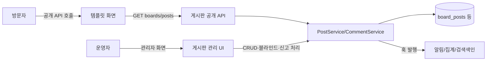

# 그누보드7 게시판 모듈

**그누보드7 모듈 · sirsoft-board**
게시판 관리를 위한 모듈

<!-- @generated:badges START — ext:docgen 이 갱신. 이 블록 안은 직접 수정하지 않는다 -->
<p align="center">
  
  
  
  
</p>
<!-- @generated:badges END -->

---

[소개](#소개) · [주요 기능](#주요-기능) · [동작 방식](#동작-방식) · [요구 사항](#요구-사항) · [설치](#설치) · [관리자 설정](#관리자-설정) · [사용 방법](#사용-방법) · [다른 확장과의 연동](#다른-확장과의-연동) · [문서](#문서) · [트러블슈팅](#트러블슈팅) · [변경 이력](#변경-이력) · [라이선스](#라이선스)

---

## 소개

<!-- @intent START -->
게시판·게시글·댓글·신고를 관리하는 콘텐츠 모듈입니다. 운영자가 관리자 화면에서 자유형(가로형/
갤러리형/카드형) 게시판을 원하는 개수만큼 만들고, 게시판마다 비밀글·답변형·본인인증·자동 알림
같은 세부 정책을 독립적으로 설정할 수 있습니다.

이 모듈은 관리자 화면과 공개 API 만 제공합니다. 방문자가 보는 목록·상세·글쓰기 화면은
템플릿(`sirsoft-basic`)이 이 모듈의 API 를 호출해 그립니다 — 운영자 입장에서는 "게시판 콘텐츠는
여기서 관리하고, 화면 디자인은 템플릿이 담당한다"로 이해하면 됩니다.
<!-- @intent END -->

## 주요 기능

<!-- @intent START -->
| 영역 | 설명 |
|---|---|
| 게시판 관리 | 게시판 생성/수정/삭제, 게시판 유형(기본/갤러리/카드) 선택, 게시판별 세부 설정 일괄 적용 |
| 게시글·댓글 | 작성/수정/삭제/블라인드/복원, 답변형 게시판(원글-답변 트리), 대댓글, 비밀글 |
| 신고 처리 | 사용자 신고 접수 → 관리자 검토 → 블라인드/삭제/복원 처리, 처리 결과 알림 |
| 첨부파일 | 업로드/다운로드/순서 변경, 게시판별 허용 확장자·용량 제한 |
| 대시보드 | 게시판별 게시글·댓글·신고 현황과 추세, 미처리 신고 요약 |
| 알림 | 새 댓글/대댓글/답변글/신고 접수/처리 결과를 메일·앱 내 알림으로 발송, 회원별 수신 여부 설정 |
| 본인인증 연동 | 게시글/댓글 삭제, 신고 작성, 첫 글 작성 등 민감 작업에 코어 IDV 정책 적용(기본은 비활성) |
<!-- @intent END -->

## 동작 방식

<!-- @intent START -->


방문자는 템플릿이 그린 화면에서 공개 API 만 호출하고, 운영자는 이 모듈이 직접 제공하는
관리자 화면을 씁니다. 두 경로 모두 결국 같은 Service 계층을 거치므로 비밀글 게이팅·카운트
동기화·훅 발행은 어느 쪽에서 들어오든 동일하게 적용됩니다.
<!-- @intent END -->

## 요구 사항

<!-- @generated:requirements START — ext:docgen 이 갱신. 이 블록 안은 직접 수정하지 않는다 -->
| 항목 | 값 |
|---|---|
| 그누보드7 코어 | `>=7.0.10` |
| PHP | `^8.2` |
<!-- @generated:requirements END -->

## 설치

<!-- @generated:install START — ext:docgen 이 갱신. 이 블록 안은 직접 수정하지 않는다 -->
```bash
# 번들 설치 (코어에 동봉된 소스에서 설치)
php artisan module:install sirsoft-board

# 활성화
php artisan module:activate sirsoft-board

# 업데이트 (번들 소스 기준 강제 반영)
php artisan module:update sirsoft-board --force
```

저장소: https://github.com/gnuboard/g7-module-sirsoft-board
<!-- @generated:install END -->

## 관리자 설정

<!-- @generated:settings-summary START — ext:docgen 이 갱신. 이 블록 안은 직접 수정하지 않는다 -->
_별도의 관리자 설정 항목이 없습니다._
<!-- @generated:settings-summary END -->

<!-- @intent START -->
위 표가 비어 있는 이유는 이 모듈에 전역 환경설정(`getSettingsSchema()`) 이 없기 때문입니다 —
설정은 전역이 아니라 **게시판 하나하나**에 딸려 있습니다(`/admin/boards/{slug}/settings`).
게시판을 만들 때 기본/갤러리/카드 유형을 고르면 그 유형의 기본값이 채워지고, 이후 기본
정보·목록 표시·게시글 정책·댓글 정책·첨부 정책·본인인증·알림·SEO 탭에서 게시판별로 따로
조정합니다. 여러 게시판에 같은 값을 한 번에 반영하려면 게시판 목록 화면의 "설정 일괄 적용"을
씁니다(`settings.before_bulk_apply`/`after_bulk_apply` 훅으로 계측 가능).
<!-- @intent END -->

## 사용 방법

<!-- @intent START -->
**게시판 신설**: `/admin/boards` → "게시판 추가" → 이름·slug·유형 지정 → 저장. 저장 즉시
관리자 메뉴·동적 권한(`sirsoft-board.{slug}.*`)·역할(`{slug}.manager`)이 자동 생성되므로,
바로 이어서 "권한" 탭에서 그 게시판을 담당할 운영자에게 `{slug}.manager` 역할을 부여합니다.

**신고 처리**: 방문자가 게시글/댓글을 신고하면 `/admin/boards/reports` 에 접수되고 담당자에게
메일이 갑니다. 신고 상세에서 신고 사유·신고 이력을 확인한 뒤 블라인드/삭제/복원 중 하나로
처리하면, 그 결과가 원 작성자에게 자동으로 통지됩니다 — 별도로 작성자에게 안내 메일을 보낼
필요가 없습니다.

**여러 게시판 설정 일괄 변경**: 예를 들어 전체 게시판의 첨부 용량 상한을 한 번에 올리고 싶으면,
게시판 목록에서 대상 게시판을 체크한 뒤 "설정 일괄 적용" 모달에서 첨부 탭 값만 바꿔 적용합니다.
다른 탭 값은 그대로 유지되고, 체크한 게시판에만 반영됩니다.
<!-- @intent END -->

## 다른 확장과의 연동

<!-- @generated:integrations START — ext:docgen 이 갱신. 이 블록 안은 직접 수정하지 않는다 -->
**이 확장이 의존하는 확장**

없음 — 코어만으로 동작합니다.

**이 확장에 의존하는 확장** (이 확장을 비활성화하면 함께 영향을 받습니다)

| 확장 | 유형 | 요구 버전 |
|---|---|---|
| `sirsoft-basic` | 템플릿 | `>=1.0.0` |
<!-- @generated:integrations END -->

## 문서

<!-- @generated:docs-index START — ext:docgen 이 갱신. 이 블록 안은 직접 수정하지 않는다 -->
| 문서 | 내용 | 상태 |
|---|---|---|
| [docs/README.md](docs/README.md) | 문서 통합 목차와 실측 집계 | ✅ |
| [docs/architecture.md](docs/architecture.md) | 설계 의도·계층 지도·디렉토리 맵 | ✅ |
| [docs/extension-points.md](docs/extension-points.md) | 발행/구독 훅·미들웨어·채널·스케줄 | ✅ |
| [docs/data-model.md](docs/data-model.md) | 모델·소유 테이블·마이그레이션·Enum | ✅ |
| [docs/settings.md](docs/settings.md) | 설정 스키마·권한·메뉴·라우트·의존 관계 | ✅ |
| [docs/frontend.md](docs/frontend.md) | 레이아웃·액션 핸들러·전역 진입점·에셋 | ✅ |
| [docs/editor-spec.md](docs/editor-spec.md) | 레이아웃 편집기에 선언한 팔레트·컨트롤·샘플 데이터 | ✅ |
| [docs/api/](docs/api/README.md) | API 레퍼런스 (엔드포인트별 파라미터·응답 필드) | ✅ |
| [CHANGELOG.md](CHANGELOG.md) | 변경 이력 | ✅ |
<!-- @generated:docs-index END -->

## 트러블슈팅

<!-- @intent START -->
| 증상 | 원인 | 조치 |
|---|---|---|
| 게시판 삭제 후에도 관리자 화면에 그 게시판 권한/역할이 남아 있음 | 정리 배치가 아직 실행되지 않았거나 삭제 트랜잭션이 중간에 실패 | `getDynamicPermissionIdentifiers()`/`getDynamicRoleIdentifiers()` 는 현재 `boards` 테이블 기준으로 계산되므로, 확장 정리 커맨드를 다시 실행하면 stale 항목이 잡힙니다 |
| 검색어에 `+`, `-`, `"` 를 넣으면 결과가 0건으로 나옴 | 코어 검색 정제기가 FULLTEXT 연산자를 제거한 뒤 검색 — 연산자만 입력하면 빈 결과가 정상 동작 | 오류가 아닙니다. 실제 키워드를 함께 입력하면 정상 매칭됩니다 |
| 비밀글의 댓글 개수가 0으로 보이는데 실제로는 댓글이 있음 | 열람 권한이 없는 요청에는 댓글 목록이 빈 배열(200)로 마스킹됨(KVE-2026-1914) | 정상 동작입니다. 작성자 본인 또는 `posts.read-secret`/관리 권한으로 조회하면 보입니다 |
| 게시판 설정 일괄 적용 후 일부 게시판만 반영됨 | 대상 게시판 중 일부가 적용 도중 실패(예: 유효성 위반) | `settings.after_bulk_apply_aborted` 훅 시점의 로그로 실패한 게시판을 특정한 뒤 개별 재적용 |
<!-- @intent END -->

## 변경 이력

[CHANGELOG.md](CHANGELOG.md)

## 라이선스

MIT
