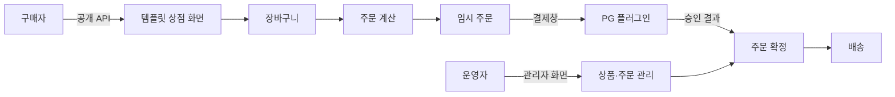
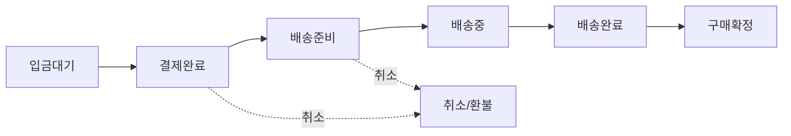

# 그누보드7 이커머스 모듈

**그누보드7 모듈 · sirsoft-ecommerce**
그누보드7 이커머스 모듈 - 상품, 주문, 결제 관리

<!-- @generated:badges START — ext:docgen 이 갱신. 이 블록 안은 직접 수정하지 않는다 -->
<p align="center">
  
  
  
  
</p>
<!-- @generated:badges END -->

---

[소개](#소개) · [주요 기능](#주요-기능) · [동작 방식](#동작-방식) · [요구 사항](#요구-사항) · [설치](#설치) · [관리자 설정](#관리자-설정) · [사용 방법](#사용-방법) · [다른 확장과의 연동](#다른-확장과의-연동) · [문서](#문서) · [트러블슈팅](#트러블슈팅) · [변경 이력](#변경-이력) · [라이선스](#라이선스)

---

## 소개

<!-- @intent START -->
온라인 상점 운영에 필요한 상품·주문·결제·배송·취소/환불·쿠폰·마일리지·리뷰·문의를 한곳에서
관리하는 모듈입니다. 관리자 화면에서 상품을 등록하고 주문을 처리하면, 방문자가 보는 상점
화면은 템플릿(`sirsoft-basic`)이 이 모듈의 데이터를 받아 그립니다.

여러 나라·여러 통화를 동시에 다루도록 설계되어 있습니다. 상품 가격을 저장하는 **기본 통화**,
구매자가 화면에서 고르는 **표시 통화**, 결제사에 청구되는 **결제 통화**를 각각 따로 설정할 수
있고, 주문이 만들어지는 순간의 통화 정보가 그 주문에 그대로 남습니다 — 나중에 통화 설정을
바꿔도 지난 주문의 금액 표기는 변하지 않습니다.

결제사(PG) 연동은 이 모듈에 들어 있지 않습니다. KG이니시스·NHN KCP·나이스페이먼츠·토스페이먼츠는
각각 별도 플러그인이며, 쓰려는 결제사의 플러그인을 설치·활성화한 뒤 환경설정에서 고르면 됩니다.
상품 문의 게시판도 마찬가지로 게시판 모듈이 글을 보관하고, 이 모듈은 "어떤 상품의 문의인가"만
연결합니다.
<!-- @intent END -->

## 주요 기능

<!-- @intent START -->
| 영역 | 설명 |
|---|---|
| 상품 | 상품·옵션·추가옵션·이미지 등록, 카테고리/브랜드/라벨 분류, 상품정보제공고시와 공통정보 템플릿, 진열·판매 상태 관리 |
| 주문 | 주문 목록·상세, 상태 변경(입금대기 → 결제완료 → 배송준비 → 배송중 → 배송완료 → 구매확정), 관리자 수기 결제, 엑셀 내려받기 |
| 결제 | 카드·가상계좌·계좌이체·무통장·휴대폰·마일리지 등 결제수단 관리, 현금영수증·세금계산서 발행 이력, 입금 확인 |
| 배송 | 배송정책(국가별 요금·무료배송 기준·구간 요금 14종)·배송사·배송유형·추가배송비 템플릿, 송장 등록과 배송 추적 |
| 취소·환불 | 주문 전체/부분 취소, 환불 수단(PG·계좌·마일리지) 선택, 클레임 사유 관리, 이미 적용된 쿠폰·마일리지 자동 되돌림 |
| 쿠폰 | 상품/카테고리/주문금액/배송비 대상 쿠폰, 정액·정률 할인, 발급 방식(직접·다운로드·자동), 가입·첫구매·생일 자동 발급 |
| 마일리지 | 적립률·적립 시점(배송완료/구매확정)·지연 적립·자동 소멸과 소멸 예정 알림, 통화별 적립 규칙, 관리자 수동 지급·차감 |
| 리뷰·문의 | 구매자 리뷰(이미지 첨부·작성 기한·노출 관리), 상품 1:1 문의(게시판 모듈에 글로 보관) |
| 회원 | 회원별 배송지, 결제 통화·배송 국가 지정, 장바구니(비로그인 → 로그인 시 자동 병합), 찜 목록 |
| 대시보드·통계 | 매출·주문 현황 집계, 미처리 주문 요약, 관리자 대시보드에 커머스 위젯 주입 |
| 다국어·다통화 | 기본/표시/결제 통화 분리, 통화별 소수 자릿수·절사 규칙, 주문 시점 통화 정보 보존 |
| SEO | 상품·카테고리·검색·상점 첫 화면의 메타 정보와 구조화 데이터 자동 생성 |
<!-- @intent END -->

## 동작 방식

<!-- @intent START -->


구매자가 보는 화면은 템플릿이 그리고, 금액 계산·주문 확정은 이 모듈이 합니다. 결제창 왕복만
결제사 플러그인이 담당하며, 승인 결과가 돌아오면 이 모듈이 다시 금액을 검증한 뒤 주문을
확정합니다.



주문 상태는 위 순서로 진행하며, 결제 완료 이후 배송 시작 전까지는 취소가 가능합니다(어느
상태까지 취소를 허용할지는 환경설정에서 조정합니다). 취소하면 그 주문에 쓰인 쿠폰과 마일리지가
자동으로 되돌아갑니다.
<!-- @intent END -->

## 요구 사항

<!-- @generated:requirements START — ext:docgen 이 갱신. 이 블록 안은 직접 수정하지 않는다 -->
| 항목 | 값 |
|---|---|
| 그누보드7 코어 | `>=7.0.10` |
| PHP | `^8.2` |
<!-- @generated:requirements END -->

## 설치

<!-- @generated:install START — ext:docgen 이 갱신. 이 블록 안은 직접 수정하지 않는다 -->
```bash
# 번들 설치 (코어에 동봉된 소스에서 설치)
php artisan module:install sirsoft-ecommerce

# 활성화
php artisan module:activate sirsoft-ecommerce

# 업데이트 (번들 소스 기준 강제 반영)
php artisan module:update sirsoft-ecommerce --force
```

저장소: https://github.com/gnuboard/g7-module-sirsoft-ecommerce
<!-- @generated:install END -->

## 관리자 설정

<!-- @generated:settings-summary START — ext:docgen 이 갱신. 이 블록 안은 직접 수정하지 않는다 -->
_별도의 관리자 설정 항목이 없습니다._
<!-- @generated:settings-summary END -->

<!-- @intent START -->
위 표가 비어 있는 이유는 이 모듈의 환경설정이 코드 선언이 아니라 설정 파일
(`config/settings/defaults.json`)에서 오기 때문입니다. 실제 설정은 `/admin/ecommerce/settings`
한 화면에 9개 탭으로 모여 있습니다.

| 탭 | 언제 바꾸는가 | 바꾸면 달라지는 것 |
|---|---|---|
| 기본 정보 | 개점 준비 시 1회 | 상점명·사업자 정보·상점 주소 경로가 상점 화면과 주문서에 반영됩니다 |
| 언어·통화 | 판매 국가를 늘릴 때 | 기본 통화와 취급 통화 목록. 기본 통화를 바꿔도 **이미 만들어진 주문의 표기는 그대로**입니다 |
| 주문 설정 | 결제사를 도입·교체할 때 | 기본 PG·현금영수증 발행처·결제수단 노출·무통장 계좌·미입금 자동취소 기한·취소 허용 상태 |
| 배송 | 해외 배송을 시작할 때 | 기본 배송 국가·취급 국가·무료배송 기준·주소 검증 사용 여부 |
| SEO | 검색 노출을 조정할 때 | 상품·카테고리·검색·상점 첫 화면의 제목/설명 서식과 구조화 데이터 사용 여부 |
| 리뷰 | 리뷰 정책을 바꿀 때 | 작성 가능 기한(구매 후 N일)·이미지 개수와 용량 제한 |
| 문의 | 문의 게시판을 지정할 때 | 상품 문의가 저장될 게시판. **게시판 모듈이 설치·활성화되어 있어야 합니다** |
| 알림 | 알림 채널을 조정할 때 | 주문·배송·문의 알림을 메일/앱 내 알림 중 어디로 보낼지 |
| 마일리지 | 적립 제도를 운영할 때 | 사용 여부·적립률·적립 시점(배송완료/구매확정)·지연 적립일·통화별 규칙·소멸 기한과 사전 알림 |

결제수단 목록은 **설치된 결제사 플러그인이 스스로 등록**합니다. 그래서 플러그인을 삭제하거나
비활성화하면 그 결제수단은 구매자 화면에서 자동으로 사라집니다 — 설정에서 따로 지울 필요가
없습니다.
<!-- @intent END -->

## 사용 방법

<!-- @intent START -->
**개점 준비**: `/admin/ecommerce/settings` 에서 기본 정보와 기본 통화를 정하고, 쓰려는 결제사
플러그인을 설치·활성화한 뒤 "주문 설정" 탭에서 기본 PG 와 노출할 결제수단을 고릅니다. 그다음
"배송" 탭에서 기본 배송 국가를 정하고 `/admin/ecommerce/shipping-policies` 에서 배송정책을
하나 이상 만듭니다 — 배송정책이 없으면 상품을 등록해도 배송비가 계산되지 않습니다. 마지막으로
`/admin/ecommerce/categories` 에서 카테고리를 만든 뒤 상품을 등록합니다.

**주문 처리**: 새 주문이 들어오면 `/admin/ecommerce/orders` 에 뜨고 담당자에게 알림이 갑니다.
무통장 입금 주문은 입금을 확인해 "결제완료"로 바꾸고(현금영수증 발행 설정이 켜져 있으면 이때
자동 발행됩니다), 상품을 준비한 뒤 송장 번호를 등록하면 상태가 "배송중"으로 넘어가면서 구매자
알림이 나갑니다. 배송완료 후 구매확정되면 마일리지 적립 시점 설정에 따라 적립이 이루어집니다.

**부분 취소·환불**: 주문 상세에서 취소할 **옵션(품목)을 골라** 취소를 진행합니다. 주문 전체가
아니라 품목 단위라서, 세 개 중 하나만 취소하면 나머지 두 개에 걸린 할인과 배송비가 자동으로
다시 안분됩니다. 환불 수단은 PG 취소·계좌 입금·마일리지 반환 중에서 고르며, 그 주문에 쓰인
쿠폰과 마일리지는 취소 처리와 같은 시점에 되돌아갑니다.

**쿠폰 발행**: `/admin/ecommerce/promotion-coupons` 에서 대상(전체/특정 상품/특정 카테고리)과
할인 방식(정액/정률), 적용 대상(상품금액/주문금액/배송비)을 정합니다. 발급 방식을 "자동"으로
두고 조건을 가입·첫구매·생일 중에서 고르면 해당 시점에 자동 발급됩니다.
<!-- @intent END -->

## 다른 확장과의 연동

<!-- @generated:integrations START — ext:docgen 이 갱신. 이 블록 안은 직접 수정하지 않는다 -->
**이 확장이 의존하는 확장**

없음 — 코어만으로 동작합니다.

**이 확장에 의존하는 확장** (이 확장을 비활성화하면 함께 영향을 받습니다)

| 확장 | 유형 | 요구 버전 |
|---|---|---|
| `sirsoft-pay_kginicis` | 플러그인 | `>=1.1.0` |
| `sirsoft-pay_nhnkcp` | 플러그인 | `>=1.1.0` |
| `sirsoft-pay_nicepayments` | 플러그인 | `>=1.1.0` |
| `sirsoft-tosspayments` | 플러그인 | `>=1.1.0` |
| `sirsoft-basic` | 템플릿 | `>=1.1.0` |
<!-- @generated:integrations END -->

## 문서

<!-- @generated:docs-index START — ext:docgen 이 갱신. 이 블록 안은 직접 수정하지 않는다 -->
| 문서 | 내용 | 상태 |
|---|---|---|
| [docs/README.md](docs/README.md) | 문서 통합 목차와 실측 집계 | ✅ |
| [docs/architecture.md](docs/architecture.md) | 설계 의도·계층 지도·디렉토리 맵 | ✅ |
| [docs/extension-points.md](docs/extension-points.md) | 발행/구독 훅·미들웨어·채널·스케줄 | ✅ |
| [docs/data-model.md](docs/data-model.md) | 모델·소유 테이블·마이그레이션·Enum | ✅ |
| [docs/settings.md](docs/settings.md) | 설정 스키마·권한·메뉴·라우트·의존 관계 | ✅ |
| [docs/frontend.md](docs/frontend.md) | 레이아웃·액션 핸들러·전역 진입점·에셋 | ✅ |
| [docs/editor-spec.md](docs/editor-spec.md) | 레이아웃 편집기에 선언한 팔레트·컨트롤·샘플 데이터 | ✅ |
| [docs/api/](docs/api/README.md) | API 레퍼런스 (엔드포인트별 파라미터·응답 필드) | ✅ |
| [CHANGELOG.md](CHANGELOG.md) | 변경 이력 | ✅ |
<!-- @generated:docs-index END -->

## 트러블슈팅

<!-- @intent START -->
| 증상 | 원인 | 조치 |
|---|---|---|
| 결제 단계에서 결제수단이 하나도 보이지 않음 | 결제사 플러그인이 설치·활성화되지 않았거나, 환경설정 "주문 설정" 탭에서 노출이 꺼져 있음 | 플러그인을 활성화한 뒤 주문 설정 탭에서 해당 결제수단을 켭니다. 플러그인을 지웠다면 그 결제수단은 자동으로 목록에서 빠집니다 |
| 상품을 등록했는데 장바구니에서 배송비가 0원 | 그 상품에 배송정책이 지정되지 않았거나, 정책에 현재 배송 국가 설정이 없음 | 배송정책을 만들고 상품 편집 화면에서 지정한 뒤, 정책의 국가별 설정에 해당 국가를 추가합니다 |
| 상품 문의 메뉴가 동작하지 않음 | 게시판 모듈이 없거나, 환경설정 "문의" 탭의 게시판이 지정되지 않음 | 게시판 모듈을 활성화하고 문의용 게시판을 만든 뒤 문의 탭에서 그 게시판을 고릅니다 |
| 통화 설정을 바꿨는데 지난 주문의 금액 표기가 그대로 | 주문 시점의 통화 정보가 그 주문에 보존됨 | 정상 동작입니다. 지난 거래의 표기가 나중 설정 변경으로 달라지면 정산 근거가 바뀌므로 의도적으로 고정합니다 |
| 마일리지 잔액이 내역 합계와 어긋나 보임 | 표시용 잔액이 아직 재계산되지 않음 | 정합 교정 스케줄이 주기적으로 맞춥니다. 즉시 맞추려면 `php artisan sirsoft-ecommerce:reconcile-mileage-balance` 를 실행합니다 |
| 소멸 예정 마일리지 알림이 오지 않음 | 스케줄러가 동작하지 않거나 알림 채널이 꺼져 있음 | 서버의 스케줄러 등록을 확인하고, 환경설정 "알림" 탭에서 해당 알림의 채널을 켭니다 |
| 미입금 주문이 계속 남아 있음 | 자동 취소가 꺼져 있거나 기한이 길게 설정됨 | 주문 설정 탭의 "미입금 자동취소" 사용 여부와 기한(일)을 확인합니다 |
<!-- @intent END -->

## 변경 이력

[CHANGELOG.md](CHANGELOG.md)

## 라이선스

MIT
