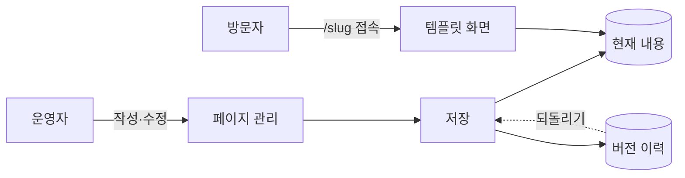

# 그누보드7 페이지 모듈

**그누보드7 모듈 · sirsoft-page**
정적 페이지(정보/정책/안내) 관리 모듈

<!-- @generated:badges START — ext:docgen 이 갱신. 이 블록 안은 직접 수정하지 않는다 -->
<p align="center">
  
  
  
  
</p>
<!-- @generated:badges END -->

---

[소개](#소개) · [주요 기능](#주요-기능) · [동작 방식](#동작-방식) · [요구 사항](#요구-사항) · [설치](#설치) · [관리자 설정](#관리자-설정) · [사용 방법](#사용-방법) · [다른 확장과의 연동](#다른-확장과의-연동) · [문서](#문서) · [트러블슈팅](#트러블슈팅) · [변경 이력](#변경-이력) · [라이선스](#라이선스)

---

## 소개

<!-- @intent START -->
회사소개·이용약관·개인정보처리방침처럼 **주소가 고정된 문서 한 장**을 만들고 관리하는
모듈입니다. 관리자 화면에서 주소(slug)와 내용을 정해 저장하면 `/{slug}` 로 공개됩니다.

게시판과 헷갈리기 쉬운데 역할이 다릅니다. 게시판은 여러 글이 목록을 이루고 댓글·검색·신고가
따라오지만, 페이지는 **글 하나가 곧 주소 하나**입니다. 목록도 댓글도 없고, 대신 수정할 때마다
이전 내용이 자동으로 보관되어 언제든 되돌릴 수 있습니다.

방문자가 보는 페이지 화면은 템플릿(`sirsoft-basic`)이 그립니다. 이 모듈은 내용을 관리하고
넘겨주는 역할까지 맡습니다.

의도적으로 두지 않은 것: 관리자 환경설정 화면(첨부 제한은 설정 파일에서 조정합니다)·알림·
페이지 목록 API. 여러 글을 목록으로 보여줘야 한다면 게시판 모듈이 맞는 선택입니다.
<!-- @intent END -->

## 주요 기능

<!-- @intent START -->
| 영역 | 설명 |
|---|---|
| 페이지 관리 | 주소(slug)·제목·본문 작성, 다국어 제목, 발행/미발행 전환, 여러 페이지 한 번에 발행 |
| 버전 이력 | 저장할 때마다 자동 스냅샷, 이전 버전 내용 확인과 되돌리기 |
| 첨부파일 | 파일 업로드·순서 변경·삭제, 개수/용량/형식 제한, 공개 내려받기와 미리보기 |
| 미리보기 | 아직 발행하지 않은 페이지를 운영자만 실제 화면으로 확인 |
| 검색 노출 | 사이트 통합 검색 결과에 페이지가 함께 나옴 |
| SEO | 페이지별 메타 정보 설정, 내용이 바뀌면 검색엔진용 화면 캐시 자동 갱신 |
| 본문 대표 이미지 | 본문에서 첫 이미지를 자동으로 뽑아 목록·공유 미리보기에 사용 |
| 편집기 연동 | 편집기에서 이미지를 고를 때 페이지 첨부를 함께 제시 |
<!-- @intent END -->

## 동작 방식

<!-- @intent START -->


저장할 때마다 현재 내용과 버전 이력이 함께 갱신됩니다. 되돌리기도 "예전으로 덮어쓰기"가 아니라
**그 내용으로 다시 한 번 저장**하는 것이라, 되돌린 사실 자체가 이력에 남습니다.
<!-- @intent END -->

## 요구 사항

<!-- @generated:requirements START — ext:docgen 이 갱신. 이 블록 안은 직접 수정하지 않는다 -->
| 항목 | 값 |
|---|---|
| 그누보드7 코어 | `>=7.0.10` |
| PHP | `^8.2` |
<!-- @generated:requirements END -->

## 설치

<!-- @generated:install START — ext:docgen 이 갱신. 이 블록 안은 직접 수정하지 않는다 -->
```bash
# 번들 설치 (코어에 동봉된 소스에서 설치)
php artisan module:install sirsoft-page

# 활성화
php artisan module:activate sirsoft-page

# 업데이트 (번들 소스 기준 강제 반영)
php artisan module:update sirsoft-page --force
```

저장소: https://github.com/gnuboard/g7-module-sirsoft-page
<!-- @generated:install END -->

## 관리자 설정

<!-- @generated:settings-summary START — ext:docgen 이 갱신. 이 블록 안은 직접 수정하지 않는다 -->
_별도의 관리자 설정 항목이 없습니다._
<!-- @generated:settings-summary END -->

<!-- @intent START -->
위 표가 비어 있는 것은 이 모듈에 **관리자 환경설정 화면이 없기** 때문입니다. 조정할 수 있는
값은 첨부 제한 셋뿐이고, 설정 파일(`config/settings/defaults.json`)에 들어 있습니다.

| 항목 | 기본값 | 바꾸면 달라지는 것 |
|---|---|---|
| `attachment.max_count` | 5 | 페이지 하나에 붙일 수 있는 파일 개수 |
| `attachment.max_size_mb` | 10 | 파일 하나의 최대 용량(MB) |
| `attachment.allowed_types` | JPEG·PNG·GIF·WebP·PDF·ZIP | 업로드를 허용할 파일 형식 |

값을 바꾸려면 설치된 모듈의 설정 파일을 고친 뒤 모듈 캐시를 비웁니다. 화면 입력이 없는 이유는
이 셋이 개점 후 거의 바뀌지 않는 값이라 판단했기 때문이며, 조정이 잦아지면 그때 설정 화면을
추가하는 것이 맞습니다.
<!-- @intent END -->

## 사용 방법

<!-- @intent START -->
**페이지 만들기**: `/admin/pages` → "페이지 추가" → 주소(slug)와 제목·본문을 입력합니다. 주소는
저장 전에 중복 여부를 확인해 주며, 한번 공개한 주소를 바꾸면 기존 링크가 끊기므로 신중히
정합니다. 작성 중에는 "미발행" 으로 두고 미리보기로 확인한 뒤 발행합니다.

**예전 내용으로 되돌리기**: 페이지 상세의 버전 목록에서 원하는 시점을 골라 내용을 확인한 뒤
복원합니다. 복원해도 그 사이의 버전이 지워지지 않고 **새 버전이 하나 더 생기므로**, 되돌린
것을 다시 되돌릴 수 있습니다.

**약관 개정 공지처럼 여러 페이지를 동시에 여는 경우**: 각 페이지를 미발행 상태로 준비해 두고
목록에서 대상을 체크한 뒤 일괄 발행합니다.
<!-- @intent END -->

## 다른 확장과의 연동

<!-- @generated:integrations START — ext:docgen 이 갱신. 이 블록 안은 직접 수정하지 않는다 -->
**이 확장이 의존하는 확장**

없음 — 코어만으로 동작합니다.

**이 확장에 의존하는 확장** (이 확장을 비활성화하면 함께 영향을 받습니다)

| 확장 | 유형 | 요구 버전 |
|---|---|---|
| `sirsoft-marketing` | 플러그인 | `>=1.0.0` |
| `sirsoft-basic` | 템플릿 | `>=1.1.0` |
<!-- @generated:integrations END -->

## 문서

<!-- @generated:docs-index START — ext:docgen 이 갱신. 이 블록 안은 직접 수정하지 않는다 -->
| 문서 | 내용 | 상태 |
|---|---|---|
| [docs/README.md](docs/README.md) | 문서 통합 목차와 실측 집계 | ✅ |
| [docs/architecture.md](docs/architecture.md) | 설계 의도·계층 지도·디렉토리 맵 | ✅ |
| [docs/extension-points.md](docs/extension-points.md) | 발행/구독 훅·미들웨어·채널·스케줄 | ✅ |
| [docs/data-model.md](docs/data-model.md) | 모델·소유 테이블·마이그레이션·Enum | ✅ |
| [docs/settings.md](docs/settings.md) | 설정 스키마·권한·메뉴·라우트·의존 관계 | ✅ |
| [docs/frontend.md](docs/frontend.md) | 레이아웃·액션 핸들러·전역 진입점·에셋 | ✅ |
| [docs/editor-spec.md](docs/editor-spec.md) | 레이아웃 편집기에 선언한 팔레트·컨트롤·샘플 데이터 | ✅ |
| [docs/api/](docs/api/README.md) | API 레퍼런스 (엔드포인트별 파라미터·응답 필드) | ✅ |
| [CHANGELOG.md](CHANGELOG.md) | 변경 이력 | ✅ |
<!-- @generated:docs-index END -->

## 트러블슈팅

<!-- @intent START -->
| 증상 | 원인 | 조치 |
|---|---|---|
| 페이지 주소로 들어가면 404 | 아직 발행하지 않았거나 주소를 바꿈 | 관리자 화면에서 발행 상태와 현재 주소를 확인합니다. 운영자 계정으로는 미발행 페이지도 미리보기로 열립니다 |
| 첨부 파일이 내려받아지지 않음 | 그 페이지가 미발행 상태 | 페이지를 발행하면 첨부도 함께 공개됩니다. 미발행 상태의 첨부는 권한 있는 운영자에게만 열립니다 |
| 파일 업로드가 거부됨 | 개수·용량·형식 제한에 걸림 | 기본값은 5개·10MB·이미지/PDF/ZIP 입니다. 설정 파일에서 조정할 수 있습니다 |
| 내용을 고쳤는데 검색 결과가 예전 그대로 | 검색 색인이 아직 갱신되지 않음 | 잠시 후 다시 확인하고, 계속 그렇다면 코어 검색 색인 점검을 실행합니다 |
| 페이지를 지웠는데 되돌릴 수 없음 | 이 모듈은 삭제를 실제 삭제로 처리 | 삭제 전 되돌리기 수단은 버전 이력뿐입니다. 삭제 대신 "미발행" 으로 두면 언제든 되살릴 수 있습니다 |
| 공유했을 때 미리보기 이미지가 나오지 않음 | 본문에 이미지가 없거나 대표 이미지를 뽑지 못함 | 본문 첫머리에 이미지를 넣거나 SEO 설정에서 직접 지정합니다 |
<!-- @intent END -->

## 변경 이력

[CHANGELOG.md](CHANGELOG.md)

## 라이선스

MIT
