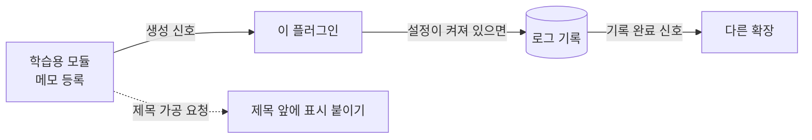

# 그누보드7 Hello 플러그인

**그누보드7 플러그인 · gnuboard7-hello_plugin**
학습용 최소 샘플 플러그인 (Hello 모듈 훅 소비)

<!-- @generated:badges START — ext:docgen 이 갱신. 이 블록 안은 직접 수정하지 않는다 -->
<p align="center">
  
  
  
  
  
</p>
<!-- @generated:badges END -->

---

[소개](#소개) · [주요 기능](#주요-기능) · [동작 방식](#동작-방식) · [요구 사항](#요구-사항) · [설치](#설치) · [관리자 설정](#관리자-설정) · [사용 방법](#사용-방법) · [다른 확장과의 연동](#다른-확장과의-연동) · [문서](#문서) · [트러블슈팅](#트러블슈팅) · [변경 이력](#변경-이력) · [라이선스](#라이선스)

---

## 소개

<!-- @intent START -->
그누보드7 **플러그인이 어떻게 생겼는지 보여주는 학습용 샘플**입니다. 실제 업무에 쓰는 기능은
없습니다.

플러그인의 핵심 역할은 **다른 확장의 코드를 고치지 않고 그 동작에 끼어드는 것**입니다. 이
샘플은 그 두 가지 방식을 하나씩 보여줍니다 — 학습용 모듈에 메모가 등록되면 기록을 남기고,
메모 제목이 화면에 나가기 전에 앞에 표시를 붙이는 것입니다.

관리자 화면의 플러그인 목록에는 나타나지 않습니다(학습용이 운영 목록에 섞이지 않도록). 명령줄로
설치·활성화할 수 있으며, 학습용 모듈이 함께 설치되어 있어야 동작을 확인할 수 있습니다.

플러그인은 자기 페이지를 가질 수 없습니다 — 설정 화면과 "다른 화면에 끼워 넣는 조각" 만
허용됩니다. 이 샘플에는 설정 화면 하나가 있습니다.
<!-- @intent END -->

## 주요 기능

<!-- @intent START -->
| 영역 | 설명 |
|---|---|
| 기록 남기기 | 학습용 모듈에 메모가 등록되면 로그 파일에 기록 (설정으로 끌 수 있음) |
| 제목 가공 | 메모 제목 앞에 표시를 붙이는 예시 |
| 설정 화면 | 기록 사용 여부를 켜고 끄는 관리자 설정 |
| 연결점 제공 | 기록을 남긴 직후 다른 확장이 반응할 수 있는 연결점 |
| 다국어 | 한국어·영어 화면 문구 |
| 테스트 | 모듈이 신호를 보내고 이 플러그인이 받는지 확인하는 예시 |
<!-- @intent END -->

## 동작 방식

<!-- @intent START -->


모듈은 이 플러그인의 존재를 모릅니다. 모듈이 "메모가 등록되었다" 는 신호를 보내면, 그 신호를
듣고 있던 이 플러그인이 자기 일을 합니다. 그래서 플러그인을 꺼도 모듈은 그대로 동작합니다.

기록을 남긴 뒤에는 이 플러그인도 신호를 보냅니다 — 신호를 받은 확장이 다시 신호를 보내며
이어지는 것이 확장 시스템의 기본 구조입니다.
<!-- @intent END -->

## 요구 사항

<!-- @generated:requirements START — ext:docgen 이 갱신. 이 블록 안은 직접 수정하지 않는다 -->
| 항목 | 값 |
|---|---|
| 그누보드7 코어 | `>=7.0.0` |
| PHP | `^8.2` |
| 의존 모듈 | `gnuboard7-hello_module` `>=0.1.0` |
<!-- @generated:requirements END -->

## 설치

<!-- @generated:install START — ext:docgen 이 갱신. 이 블록 안은 직접 수정하지 않는다 -->
```bash
# 번들 설치 (코어에 동봉된 소스에서 설치)
php artisan plugin:install gnuboard7-hello_plugin

# 활성화
php artisan plugin:activate gnuboard7-hello_plugin

# 업데이트 (번들 소스 기준 강제 반영)
php artisan plugin:update gnuboard7-hello_plugin --force
```
<!-- @generated:install END -->

## 관리자 설정

<!-- @generated:settings-summary START — ext:docgen 이 갱신. 이 블록 안은 직접 수정하지 않는다 -->
| 키 | 의미 | 기본값 |
|---|---|---|
| `log_enabled` | 로그 기록 사용 | `true` |

개발자용 상세(타입·검증·저장 위치)는 [설정 스키마](docs/settings.md#설정-스키마) 를 보세요.
<!-- @generated:settings-summary END -->

<!-- @intent START -->
설정 항목은 하나뿐입니다.

| 항목 | 기본값 | 바꾸면 달라지는 것 |
|---|---|---|
| 로그 기록 사용 | 켜짐 | 끄면 메모가 등록되어도 기록을 남기지 않습니다 (모듈 동작에는 영향 없음) |

부가 동작을 **설정으로 끌 수 있게 만드는 것**이 이 항목의 학습 포인트입니다. 설정 없이 무조건
동작하면 그 플러그인을 설치한 사이트는 동작을 멈출 방법이 없습니다.
<!-- @intent END -->

## 사용 방법

<!-- @intent START -->
**설치해 보기**: 학습용 모듈을 먼저 설치한 뒤 이 플러그인을 설치합니다.

```bash
php artisan module:install gnuboard7-hello_module
php artisan module:activate gnuboard7-hello_module
php artisan plugin:install gnuboard7-hello_plugin
php artisan plugin:activate gnuboard7-hello_plugin
```

관리자에서 "Hello 메모" 를 등록하면 로그에 기록이 남습니다. 플러그인 설정에서 기록을 끈 뒤
다시 등록해 보면 기록이 남지 않는 것을 확인할 수 있습니다 — 모듈 동작 자체는 그대로입니다.

**새 플러그인의 출발점으로 쓰기**: 이 디렉토리를 복제한 뒤 식별자·네임스페이스를 모두 바꾸고
학습용 표시를 지우면 새 플러그인이 됩니다. 자세한 절차는 확장 시스템 문서의 "학습용 샘플 확장"
항목을 참고합니다.
<!-- @intent END -->

## 다른 확장과의 연동

<!-- @generated:integrations START — ext:docgen 이 갱신. 이 블록 안은 직접 수정하지 않는다 -->
**이 확장이 의존하는 확장**

| 확장 | 유형 | 버전 제약 | 번들 |
|---|---|---|---|
| `gnuboard7-hello_module` | 모듈 | `>=0.1.0` | ✅ |

**이 확장에 의존하는 확장** (이 확장을 비활성화하면 함께 영향을 받습니다)

없음.
<!-- @generated:integrations END -->

## 문서

<!-- @generated:docs-index START — ext:docgen 이 갱신. 이 블록 안은 직접 수정하지 않는다 -->
| 문서 | 내용 | 상태 |
|---|---|---|
| [docs/README.md](docs/README.md) | 문서 통합 목차와 실측 집계 | ✅ |
| [docs/architecture.md](docs/architecture.md) | 설계 의도·계층 지도·디렉토리 맵 | ✅ |
| [docs/extension-points.md](docs/extension-points.md) | 발행/구독 훅·미들웨어·채널·스케줄 | ✅ |
| [docs/data-model.md](docs/data-model.md) | 모델·소유 테이블·마이그레이션·Enum | ✅ |
| [docs/settings.md](docs/settings.md) | 설정 스키마·권한·메뉴·라우트·의존 관계 | ✅ |
| [docs/frontend.md](docs/frontend.md) | 레이아웃·액션 핸들러·전역 진입점·에셋 | ✅ |
| [docs/editor-spec.md](docs/editor-spec.md) | 레이아웃 편집기에 선언한 팔레트·컨트롤·샘플 데이터 | ✅ |
| [CHANGELOG.md](CHANGELOG.md) | 변경 이력 | ✅ |
<!-- @generated:docs-index END -->

## 트러블슈팅

<!-- @intent START -->
| 증상 | 원인 | 조치 |
|---|---|---|
| 관리자 플러그인 목록에 이 플러그인이 없음 | 학습용이라 목록에서 제외됨 | 정상입니다. 명령줄로 설치·활성화합니다 |
| 메모를 등록해도 기록이 남지 않음 | 설정에서 기록이 꺼져 있거나 학습용 모듈이 비활성 | 플러그인 설정과 모듈 활성화 상태를 확인합니다 |
| 제목 가공이 반영되지 않음 | 이 예시가 기대하는 가공 요청 지점이 모듈에 없음 | 정상입니다. 연결점이 없어도 등록 자체는 유효하며, 그 지점이 생기면 자동으로 동작합니다 |
| 복제해서 만든 플러그인이 관리자 목록에 안 보임 | 복제본에 학습용 표시가 남아 있음 | 복제본의 `hidden` 표시를 지웁니다 |
| 복제한 플러그인에서 값 가공이 무시됨 | 가공용 구독에 종류 표시가 빠짐 | 가공(Filter) 구독에는 종류를 명시해야 반환값이 반영됩니다 |
<!-- @intent END -->

## 변경 이력

[CHANGELOG.md](CHANGELOG.md)

## 라이선스

MIT
