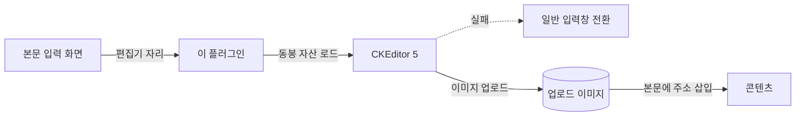
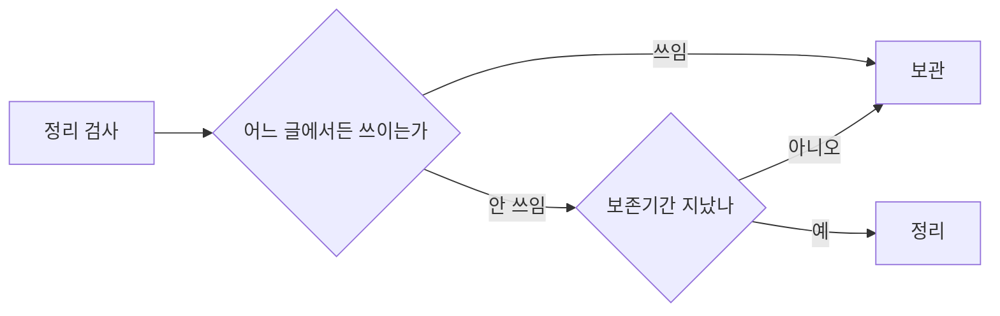

# 그누보드7 CKEditor 5 WYSIWYG 에디터 플러그인

**그누보드7 플러그인 · sirsoft-ckeditor5**
CKEditor 5를 이용한 WYSIWYG 에디터 플러그인입니다. 플러그인 설치만으로 기존 HtmlEditor가 교체됩니다.

<!-- @generated:badges START — ext:docgen 이 갱신. 이 블록 안은 직접 수정하지 않는다 -->
<p align="center">
  
  
  
  
</p>
<!-- @generated:badges END -->

---

[소개](#소개) · [주요 기능](#주요-기능) · [동작 방식](#동작-방식) · [요구 사항](#요구-사항) · [설치](#설치) · [관리자 설정](#관리자-설정) · [사용 방법](#사용-방법) · [다른 확장과의 연동](#다른-확장과의-연동) · [문서](#문서) · [트러블슈팅](#트러블슈팅) · [변경 이력](#변경-이력) · [라이선스](#라이선스)

---

## 소개

<!-- @intent START -->
글을 쓰는 자리에 **위지윅 편집기**를 제공하는 플러그인입니다. 설치·활성화하면 게시판 글쓰기,
상품 설명, 페이지 내용처럼 본문을 입력하는 화면이 자동으로 CKEditor 5 로 바뀝니다 — 각
화면을 따로 설정할 필요가 없습니다.

편집기 프로그램은 외부 서버에서 받아오지 않고 이 플러그인 안에 함께 들어 있습니다. 인터넷이
차단된 사내망이나 광고 차단 프로그램을 쓰는 환경에서도 편집기가 정상적으로 뜨게 하기 위한
선택입니다. 혹시 편집기를 불러오지 못하더라도 **일반 입력창으로 자동 전환되어 글은 계속 쓸 수
있고**, 작성 중이던 내용도 그대로 유지됩니다.

편집기로 올린 이미지는 따로 관리됩니다. 어느 글에서도 더 이상 쓰이지 않는 이미지를 찾아
정리하는 기능이 있으며, 실수로 지우는 일이 없도록 여러 안전장치를 두고 기본값은 꺼져
있습니다.
<!-- @intent END -->

## 주요 기능

<!-- @intent START -->
| 영역 | 설명 |
|---|---|
| 위지윅 편집 | 서식·표·목록·링크 등 문서 편집 기능. 툴바 구성을 간단형·표준형·전체 중에서 선택 |
| 이미지 업로드 | 편집기에서 바로 이미지 붙여넣기·끌어놓기, 용량 제한 설정 |
| 업로드 이미지 관리 | 관리자 화면에서 올린 이미지 목록 확인과 개별·일괄 삭제 |
| 미사용 이미지 정리 | 어느 글에서도 쓰이지 않는 이미지를 보존기간 경과 후 자동 정리 (기본 꺼짐) |
| 다국어 본문 | 언어별로 본문을 따로 작성 |
| 자동 폴백 | 편집기를 불러오지 못하면 일반 입력창으로 전환하고 알림, 재시도 시 내용 승계 |
| 저장소 선택 | 이미지를 어느 디스크에 둘지 지정 (로컬·외부 저장소) |
<!-- @intent END -->

## 동작 방식

<!-- @intent START -->


본문 입력 화면은 "편집기가 들어갈 자리" 만 비워 두고, 그 자리를 이 플러그인이 채웁니다. 그래서
편집기를 다른 것으로 바꾸고 싶으면 각 화면을 고치는 것이 아니라 이 플러그인을 다른 편집기
플러그인으로 교체하면 됩니다.



미사용 이미지 정리는 "본문 어디에도 그 이미지 주소가 없고, 올린 지 보존기간이 지났을 때"만
동작합니다. 게다가 **비활성 상태인 모듈이 하나라도 있으면 검사 자체를 멈춥니다** — 그 모듈의
글을 확인할 수 없어 쓰이는 이미지를 안 쓰인다고 오판할 수 있기 때문입니다.
<!-- @intent END -->

## 요구 사항

<!-- @generated:requirements START — ext:docgen 이 갱신. 이 블록 안은 직접 수정하지 않는다 -->
| 항목 | 값 |
|---|---|
| 그누보드7 코어 | `>=7.0.10` |
| PHP | `^8.2` |
<!-- @generated:requirements END -->

## 설치

<!-- @generated:install START — ext:docgen 이 갱신. 이 블록 안은 직접 수정하지 않는다 -->
```bash
# 번들 설치 (코어에 동봉된 소스에서 설치)
php artisan plugin:install sirsoft-ckeditor5

# 활성화
php artisan plugin:activate sirsoft-ckeditor5

# 업데이트 (번들 소스 기준 강제 반영)
php artisan plugin:update sirsoft-ckeditor5 --force
```

저장소: https://github.com/gnuboard/g7-plugin-sirsoft-ckeditor5
<!-- @generated:install END -->

## 관리자 설정

<!-- @generated:settings-summary START — ext:docgen 이 갱신. 이 블록 안은 직접 수정하지 않는다 -->
| 키 | 의미 | 기본값 |
|---|---|---|
| `imageUpload` | 이미지 업로드 | `true` |
| `imageMaxSizeMb` | 이미지 최대 크기 (MB) | `2` |
| `editorHeight` | 에디터 높이 (px) | `400` |
| `toolbar` | 툴바 유형 | `standard` |
| `public_asset_disk` | 공개 자산 디스크 | - |
| `unusedImageCleanup` | 미사용 이미지 자동 정리 | `false` |
| `unusedImageRetentionDays` | 미사용 이미지 보존기간 (일) | `30` |

개발자용 상세(타입·검증·저장 위치)는 [설정 스키마](docs/settings.md#설정-스키마) 를 보세요.
<!-- @generated:settings-summary END -->

<!-- @intent START -->
설정은 관리자의 플러그인 목록에서 이 플러그인의 설정으로 들어가 조정합니다.

| 항목 | 언제 바꾸는가 | 바꾸면 달라지는 것 |
|---|---|---|
| 이미지 업로드 | 편집기에서 이미지 첨부를 막고 싶을 때 | 끄면 편집기 툴바에서 이미지 버튼이 사라집니다 |
| 이미지 최대 크기 (MB) | 큰 사진을 그대로 올려야 할 때 | 이 값을 넘는 파일은 업로드가 거부됩니다 (기본 2MB) |
| 에디터 높이 (px) | 본문이 긴 화면에서 | 편집 영역의 기본 높이 (기본 400px) |
| 툴바 유형 | 필요한 기능만 남기고 싶을 때 | 툴바 버튼 구성 — 간단형(minimal)·표준형(standard)·전체(full) |
| 공개 자산 디스크 | 이미지를 외부 저장소·CDN 에 둘 때 | 업로드 이미지가 저장되고 서빙되는 위치 |
| 미사용 이미지 자동 정리 | 저장 공간을 관리할 때 | **기본은 꺼짐.** 켜면 하루 한 번 미사용 이미지를 정리합니다 |
| 미사용 이미지 보존기간 (일) | 정리 시점을 조정할 때 | 올린 지 이 기간이 지난 것만 정리 대상 (기본 30일) |

미사용 이미지 정리를 켜기 전에 확인할 것: 본문에 이미지를 담는 모듈이 **모두 활성 상태**여야
합니다. 설치만 되어 있고 꺼진 모듈이 있으면 그 모듈의 글을 검사할 수 없어, 안전을 위해 정리가
수행되지 않습니다.
<!-- @intent END -->

## 사용 방법

<!-- @intent START -->
**도입**: 플러그인을 설치·활성화하면 끝입니다. 본문을 입력하는 화면들이 자동으로 위지윅
편집기로 바뀝니다. 편집기 플러그인은 **하나만 활성화**합니다 — 둘 이상 켜면 어느 것이 표시될지
설치 순서에 좌우됩니다.

**업로드 이미지 관리**: `/admin/plugins/sirsoft-ckeditor5/uploads` 에서 편집기로 올린 이미지를
목록으로 보고, 필요 없는 것을 개별 또는 일괄로 지웁니다. 여기서 지운 이미지가 아직 본문에
쓰이고 있으면 그 자리가 깨지므로, 삭제 전에 사용처를 확인합니다.

**저장 공간 정리**: 이미지가 계속 쌓여 용량이 부담되면 설정에서 "미사용 이미지 자동 정리" 를
켜고 보존기간을 정합니다. 처음 켤 때는 보존기간을 넉넉히(예: 90일) 잡아 한 주기 동안 어떤
것이 정리되는지 확인한 뒤 줄이는 편이 안전합니다.
<!-- @intent END -->

## 다른 확장과의 연동

<!-- @generated:integrations START — ext:docgen 이 갱신. 이 블록 안은 직접 수정하지 않는다 -->
**이 확장이 의존하는 확장**

없음 — 코어만으로 동작합니다.

**이 확장에 의존하는 확장** (이 확장을 비활성화하면 함께 영향을 받습니다)

없음.
<!-- @generated:integrations END -->

## 문서

<!-- @generated:docs-index START — ext:docgen 이 갱신. 이 블록 안은 직접 수정하지 않는다 -->
| 문서 | 내용 | 상태 |
|---|---|---|
| [docs/README.md](docs/README.md) | 문서 통합 목차와 실측 집계 | ✅ |
| [docs/architecture.md](docs/architecture.md) | 설계 의도·계층 지도·디렉토리 맵 | ✅ |
| [docs/extension-points.md](docs/extension-points.md) | 발행/구독 훅·미들웨어·채널·스케줄 | ✅ |
| [docs/data-model.md](docs/data-model.md) | 모델·소유 테이블·마이그레이션·Enum | ✅ |
| [docs/settings.md](docs/settings.md) | 설정 스키마·권한·메뉴·라우트·의존 관계 | ✅ |
| [docs/frontend.md](docs/frontend.md) | 레이아웃·액션 핸들러·전역 진입점·에셋 | ✅ |
| [docs/editor-spec.md](docs/editor-spec.md) | 레이아웃 편집기에 선언한 팔레트·컨트롤·샘플 데이터 | ✅ |
| [docs/api/](docs/api/README.md) | API 레퍼런스 (엔드포인트별 파라미터·응답 필드) | ✅ |
| [CHANGELOG.md](CHANGELOG.md) | 변경 이력 | ✅ |
<!-- @generated:docs-index END -->

## 트러블슈팅

<!-- @intent START -->
| 증상 | 원인 | 조치 |
|---|---|---|
| 본문 자리에 편집기 대신 일반 입력창이 뜨고 안내가 나옴 | 편집기 자산을 불러오지 못함 | 안내의 재시도를 누릅니다. 작성한 내용은 유지됩니다. 반복되면 플러그인 파일이 온전히 설치되었는지 확인합니다 |
| 편집기가 두 번 뜨거나 엉뚱한 편집기가 나옴 | 편집기 플러그인이 둘 이상 활성화됨 | 하나만 남기고 나머지를 비활성화합니다 |
| 이미지 업로드가 거부됨 | 용량 제한 초과 또는 업로드 기능이 꺼짐 | 설정에서 "이미지 업로드" 사용 여부와 최대 크기를 확인합니다 (기본 2MB) |
| 본문의 이미지가 깨져 보임 | 그 이미지를 관리 화면에서 지웠거나 저장 디스크 설정이 바뀜 | 업로드 관리 화면에서 삭제 여부를 확인하고, 저장 디스크를 바꿨다면 이전 위치의 파일이 접근 가능한지 확인합니다 |
| 미사용 이미지 정리를 켰는데 아무것도 정리되지 않음 | 비활성 상태의 모듈이 있어 검사가 중단됨, 또는 보존기간이 아직 지나지 않음 | 설치된 모듈을 모두 활성화하거나 쓰지 않는 모듈은 삭제합니다. 보존기간도 함께 확인합니다 |
| 편집기 툴바에 원하는 버튼이 없음 | 툴바 유형이 간단형(minimal) | 설정에서 툴바 유형을 표준형(standard) 또는 전체(full)로 바꿉니다 |
<!-- @intent END -->

## 변경 이력

[CHANGELOG.md](CHANGELOG.md)

## 라이선스

MIT
