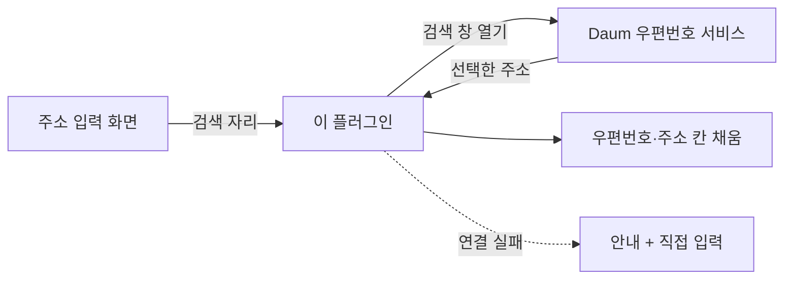

# 그누보드7 Daum 우편번호 플러그인

**그누보드7 플러그인 · sirsoft-daum_postcode**
Daum 우편번호 서비스를 통한 주소 검색 기능을 제공하는 플러그인입니다. API 키 없이 무료로 사용할 수 있습니다.

<!-- @generated:badges START — ext:docgen 이 갱신. 이 블록 안은 직접 수정하지 않는다 -->
<p align="center">
  
  
  
  
</p>
<!-- @generated:badges END -->

---

[소개](#소개) · [주요 기능](#주요-기능) · [동작 방식](#동작-방식) · [요구 사항](#요구-사항) · [설치](#설치) · [관리자 설정](#관리자-설정) · [사용 방법](#사용-방법) · [다른 확장과의 연동](#다른-확장과의-연동) · [문서](#문서) · [트러블슈팅](#트러블슈팅) · [변경 이력](#변경-이력) · [라이선스](#라이선스)

---

## 소개

<!-- @intent START -->
주소를 입력하는 자리에 **우편번호 검색 창**을 붙여 주는 플러그인입니다. 설치·활성화하면
배송지 입력 같은 주소 입력 화면에 검색 버튼이 생기고, 검색해서 고른 주소가 우편번호·기본
주소·도로명·지번 칸에 자동으로 채워집니다.

Daum(카카오)이 제공하는 무료 서비스를 사용하므로 **API 키 발급이나 별도 계약이 필요 없습니다.**
다만 주소 검색 창 자체는 Daum 서버에서 내려받으므로, 인터넷이 차단된 환경에서는 검색이
동작하지 않습니다. 그럴 때는 안내가 뜨고 **주소를 직접 입력**할 수 있으므로 주문이나 배송지
등록이 막히지는 않습니다.

이 플러그인은 주소를 찾아 칸에 넣어 주는 데까지만 합니다. 그 주소를 어디에 어떻게 저장할지는
주소 입력 화면을 가진 확장(예: 이커머스)이 정합니다.
<!-- @intent END -->

## 주요 기능

<!-- @intent START -->
| 영역 | 설명 |
|---|---|
| 주소 검색 | 도로명·지번·건물명·우편번호로 검색해 정확한 주소 선택 |
| 자동 입력 | 선택한 주소를 우편번호·기본주소·도로명·지번 칸에 자동으로 채움 |
| 오타 방지 | 검색으로 채우는 칸은 직접 수정할 수 없게 잠금 (상세주소는 직접 입력) |
| 표시 방식 | 화면 안에 겹쳐 띄우는 레이어 방식과 별도 창 팝업 방식 중 선택 |
| 모양 조정 | 팝업 크기와 테마 색상을 사이트에 맞게 설정 |
| 연결 실패 대비 | 검색을 불러오지 못하면 안내 후 직접 입력 허용, 재시도 제공 |
| 연동 지점 | 주소 선택 시점에 다른 확장이 반응할 수 있는 확장점 제공 |
<!-- @intent END -->

## 동작 방식

<!-- @intent START -->


주소 입력 화면은 "검색 버튼이 들어갈 자리" 만 비워 두고 이 플러그인이 그 자리를 채웁니다.
그래서 이커머스 배송지든 다른 확장의 주소 입력이든 같은 방식으로 동작합니다.

검색 창을 불러오지 못하면 잠겨 있던 주소 칸이 **편집 가능한 상태로 남아** 직접 입력할 수
있습니다. 검색이 안 된다고 화면 전체가 막히지 않도록 한 것입니다.
<!-- @intent END -->

## 요구 사항

<!-- @generated:requirements START — ext:docgen 이 갱신. 이 블록 안은 직접 수정하지 않는다 -->
| 항목 | 값 |
|---|---|
| 그누보드7 코어 | `>=7.0.10` |
| PHP | `^8.2` |
| 외부 스크립트 호스트 | `t1.daumcdn.net` |
<!-- @generated:requirements END -->

## 설치

<!-- @generated:install START — ext:docgen 이 갱신. 이 블록 안은 직접 수정하지 않는다 -->
```bash
# 번들 설치 (코어에 동봉된 소스에서 설치)
php artisan plugin:install sirsoft-daum_postcode

# 활성화
php artisan plugin:activate sirsoft-daum_postcode

# 업데이트 (번들 소스 기준 강제 반영)
php artisan plugin:update sirsoft-daum_postcode --force
```

저장소: https://github.com/gnuboard/g7-plugin-sirsoft-daum_postcode
<!-- @generated:install END -->

## 관리자 설정

<!-- @generated:settings-summary START — ext:docgen 이 갱신. 이 블록 안은 직접 수정하지 않는다 -->
| 키 | 의미 | 기본값 |
|---|---|---|
| `display_mode` | 표시 방식 | `layer` |
| `popup_width` | 팝업 너비 (px) | `500` |
| `popup_height` | 팝업 높이 (px) | `600` |
| `theme_color` | 테마 색상 | `#1D4ED8` |

개발자용 상세(타입·검증·저장 위치)는 [설정 스키마](docs/settings.md#설정-스키마) 를 보세요.
<!-- @generated:settings-summary END -->

<!-- @intent START -->
설정은 관리자의 플러그인 목록에서 이 플러그인의 설정으로 들어가 조정합니다.

| 항목 | 언제 바꾸는가 | 바꾸면 달라지는 것 |
|---|---|---|
| 표시 방식 | 팝업 차단 프로그램 사용자가 많을 때 | `layer`(기본)는 화면 안에 겹쳐 띄우고, `popup`은 별도 창을 엽니다 |
| 팝업 너비 / 높이 (px) | 팝업 방식일 때 창이 작거나 클 때 | 별도 창의 크기 (기본 500 × 600) |
| 테마 색상 | 사이트 색과 맞출 때 | 검색 창의 강조 색 (기본 `#1D4ED8`) |

표시 방식은 `layer` 를 기본값으로 둡니다 — 팝업은 브라우저나 확장 프로그램에 의해 차단될 수
있고, 차단되면 사용자에게는 "버튼을 눌러도 아무 일이 없는" 것으로 보이기 때문입니다.
<!-- @intent END -->

## 사용 방법

<!-- @intent START -->
**도입**: 플러그인을 설치·활성화하면 끝입니다. 주소 입력 자리를 제공하는 화면(이커머스 배송지
입력 등)에 검색 버튼이 자동으로 나타납니다. 별도의 키 발급이나 신청 절차는 없습니다.

**주소 입력**: 검색 버튼을 눌러 도로명·건물명·지번 중 아는 것으로 검색하고 결과를 고릅니다.
우편번호와 주소 칸이 자동으로 채워지며, 상세주소(동·호수)만 직접 입력하면 됩니다.

**팝업이 뜨지 않을 때**: 설정에서 표시 방식을 `layer` 로 바꿉니다. 화면 안에 겹쳐 뜨는 방식이라
팝업 차단의 영향을 받지 않습니다.
<!-- @intent END -->

## 다른 확장과의 연동

<!-- @generated:integrations START — ext:docgen 이 갱신. 이 블록 안은 직접 수정하지 않는다 -->
**이 확장이 의존하는 확장**

없음 — 코어만으로 동작합니다.

**이 확장에 의존하는 확장** (이 확장을 비활성화하면 함께 영향을 받습니다)

| 확장 | 유형 | 요구 버전 |
|---|---|---|
| `sirsoft-basic` | 템플릿 | `>=1.0.0` |
<!-- @generated:integrations END -->

## 문서

<!-- @generated:docs-index START — ext:docgen 이 갱신. 이 블록 안은 직접 수정하지 않는다 -->
| 문서 | 내용 | 상태 |
|---|---|---|
| [docs/README.md](docs/README.md) | 문서 통합 목차와 실측 집계 | ✅ |
| [docs/architecture.md](docs/architecture.md) | 설계 의도·계층 지도·디렉토리 맵 | ✅ |
| [docs/extension-points.md](docs/extension-points.md) | 발행/구독 훅·미들웨어·채널·스케줄 | ✅ |
| [docs/data-model.md](docs/data-model.md) | 모델·소유 테이블·마이그레이션·Enum | ✅ |
| [docs/settings.md](docs/settings.md) | 설정 스키마·권한·메뉴·라우트·의존 관계 | ✅ |
| [docs/frontend.md](docs/frontend.md) | 레이아웃·액션 핸들러·전역 진입점·에셋 | ✅ |
| [docs/editor-spec.md](docs/editor-spec.md) | 레이아웃 편집기에 선언한 팔레트·컨트롤·샘플 데이터 | ✅ |
| [CHANGELOG.md](CHANGELOG.md) | 변경 이력 | ✅ |
<!-- @generated:docs-index END -->

## 트러블슈팅

<!-- @intent START -->
| 증상 | 원인 | 조치 |
|---|---|---|
| 검색 버튼을 눌러도 창이 뜨지 않음 | 표시 방식이 팝업인데 브라우저가 팝업을 차단 | 설정에서 표시 방식을 `layer` 로 바꿉니다 |
| "주소 검색을 불러오지 못했습니다" 안내가 뜸 | 인터넷 차단·방화벽·광고차단 프로그램이 Daum 서버 접속을 막음 | 안내의 재시도를 눌러 봅니다. 계속 실패하면 주소를 직접 입력하면 되며, 사내망이라면 `t1.daumcdn.net` 접속을 허용합니다 |
| 주소 칸을 직접 고칠 수 없음 | 오타 방지를 위해 검색으로만 채우도록 잠금 | 정상 동작입니다. 상세주소 칸은 직접 입력할 수 있습니다 |
| 검색이 안 되는 환경인데 주소 칸도 잠겨 있음 | 정상이라면 발생하지 않는 상태 | 검색을 불러오지 못하면 칸이 편집 가능한 상태로 남습니다. 잠겨 있다면 플러그인이 온전히 설치되었는지 확인합니다 |
| 주소 입력 화면에 검색 버튼이 없음 | 그 화면이 주소 검색 자리를 제공하지 않음 | 해당 화면을 가진 확장이 주소 검색 확장 자리를 지원하는지 확인합니다 |
| 해외 주소를 검색할 수 없음 | 국내 우편번호 서비스 | 해외 주소는 직접 입력해야 합니다 |
<!-- @intent END -->

## 변경 이력

[CHANGELOG.md](CHANGELOG.md)

## 라이선스

MIT
