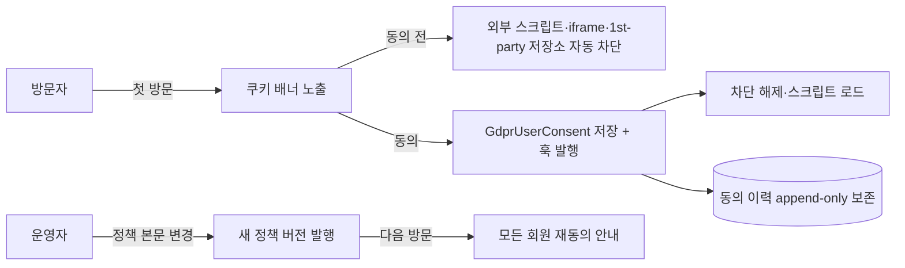

# 그누보드7 GDPR (일반 데이터 보호 규정) 플러그인

**그누보드7 플러그인 · sirsoft-gdpr**
GDPR·개인정보보호법 대응 쿠키 동의 배너와 동의 이력 관리를 제공하는 플러그인

<!-- @generated:badges START — ext:docgen 이 갱신. 이 블록 안은 직접 수정하지 않는다 -->
<p align="center">
  
  
  
  
</p>
<!-- @generated:badges END -->

---

[소개](#소개) · [주요 기능](#주요-기능) · [동작 방식](#동작-방식) · [요구 사항](#요구-사항) · [설치](#설치) · [관리자 설정](#관리자-설정) · [사용 방법](#사용-방법) · [다른 확장과의 연동](#다른-확장과의-연동) · [문서](#문서) · [트러블슈팅](#트러블슈팅) · [변경 이력](#변경-이력) · [라이선스](#라이선스)

---

## 소개

<!-- @intent START -->
GDPR(유럽 일반 데이터 보호 규정) 및 한국 개인정보보호법 대응 핵심 기능을 제공하는 플러그인입니다.
쿠키 동의 배너·동의 전 자동 차단·동의 이력 영구 보존·마이페이지 동의 철회를 한 패키지로
제공합니다.

이 플러그인이 의도적으로 하지 않는 것 하나는 **게스트 → 회원 동의 자동 승계**입니다. GDPR
Art.6/ePrivacy Art.5(3) 관점에서 게스트(디바이스 단위)와 회원(주체 단위)은 별도 동의 모델이며,
회원가입 폼 동의로 Art.7(1) 입증 책임이 별도로 충족됩니다. 게스트 시절 동의 이력은 세션 기준
으로 보존될 뿐 회원 계정과 자동으로 이어붙지 않습니다.
<!-- @intent END -->

## 주요 기능

<!-- @intent START -->
| 영역 | 설명 |
|---|---|
| 쿠키 동의 배너 | 필수/기능/분석/마케팅 4분류(ICO·CNIL 권장 표준), 다크 모드, 4가지 위치(하단 바·좌하단·우하단·중앙 모달) |
| 동의 전 자동 차단 | 외부 추적 스크립트·iframe + 기능 카테고리 1st-party 저장소(localStorage·sessionStorage·쿠키) 게이팅 |
| 동의 이력 저장 | 정책 버전·출처·카테고리 스냅샷을 함께 immutable 보존(GDPR Art.7(1) 입증 자료) |
| 마이페이지 동의 관리 | 회원이 자신의 동의 현황을 조회·개별 철회·재동의·전체 일괄 재동의 |
| 관리자 동의 이력 조회 | 회원/게스트 동의 변경 이력(이메일·세션 검색, 카테고리·출처 다중 필터, 카테고리 스냅샷 표) |
| 정책 버전 발행 | 정책 본문 변경 시 수동 발행으로 모든 회원에게 재동의를 트리거 |
<!-- @intent END -->

## 동작 방식

<!-- @intent START -->


동의는 부여든 철회든 상태 저장(`gdpr_user_consents`, mutable)과 이력 기록
(`gdpr_user_consent_histories`, immutable append-only)이 항상 함께 일어납니다 — "지금 동의
상태가 무엇인가"와 "언제 무엇에 동의했었는가"를 구분해서 답할 수 있어야 하기 때문입니다.
<!-- @intent END -->

## 요구 사항

<!-- @generated:requirements START — ext:docgen 이 갱신. 이 블록 안은 직접 수정하지 않는다 -->
| 항목 | 값 |
|---|---|
| 그누보드7 코어 | `>=7.0.6` |
| PHP | `^8.2` |
<!-- @generated:requirements END -->

## 설치

<!-- @generated:install START — ext:docgen 이 갱신. 이 블록 안은 직접 수정하지 않는다 -->
```bash
# 번들 설치 (코어에 동봉된 소스에서 설치)
php artisan plugin:install sirsoft-gdpr

# 활성화
php artisan plugin:activate sirsoft-gdpr

# 업데이트 (번들 소스 기준 강제 반영)
php artisan plugin:update sirsoft-gdpr --force
```

저장소: https://github.com/gnuboard/g7-plugin-sirsoft-gdpr
<!-- @generated:install END -->

설치 직후 쿠키 배너는 **비활성** 상태입니다. 운영자가 운영 주체명·데이터 저장 위치·정책 페이지
슬러그를 입력한 뒤 "쿠키 배너 노출" 토글을 켜야 사이트에 노출됩니다.

## 관리자 설정

<!-- @generated:settings-summary START — ext:docgen 이 갱신. 이 블록 안은 직접 수정하지 않는다 -->
| 키 | 의미 | 기본값 |
|---|---|---|
| `privacy_policy_slug` | 개인정보처리방침 페이지 슬러그 | `privacy` |
| `legal_entity_name` | 운영 주체명 | - |
| `data_storage_location` | 데이터 저장 위치 | - |
| `banner_enabled` | 쿠키 배너 노출 | `true` |
| `banner_position` | 배너 위치 | `bottom_bar` |
| `blocked_domains` | 추적 도메인 차단 목록 | `{"functional":["*.crisp.chat","client.crisp.chat","*.intercom.io","widget.intercom.io","*.tawk.to","embed.tawk.to","cdn.weglot.com","*.weglot.com","*.usercentrics.eu"],"analytics":["google-analytics.com","*.google-analytics.com","googletagmanager.com","*.googletagmanager.com","ssl.google-analytics.com","*.hotjar.com","static.hotjar.com","*.mixpanel.com","cdn.mxpnl.com","*.amplitude.com","cdn.amplitude.com","*.segment.io","*.segment.com","wcs.naver.net","wcs.naver.com","*.beusable.net"],"marketing":["facebook.net","connect.facebook.net","facebook.com","*.facebook.com","doubleclick.net","*.doubleclick.net","googleadservices.com","googlesyndication.com","ads.google.com","*.criteo.com","static.criteo.net","*.adnxs.com","*.taboola.com","cdn.taboola.com","*.outbrain.com","*.kakao.com","analytics.ad.daum.net","platform.twitter.com","*.twitter.com","platform.linkedin.com","*.linkedin.com"]}` |
| `necessary_storage_allowlist` | 필수 저장 항목 허용목록 | `{"localStorage":["g7_locale","g7_color_scheme","g7_cache_version","g7_asset_url_mode*","g7_cart_key","g7-devtools-panel","g7_guest_order_token","g7_guest_order_number","g7_guest_order_expires_at","g7_devtools_*","g7_filters_*","g7_columns_*","g7_order_*","g7_admin_sidebar_collapsed","g7_filter_visibility_*","g7_dismissed_warnings","g7le.*","__sirsoftKginicisMobilePaymentReturnPending","g7.identity.redirectStash","sirsoft-verification_nhnkcp.formStash"],"sessionStorage":["g7:sirsoft-pay_kginicis:pendingClose","g7:sirsoft-pay_nhnkcp:pendingClose","g7:sirsoft-tosspayments:pendingClose","g7.identity.redirectStash","sirsoft-verification_nhnkcp.formStash","__sirsoftKginicisMobilePaymentReturnPending","g7le.*","g7_devtools_*","g7_filters_*","g7_columns_*","g7_order_*","g7_filter_visibility_*"],"cookie":["laravel_maintenance"]}` |
| `cookie_categories` | 쿠키 카테고리 정의 | `[]` |

개발자용 상세(타입·검증·저장 위치)는 [설정 스키마](docs/settings.md#설정-스키마) 를 보세요.
<!-- @generated:settings-summary END -->

<!-- @intent START -->
`쿠키 배너 노출` 은 마스터 토글입니다 — ON 하면 배너와 자동 차단이 **함께** 켜집니다. GDPR
Art.6 "동의 전 처리 금지"를 강제하는 메커니즘인 자동 차단만 단독으로 끌 수 없도록 의도적으로
하나의 토글에 묶었습니다. 반대로 마이페이지 동의 관리 카드는 이 토글과 무관하게, 동의/철회
이력이 있는 회원에게는 항상 노출됩니다(Art.7(3) 철회 대칭성 보장 — 동의를 배너로 받았다면
철회도 언제든 마이페이지에서 가능해야 합니다).

데이터 저장 위치(`data_storage_location`)에는 IP 주소·CIDR·클라우드 리전 코드(예:
`ap-northeast-2`)를 입력할 수 없습니다 — 보안상 자동 거부됩니다. "대한민국", "미국 (AWS)"처럼
사용자에게 안내할 국가/지역명만 입력합니다.

자동 차단 대상 도메인은 카테고리(기능/분석/마케팅)별 카탈로그로 관리하며, 기본 카탈로그(예:
Google Analytics, Facebook Pixel, Kakao Pixel 등)가 시드되어 있고 운영자가 추가·삭제할 수
있습니다. 도메인 형식은 `example.com` 또는 와일드카드 `*.example.com` 만 지원하며, `localhost`
같은 단일 라벨과 한글 도메인(xn-- 변환)은 지원하지 않습니다.

`필수 저장 항목`(`necessary_storage_allowlist`)은 **기능 쿠키에 동의하지 않은 방문자에게도
저장이 허용되는 항목** 목록입니다. 이 목록 밖의 항목은 방문할 때마다 지워지므로, 새로 설치한
확장의 설정이 "저장했는데 새로고침하면 사라진다"면 그 확장이 쓰는 항목 이름을 여기에
추가하면 됩니다 — 이 플러그인을 고칠 필요가 없습니다. 항목 이름은 그 확장의 문서나 브라우저
개발자 도구(Application → Storage)에서 확인할 수 있습니다.

목록은 저장소 구분(브라우저 저장소 / 세션 저장소 / 쿠키) 셋으로 나뉘고, 이름 끝에 `*` 를
붙이면 앞부분이 같은 항목을 모두 포함합니다(`g7_filters_*` → `g7_filters_orders_1`). `*` 는
끝에만 쓸 수 있습니다 — 앞에 두면 모든 항목이 열려 동의 전 차단이 무의미해지기 때문입니다.

로그인 토큰·CSRF 토큰·세션 쿠키·쿠키 동의 기록은 `잠금 항목`으로 카드 위쪽에 따로 표시되며
삭제할 수 없습니다. 이 넷이 없으면 사이트가 동작하지 않습니다.

사이트 운영에 반드시 필요한 항목만 등록하세요. 추적·분석 목적의 항목을 여기 넣으면 동의 전
차단 원칙이 무너집니다.
<!-- @intent END -->

## 사용 방법

<!-- @intent START -->
**자체 호스팅 추적 자원 등록**: 자체 도메인에서 서빙하는 추적 스크립트·iframe·임베드는 도메인
매칭 대상이 아니므로 HTML 속성으로 분류합니다.

```html
<script src="/js/my-analytics.js" data-gdpr-category="analytics"></script>
<iframe src="/embed/custom-tracker" data-gdpr-category="marketing"></iframe>
```

동의 전까지 자동 차단되고, 동의 후 자동 복원되며, 동의 철회 시 다시 차단됩니다.

**정책 버전 발행**: `관리자 → 플러그인 → GDPR 설정` 의 "정책 버전" 카드에서 "+ 새 버전 발행"을
누르면 모든 회원이 다음 방문 시 재동의 화면을 보게 됩니다. 아래 기준으로 발행 여부를 판단합니다.

| 발행이 필요한 변경 | 발행이 필요 없는 변경 |
|---|---|
| 정책 본문(개인정보처리방침 페이지) 변경 | 차단 도메인 추가/삭제 |
| 카테고리 의미 변경 | UI 라벨/설명 정정 |
| 위탁자·데이터 보관 정보 변경 | 운영 주체명·저장 위치 정정 |

발행 시 변경 사유 메모를 함께 저장합니다(GDPR Art.30 처리 기록 의무).

**동의 이력 조회**: `관리자 → GDPR 동의 이력` 메뉴에서 이메일 부분 일치·세션 ID 로 검색하고,
카테고리·출처(banner/mypage/register/withdraw 등)·동의 액션(granted/revoked)으로 필터링합니다.
각 행을 펼치면 동의 시점의 전체 카테고리 의사 스냅샷을 확인할 수 있습니다(Art.7(1) 입증 자료).
<!-- @intent END -->

## 다른 확장과의 연동

<!-- @generated:integrations START — ext:docgen 이 갱신. 이 블록 안은 직접 수정하지 않는다 -->
**이 확장이 의존하는 확장**

없음 — 코어만으로 동작합니다.

**이 확장에 의존하는 확장** (이 확장을 비활성화하면 함께 영향을 받습니다)

없음.
<!-- @generated:integrations END -->

<!-- @intent START -->
`sirsoft-page` 는 소프트 의존(런타임 체크)입니다 — 미설치 시 쿠키 배너의 "자세히" 정책 링크만
자동으로 숨겨지고 나머지 기능은 정상 동작합니다. `sirsoft-basic` 템플릿은 배너가 주입되는
지점(`_user_base.json` 의 공용 확장 지점)을 제공해야 하므로, 다른 사용자 템플릿을 쓰려면
그 템플릿에도 같은 주입 지점이 있어야 배너가 정상 노출됩니다.
<!-- @intent END -->

## 문서

<!-- @generated:docs-index START — ext:docgen 이 갱신. 이 블록 안은 직접 수정하지 않는다 -->
| 문서 | 내용 | 상태 |
|---|---|---|
| [docs/README.md](docs/README.md) | 문서 통합 목차와 실측 집계 | ✅ |
| [docs/architecture.md](docs/architecture.md) | 설계 의도·계층 지도·디렉토리 맵 | ✅ |
| [docs/extension-points.md](docs/extension-points.md) | 발행/구독 훅·미들웨어·채널·스케줄 | ✅ |
| [docs/data-model.md](docs/data-model.md) | 모델·소유 테이블·마이그레이션·Enum | ✅ |
| [docs/settings.md](docs/settings.md) | 설정 스키마·권한·메뉴·라우트·의존 관계 | ✅ |
| [docs/frontend.md](docs/frontend.md) | 레이아웃·액션 핸들러·전역 진입점·에셋 | ✅ |
| [docs/editor-spec.md](docs/editor-spec.md) | 레이아웃 편집기에 선언한 팔레트·컨트롤·샘플 데이터 | ✅ |
| [docs/api/](docs/api/README.md) | API 레퍼런스 (엔드포인트별 파라미터·응답 필드) | ✅ |
| [CHANGELOG.md](CHANGELOG.md) | 변경 이력 | ✅ |
<!-- @generated:docs-index END -->

## 트러블슈팅

<!-- @intent START -->
| 증상 | 원인 | 조치 |
|---|---|---|
| 쿠키 배너 설정을 저장했는데도 배너가 안 뜸 | "쿠키 배너 노출" 마스터 토글이 꺼져 있음 | 관리자 설정에서 토글을 켠다 — 개별 항목 저장만으로는 배너가 켜지지 않는다 |
| 정책 페이지 링크가 배너에 안 보임 | `privacy_policy_slug` 미설정 또는 `sirsoft-page` 미설치 | 슬러그를 입력하거나, 링크 없이 운영할지 결정한다(자동 숨김은 정상 동작) |
| 배너에서 동의했는데 마이페이지에 이력이 안 보임 | 게스트 상태에서 동의 후 회원가입한 경우 — 게스트→회원 자동 승계를 제공하지 않음 | 의도된 동작이다(§소개 참고). 회원가입 시 별도 동의를 다시 받는다 |
| 자체 호스팅 스크립트가 동의 전에도 로드됨 | `data-gdpr-category` 속성 누락 | 스크립트/iframe 태그에 카테고리 속성을 추가한다 |
<!-- @intent END -->

## 변경 이력

[CHANGELOG.md](CHANGELOG.md)

## 라이선스

MIT
