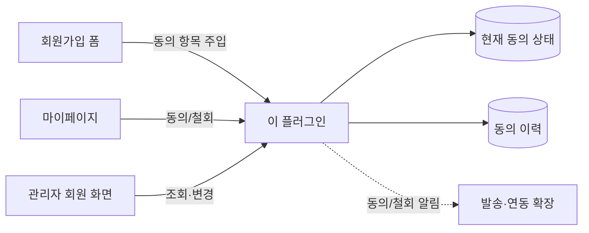

# 그누보드7 마케팅 동의 플러그인

**그누보드7 플러그인 · sirsoft-marketing**
이메일 구독, 마케팅 동의, 제3자 제공 동의 등을 관리하는 플러그인

<!-- @generated:badges START — ext:docgen 이 갱신. 이 블록 안은 직접 수정하지 않는다 -->
<p align="center">
  
  
  
  
  
</p>
<!-- @generated:badges END -->

---

[소개](#소개) · [주요 기능](#주요-기능) · [동작 방식](#동작-방식) · [요구 사항](#요구-사항) · [설치](#설치) · [관리자 설정](#관리자-설정) · [사용 방법](#사용-방법) · [다른 확장과의 연동](#다른-확장과의-연동) · [문서](#문서) · [트러블슈팅](#트러블슈팅) · [변경 이력](#변경-이력) · [라이선스](#라이선스)

---

## 소개

<!-- @intent START -->
회원에게 **마케팅 정보 수신 동의**를 받고 그 이력을 남기는 플러그인입니다. 이메일·SMS 같은
수신 채널을 관리자 화면에서 원하는 만큼 추가할 수 있고, 제3자 제공 동의·정보 공개 동의처럼
채널이 아닌 법정 동의 항목도 함께 다룹니다.

동의 항목은 회원가입 폼과 마이페이지, 관리자의 회원 상세·수정 화면에 자동으로 나타납니다.
이 플러그인은 자기 화면을 갖지 않고 **기존 화면에 항목을 얹는** 방식이라, 도입해도 회원
관리 흐름이 달라지지 않습니다.

동의와 철회는 모두 기록됩니다 — 언제, 어느 경로로, 어느 IP 에서 이루어졌는지가 남습니다.
동의 여부만 남기면 나중에 "동의를 받았다" 는 사실을 증명할 수 없기 때문입니다.

의도적으로 하지 않는 것: **실제 발송**. 이 플러그인은 "누가 무엇에 동의했는가" 까지만
답하고, 그 동의를 근거로 메일이나 문자를 보내는 것은 발송 담당 확장의 몫입니다.
<!-- @intent END -->

## 주요 기능

<!-- @intent START -->
| 영역 | 설명 |
|---|---|
| 수신 채널 관리 | 이메일·SMS 등 수신 채널을 관리자 화면에서 추가·수정·사용중지 |
| 법정 동의 항목 | 마케팅 활용 동의·제3자 제공 동의·정보 공개 동의를 각각 켜고 끔 |
| 약관 연결 | 동의 항목마다 약관 페이지를 지정해 회원이 내용을 확인하고 동의 |
| 가입 시 수집 | 회원가입 폼에 동의 항목이 자동으로 나타남 |
| 마이페이지 관리 | 회원이 언제든 스스로 동의·철회 |
| 관리자 조회·수정 | 회원 상세·수정 화면에서 동의 상태 확인과 변경 |
| 동의 이력 | 동의·철회 행위마다 시각·경로·IP 기록, 동의 횟수 누적 |
| 연동 지점 | 동의·철회 시점에 다른 확장이 반응할 수 있는 확장점 제공 |
<!-- @intent END -->

## 동작 방식

<!-- @intent START -->


이 플러그인은 회원 화면들을 고치지 않고 **그 화면에 항목만 얹습니다.** 어느 경로로 동의가
바뀌든 현재 상태와 이력이 함께 기록되고, 그 변화를 다른 확장이 받아 수신 목록에 반영할 수
있습니다.

수신 채널을 새로 추가하는 것은 **설정 변경만으로** 끝납니다. 프로그램을 다시 배포하거나
데이터베이스를 고칠 필요가 없습니다.
<!-- @intent END -->

## 요구 사항

<!-- @generated:requirements START — ext:docgen 이 갱신. 이 블록 안은 직접 수정하지 않는다 -->
| 항목 | 값 |
|---|---|
| 그누보드7 코어 | `>=7.0.0` |
| PHP | `^8.2` |
| 의존 모듈 | `sirsoft-page` `>=1.0.0` |
<!-- @generated:requirements END -->

## 설치

<!-- @generated:install START — ext:docgen 이 갱신. 이 블록 안은 직접 수정하지 않는다 -->
```bash
# 번들 설치 (코어에 동봉된 소스에서 설치)
php artisan plugin:install sirsoft-marketing

# 활성화
php artisan plugin:activate sirsoft-marketing

# 업데이트 (번들 소스 기준 강제 반영)
php artisan plugin:update sirsoft-marketing --force
```

저장소: https://github.com/gnuboard/g7-plugin-sirsoft-marketing
<!-- @generated:install END -->

## 관리자 설정

<!-- @generated:settings-summary START — ext:docgen 이 갱신. 이 블록 안은 직접 수정하지 않는다 -->
| 키 | 의미 | 기본값 |
|---|---|---|
| `marketing_consent_enabled` | 마케팅 동의 사용 | `true` |
| `marketing_consent_terms_slug` | 마케팅 동의 약관 페이지 Slug | `marketing-terms` |
| `channels` | 채널 목록 | `[]` |
| `third_party_consent_enabled` | 제3자 제공 동의 사용 | `true` |
| `third_party_consent_terms_slug` | 제3자 제공 동의 약관 페이지 Slug | - |
| `info_disclosure_enabled` | 정보 공개 동의 사용 | `true` |
| `info_disclosure_terms_slug` | 정보 공개 동의 약관 페이지 Slug | - |

개발자용 상세(타입·검증·저장 위치)는 [설정 스키마](docs/settings.md#설정-스키마) 를 보세요.
<!-- @generated:settings-summary END -->

<!-- @intent START -->
설정은 관리자의 플러그인 목록에서 이 플러그인의 설정으로 들어가 조정합니다.

| 항목 | 언제 바꾸는가 | 바꾸면 달라지는 것 |
|---|---|---|
| 마케팅 동의 사용 | 마케팅 수신 동의를 받지 않을 때 | 끄면 가입 폼·마이페이지에서 마케팅 동의 항목이 사라집니다 |
| 마케팅 동의 약관 페이지 | 약관 문서를 만든 뒤 | 동의 항목 옆 "내용 보기" 가 가리키는 페이지 (기본 `marketing-terms`) |
| 채널 목록 | 수신 수단을 늘리거나 줄일 때 | 이메일·SMS 등 개별 수신 채널. 여기서 추가하면 즉시 가입 폼과 마이페이지에 나타납니다 |
| 제3자 제공 동의 사용 / 약관 페이지 | 개인정보를 제휴사에 제공할 때 | 해당 동의 항목의 노출 여부와 약관 링크 |
| 정보 공개 동의 사용 / 약관 페이지 | 회원 정보를 공개 영역에 노출할 때 | 해당 동의 항목의 노출 여부와 약관 링크 |

약관 페이지는 **페이지 모듈에서 만든 문서**를 가리킵니다. 슬러그만 지정하면 되고, 문서가
없으면 링크가 열리지 않으므로 약관을 먼저 작성합니다.

채널을 **사용중지**로 바꾸면 새 가입자에게는 보이지 않지만, 이미 동의한 회원의 기록은
남습니다 — 나중에 다시 켰을 때 그 회원이 다시 동의할 필요가 없도록 하기 위해서입니다.
<!-- @intent END -->

## 사용 방법

<!-- @intent START -->
**도입**: 페이지 모듈로 마케팅 수신 동의 약관 문서를 먼저 만듭니다(예: 슬러그
`marketing-terms`). 그다음 이 플러그인의 설정에서 약관 페이지 슬러그를 지정하고, 수신 채널을
필요한 만큼 추가합니다. 저장하면 회원가입 폼과 마이페이지에 동의 항목이 바로 나타납니다.

**수신 채널 늘리기**: 예를 들어 이메일만 받다가 카카오 알림톡을 추가하려면, 설정의 채널
목록에 항목을 하나 더하고 표시할 이름과 약관 페이지를 지정합니다. 기존 회원은 새 항목에
대해 미동의 상태로 시작하며, 마이페이지에서 개별적으로 동의할 수 있습니다.

**동의 현황 확인**: 관리자의 회원 상세 화면에서 그 회원의 항목별 동의 상태를 볼 수 있습니다.
운영자가 대신 변경할 수도 있지만, 그 변경도 이력에 "관리자에 의한 변경" 으로 남습니다.
<!-- @intent END -->

## 다른 확장과의 연동

<!-- @generated:integrations START — ext:docgen 이 갱신. 이 블록 안은 직접 수정하지 않는다 -->
**이 확장이 의존하는 확장**

| 확장 | 유형 | 버전 제약 | 번들 |
|---|---|---|---|
| `sirsoft-page` | 모듈 | `>=1.0.0` | ✅ |

**이 확장에 의존하는 확장** (이 확장을 비활성화하면 함께 영향을 받습니다)

없음.
<!-- @generated:integrations END -->

## 문서

<!-- @generated:docs-index START — ext:docgen 이 갱신. 이 블록 안은 직접 수정하지 않는다 -->
| 문서 | 내용 | 상태 |
|---|---|---|
| [docs/README.md](docs/README.md) | 문서 통합 목차와 실측 집계 | ✅ |
| [docs/architecture.md](docs/architecture.md) | 설계 의도·계층 지도·디렉토리 맵 | ✅ |
| [docs/extension-points.md](docs/extension-points.md) | 발행/구독 훅·미들웨어·채널·스케줄 | ✅ |
| [docs/data-model.md](docs/data-model.md) | 모델·소유 테이블·마이그레이션·Enum | ✅ |
| [docs/settings.md](docs/settings.md) | 설정 스키마·권한·메뉴·라우트·의존 관계 | ✅ |
| [docs/frontend.md](docs/frontend.md) | 레이아웃·액션 핸들러·전역 진입점·에셋 | ✅ |
| [docs/editor-spec.md](docs/editor-spec.md) | 레이아웃 편집기에 선언한 팔레트·컨트롤·샘플 데이터 | ✅ |
| [docs/api/](docs/api/README.md) | API 레퍼런스 (엔드포인트별 파라미터·응답 필드) | ✅ |
| [CHANGELOG.md](CHANGELOG.md) | 변경 이력 | ✅ |
<!-- @generated:docs-index END -->

## 트러블슈팅

<!-- @intent START -->
| 증상 | 원인 | 조치 |
|---|---|---|
| 가입 폼에 동의 항목이 보이지 않음 | 해당 동의 항목이 꺼져 있거나 채널이 하나도 없음 | 설정에서 사용 여부를 확인하고 채널을 하나 이상 추가합니다 |
| 동의 항목의 "내용 보기" 를 눌러도 약관이 열리지 않음 | 지정한 슬러그의 페이지가 없거나 미발행 | 페이지 모듈에서 그 슬러그의 문서를 만들고 발행합니다 |
| 템플릿을 바꾸거나 업데이트한 뒤 동의 항목이 사라짐 | 새 화면에 항목이 들어갈 자리가 없음 | 해당 템플릿이 회원 화면의 확장 자리를 제공하는지 확인합니다 |
| 채널을 지웠는데 이미 동의한 회원 기록이 남아 있음 | 기록은 의도적으로 보존됨 | 정상 동작입니다. 채널을 다시 켜면 그 회원은 다시 동의할 필요가 없습니다 |
| 동의했는데 마케팅 메일이 오지 않음 | 이 플러그인은 동의만 관리하고 발송은 하지 않음 | 발송을 담당하는 확장의 설정과 발송 대상 조건을 확인합니다 |
| 회원을 지웠는데 동의 이력이 남아 있는지 확인하고 싶음 | 회원 삭제 시 함께 정리됨 | 정상 동작입니다. 삭제된 회원의 동의 기록은 삭제 흐름에서 함께 정리됩니다 |
<!-- @intent END -->

## 변경 이력

[CHANGELOG.md](CHANGELOG.md)

## 라이선스

MIT
