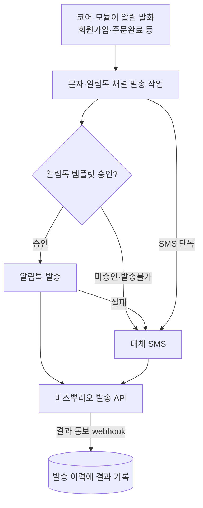
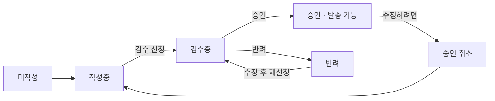

# 그누보드7 비즈뿌리오 메시지 발송 플러그인

**그누보드7 플러그인 · sirsoft-message_bizppurio**
비즈뿌리오 연동 SMS/LMS·카카오 알림톡 발송 플러그인입니다. 코어 알림 시스템 채널로 문자·알림톡을 발송하고 발송 결과를 webhook 으로 수신합니다.

<!-- @generated:badges START — ext:docgen 이 갱신. 이 블록 안은 직접 수정하지 않는다 -->
<p align="center">
  
  
  
  
</p>
<!-- @generated:badges END -->

---

[소개](#소개) · [주요 기능](#주요-기능) · [동작 방식](#동작-방식) · [요구 사항](#요구-사항) · [설치](#설치) · [관리자 설정](#관리자-설정) · [사용 방법](#사용-방법) · [다른 확장과의 연동](#다른-확장과의-연동) · [문서](#문서) · [트러블슈팅](#트러블슈팅) · [변경 이력](#변경-이력) · [라이선스](#라이선스)

---

## 소개

<!-- @intent START -->
비즈뿌리오(Bizppurio)를 연동해 **문자(SMS/LMS)와 카카오 알림톡**을 발송하는 플러그인입니다.

그누보드7 코어 알림 시스템에 문자·알림톡 채널을 추가하므로, 회원가입·주문 완료처럼 코어와 모듈이
이미 발화하는 알림을 문자와 알림톡으로도 자동 발송할 수 있습니다. 알림을 새로 만들 필요 없이
**기존 알림의 채널만 켜면** 됩니다.

발송 결과는 비즈뿌리오가 보내는 통보(webhook)로 받아 성공·실패와 실패 사유를 발송 이력에
기록합니다. 그래서 webhook 등록을 하지 않으면 발송은 되지만 결과를 확인할 수 없습니다.

카카오 알림톡 템플릿의 **작성·검수 신청·승인 취소·삭제를 관리자 화면에서 직접** 수행합니다 —
비즈뿌리오 콘솔을 따로 열 필요가 없습니다.

의도적으로 하지 않는 것: 알림 자체를 만들지 않습니다. 어떤 사건에 알림을 보낼지는 코어와
각 모듈이 정하고, 이 플러그인은 그 알림을 **어느 수단으로 내보낼지**만 담당합니다.
<!-- @intent END -->

## 주요 기능

<!-- @intent START -->
| 영역 | 설명 |
|---|---|
| 문자 발송 | 본문 길이에 따라 SMS/LMS 자동 선택 |
| 알림톡 발송 | 승인된 템플릿의 본문·버튼·바로연결·강조표기·아이템리스트·대표링크까지 반영 |
| 대체발송 | 알림톡 미승인·발송 불가 시 문자로 자동 대체(옵션), 알림톡 없이 문자만 보내는 SMS 단독 모드 |
| 템플릿 관리 | 알림별 알림톡 템플릿을 관리자 화면에서 작성 → 검수 신청 → 승인 후 자동 발송 |
| 검수 상태 추적 | 승인·반려를 30분 주기로 자동 확인, 반려 사유를 화면에서 확인해 수정 후 재신청 |
| 비회원 발송 | 주문 시 입력한 연락처로 비회원에게도 발송 |
| 다국어 문자 | 문자 본문을 언어별로 입력, 회원 언어에 맞춰 발송 |
| 결과 기록 | 비즈뿌리오 통보로 성공/실패/사유를 발송 이력에 자동 기록 |
| 검수(테스트) 모드 | 실제 발송 없이 화면·흐름 검증, 이력에 "검수" 라벨로 구분 표시 |
| 잔액 경고 | 지갑 잔액 부족·후불 한도 초과 시 관리자 알림 (반복 발송 방지 쿨다운) |
| 이력 통합 | 관리자 "알림 발송 이력" 화면에 문자·알림톡 결과를 함께 표시 |
<!-- @intent END -->

## 동작 방식

<!-- @intent START -->


알림을 만드는 것은 코어와 모듈이고, 이 플러그인은 그 알림을 문자·알림톡으로 내보냅니다.
발송 결과는 비즈뿌리오가 나중에 통보하므로, **webhook URL 을 비즈뿌리오 콘솔에 등록하지
않으면 이력에 결과가 남지 않습니다.**

일시적 오류(카카오 시스템 오류·처리 지연·게이트웨이 오류)는 자동으로 재시도합니다. 지갑 잔액
부족과 후불 한도 초과는 재시도 대상이 아니며, 즉시 실패 처리하고 관리자에게 알립니다.



알림톡 템플릿은 위 상태를 거칩니다. **승인 상태에서만 알림톡이 발송**되며, 승인을 취소하면
그 즉시 알림톡 발송이 멈춥니다(대체 SMS 는 설정에 따라 계속 발송).
<!-- @intent END -->

## 요구 사항

<!-- @generated:requirements START — ext:docgen 이 갱신. 이 블록 안은 직접 수정하지 않는다 -->
| 항목 | 값 |
|---|---|
| 그누보드7 코어 | `>=7.0.6` |
| PHP | `^8.2` |
<!-- @generated:requirements END -->

## 설치

<!-- @generated:install START — ext:docgen 이 갱신. 이 블록 안은 직접 수정하지 않는다 -->
```bash
# 번들 설치 (코어에 동봉된 소스에서 설치)
php artisan plugin:install sirsoft-message_bizppurio

# 활성화
php artisan plugin:activate sirsoft-message_bizppurio

# 업데이트 (번들 소스 기준 강제 반영)
php artisan plugin:update sirsoft-message_bizppurio --force
```

저장소: https://github.com/gnuboard/g7-plugin-sirsoft-message_bizppurio
<!-- @generated:install END -->

## 관리자 설정

<!-- @generated:settings-summary START — ext:docgen 이 갱신. 이 블록 안은 직접 수정하지 않는다 -->
| 키 | 의미 | 기본값 |
|---|---|---|
| `is_test_mode` | 검수 모드 | `true` |
| `bizppurio_id` | 비즈뿌리오 아이디 | - |
| `password` | 비밀번호 | - |
| `api_key` | API 키 | - |
| `sender_number` | 발신번호 | - |
| `sender_key` | 알림톡 발신프로필 키 | - |

개발자용 상세(타입·검증·저장 위치)는 [설정 스키마](docs/settings.md#설정-스키마) 를 보세요.
<!-- @generated:settings-summary END -->

<!-- @intent START -->
설정은 관리자의 플러그인 목록에서 이 플러그인의 설정으로 들어가 조정합니다.

| 항목 | 필수 | 언제 바꾸는가 | 바꾸면 달라지는 것 |
|---|:---:|---|---|
| 검수 모드 | - | 도입 초기·흐름 점검 시 | 켜면 실제 발송 없이 동작하고 이력에 "검수" 라벨이 붙습니다. **끄는 순간부터 실제 발송과 비용이 발생**합니다 |
| 비즈뿌리오 아이디 / 비밀번호 | 운영 시 | 계정 발급 후 | 비즈뿌리오 API 인증 |
| API 키 | 운영 시 | 계정 발급 후 | 비즈뿌리오 API 인증 |
| 발신번호 | 운영 시 | 발신번호를 등록·변경했을 때 | 문자 발송에 쓰는 번호. **비즈뿌리오 콘솔에 사전 등록된 번호만** 사용할 수 있습니다 |
| 알림톡 발신프로필 키 | 알림톡 사용 시 | 카카오 발신프로필 발급 후 | 알림톡 발송 주체 |

비밀번호·API 키·발신프로필 키는 **프론트엔드로 노출되지 않습니다**(민감값으로 선언되어 있어
설정 화면의 서버 조회로만 다뤄집니다).

설정 화면에 없는 값이 하나 있습니다 — 잔액 부족 알림의 재발송 최소 간격
(`balance_low_notify_cooldown`, 기본 3600초)은 설정 **파일**의 값입니다. 대량 실패 시 관리자
알림이 반복되는 것을 막는 장치이며, 조정하려면 설치된 플러그인의
`config/settings/defaults.json` 을 고칩니다.

**webhook 등록이 별도로 필요합니다.** 비즈뿌리오 콘솔에 아래 주소를 발송 결과 통보 URL 로
등록해야 성공/실패가 이력에 기록됩니다. 정확한 주소는 설정 화면의 환경설정 탭에서 복사할 수
있습니다.

```text
https://your-domain.com/api/plugins/sirsoft-message_bizppurio/webhook
```
<!-- @intent END -->

## 사용 방법

<!-- @intent START -->
**도입 준비**: 비즈뿌리오에 가입해 API 사용 승인을 받고, 문자 발송용 **발신번호를 콘솔에 사전
등록**합니다. 알림톡을 쓰려면 카카오 **발신프로필**도 등록합니다(템플릿 자체는 이 플러그인
화면에서 작성합니다). 그다음 플러그인을 활성화하면 회원 대상 알림에 문자·알림톡 채널이 알림
설정에 등록됩니다. 검수와 운영은 **별도의 비즈뿌리오 계정**으로 운영하는 것을 권장합니다.

**알림톡 템플릿 작성 → 발송까지**: 작성 위치는 두 곳입니다.

- **알림 설정 > 비즈뿌리오 탭** — 알림 항목의 **[편집]** 을 누르면 편집 창 안에 **알림톡 템플릿**
  섹션과 **문자(SMS)** 섹션이 함께 열립니다. 알림톡 본문·유형·버튼, 대체 SMS/SMS 단독 여부와
  문자 본문, 수신자 규칙을 한 창에서 고치고 하단 **[저장]** 한 번으로 모두 저장합니다(알림톡
  검수는 **[저장 후 검수 신청]** — 작성 폼 하단의 **검수자 전달 의견**에 변수 예시값 등을
  적으면 신청과 함께 카카오 검수자에게 전달됩니다). 이 채널에서는 코어의 제목/본문 입력이
  숨겨지고 알림톡 본문이 그 자리를 대신합니다. 알림 목록의 각 행 하단에는 승인 여부
  (**승인됨** / **미승인 (세부 상태)**)와 문자 설정 요약이 표시됩니다. 게시판·이커머스의 알림
  설정 화면에서도 동일하게 동작합니다.
- **플러그인 설정 > 알림 템플릿 관리** — 전체 알림의 템플릿 상태를 한 화면에서 보고 검색·
  필터링합니다(자체 작성/SMS 본문 모달).

기본 흐름은 **작성 → 검수 신청 → (카카오 승인) → 자동 발송** 입니다. 승인된 시점의 내용이
발송 기준으로 저장되며, 발송할 때마다 카카오를 조회하지 않습니다.

메시지 유형(기본형·부가정보형·채널추가형·복합형)과 강조 유형(없음·강조표기·이미지·아이템
리스트), 버튼(최대 5개)·바로연결(최대 10개)을 지원합니다. 본문에는 `#{변수}` 형식으로 알림
변수를 넣을 수 있습니다.

이미지 강조 유형에 쓸 이미지는 화면에서 직접 업로드하며, 카카오 규격에 따라 **jpg/png ·
500KB 이하 · 가로 500px 이상 · 가로:세로 2:1** 비율이어야 합니다. 규격에 맞지 않으면 업로드
단계에서 사유와 함께 거부됩니다.

| 상태 | 발송 가능 | 설명 |
|:---:|:---:|---|
| 미작성 | ❌ | 템플릿 내용을 아직 작성하지 않은 상태 |
| 작성중 | ❌ | 저장했으나 검수를 신청하기 전 상태 (내용 수정 가능) |
| 검수중 | ❌ | 카카오 검수 진행 중. 내용을 고치려면 먼저 [신청 취소] |
| 승인 | ✅ | 검수 승인 완료 — 이 알림이 발생하면 알림톡이 발송됩니다 |
| 반려 | ❌ | 카카오 검수 반려. 화면에서 사유를 확인하고 수정 후 재신청 |
| 중지 | ❌ | 카카오에서 사용 중지된 템플릿 |
| 차단 | ❌ | 카카오에서 차단된 템플릿 |
| 휴면 | ❌ | 장기 미사용으로 휴면 전환. 화면의 [휴면 해제]로 복구 |

검수 결과는 30분 주기로 자동 확인하며, 편집 창의 [새로고침]으로 즉시 확인할 수도 있습니다.

검수중·승인된 템플릿은 편집 창에서 내용이 잠기고 요약만 표시됩니다. 검수중이면 [신청 취소]
후, 승인된 템플릿은 [수정 (승인 취소)] 를 눌러 승인을 먼저 취소해야 고칠 수 있습니다.
**승인을 취소하면 그 즉시 해당 알림의 알림톡 발송이 중단**되므로(대체 SMS 는 설정에 따라 계속
발송), 같은 창의 확인 박스에서 확인 후 진행합니다.

**문자(SMS) 본문**: 알림마다 문자 본문을 따로 입력합니다(편집 창의 문자(SMS) 섹션). 쓰임은
두 가지이고 본문은 하나를 공유하며, 카카오 검수 대상이 아니므로 [저장] 즉시 반영됩니다.

- **대체 SMS** — 알림톡 발송이 실패했을 때(수신 거부·미가입 등) 같은 번호로 문자를 대신 보냅니다.
- **SMS 단독** — 알림톡을 쓰지 않고 문자로만 보냅니다. 이 항목을 켜면 템플릿이 승인 상태여도
  알림톡을 보내지 않습니다.

문자 본문은 **언어별로 입력**하며, 회원이 사용하는 언어의 본문으로 발송됩니다. 해당 언어의
본문이 비어 있으면 기본 언어 본문으로 발송하고, 기본 언어도 비어 있으면 그 알림의 문자 발송을
건너뜁니다. 알림톡 본문은 카카오가 승인한 원문 그대로만 발송할 수 있어 언어 구분이 없습니다.

**운영 시 확인할 것**

- 운영 모드 전환 전 검수 모드에서 문자·알림톡 발송 흐름을 먼저 확인합니다. 운영 모드는 실제
  발송과 비용이 발생합니다.
- 비밀번호·API 키·발신프로필 키를 외부에 노출하지 않습니다.
- 지갑 잔액·후불 한도를 주기적으로 확인합니다. 부족 시 관리자 알림이 발송되지만, **그 알림도
  같은 채널(문자·알림톡)을 쓰면 함께 실패**하므로 사이트 내 알림·메일 같은 다른 채널로도 받도록
  설정하는 것을 권장합니다.
- 플러그인을 삭제하면 이 플러그인이 알림 설정에 추가했던 문자·알림톡 채널이 함께 정리됩니다.
  메일·사이트 내 알림 등 다른 채널과 알림 자체는 그대로 유지되며, 다시 설치하면 문자·알림톡
  채널이 자동으로 복원됩니다.
<!-- @intent END -->

## 다른 확장과의 연동

<!-- @generated:integrations START — ext:docgen 이 갱신. 이 블록 안은 직접 수정하지 않는다 -->
**이 확장이 의존하는 확장**

없음 — 코어만으로 동작합니다.

**이 확장에 의존하는 확장** (이 확장을 비활성화하면 함께 영향을 받습니다)

없음.
<!-- @generated:integrations END -->

## 문서

<!-- @generated:docs-index START — ext:docgen 이 갱신. 이 블록 안은 직접 수정하지 않는다 -->
| 문서 | 내용 | 상태 |
|---|---|---|
| [docs/README.md](docs/README.md) | 문서 통합 목차와 실측 집계 | ✅ |
| [docs/architecture.md](docs/architecture.md) | 설계 의도·계층 지도·디렉토리 맵 | ✅ |
| [docs/extension-points.md](docs/extension-points.md) | 발행/구독 훅·미들웨어·채널·스케줄 | ✅ |
| [docs/data-model.md](docs/data-model.md) | 모델·소유 테이블·마이그레이션·Enum | ✅ |
| [docs/settings.md](docs/settings.md) | 설정 스키마·권한·메뉴·라우트·의존 관계 | ✅ |
| [docs/frontend.md](docs/frontend.md) | 레이아웃·액션 핸들러·전역 진입점·에셋 | ✅ |
| [docs/editor-spec.md](docs/editor-spec.md) | 레이아웃 편집기에 선언한 팔레트·컨트롤·샘플 데이터 | ✅ |
| [docs/api/](docs/api/README.md) | API 레퍼런스 (엔드포인트별 파라미터·응답 필드) | ✅ |
| [CHANGELOG.md](CHANGELOG.md) | 변경 이력 | ✅ |
<!-- @generated:docs-index END -->

## 트러블슈팅

<!-- @intent START -->
| 증상 | 원인 | 조치 |
|---|---|---|
| 발송은 되는데 이력에 성공/실패가 남지 않음 | 비즈뿌리오 콘솔에 결과 통보(webhook) URL 이 등록되지 않음 | 설정 화면 환경설정 탭에서 URL 을 복사해 비즈뿌리오 콘솔에 등록합니다 |
| 알림톡이 안 가고 문자만 감 | 그 알림의 템플릿이 승인 상태가 아니거나 SMS 단독이 켜져 있음 | 템플릿 상태를 확인해 검수 신청·재신청하고, SMS 단독 설정을 확인합니다 |
| 알림톡·문자 모두 발송되지 않음 | 검수 모드가 켜져 있거나 계정 정보·발신번호가 비어 있음 | 검수 모드를 끄고 아이디·비밀번호·API 키·발신번호가 모두 입력되었는지 확인합니다 |
| 템플릿을 고칠 수 없음 (입력이 잠김) | 검수중 또는 승인 상태 | 검수중이면 [신청 취소], 승인 상태면 [수정 (승인 취소)] 후 편집합니다. 승인 취소 즉시 알림톡 발송이 멈춥니다 |
| 이미지 업로드가 거부됨 | 카카오 규격 미달 | jpg/png · 500KB 이하 · 가로 500px 이상 · 가로:세로 2:1 로 맞춥니다 |
| 특정 언어 회원에게 문자가 가지 않음 | 그 언어와 기본 언어의 문자 본문이 모두 비어 있음 | 편집 창의 문자(SMS) 섹션에서 기본 언어 본문을 채웁니다 |
| 잔액 부족 알림이 계속 오지 않음 | 재발송 쿨다운(기본 3600초) 안에서는 한 번만 발송 | 정상 동작입니다. 간격을 바꾸려면 설정 파일의 `balance_low_notify_cooldown` 을 조정합니다 |
| 결과 코드만 표시되고 사유가 없음 | 다국어 파일에 없는 코드 | 코드 자체가 비즈뿌리오·카카오의 응답값입니다. 자주 나오는 코드라면 `lang/{ko,en}/result_codes.php` 에 추가합니다 |

**발송 결과 코드**는 4가지로 분류되어 처리됩니다.

| 분류 | 처리 방침 |
|:---:|---|
| 성공 | 발송 완료 |
| 재시도 (일시 오류) | 자동 재시도 대상 (예: 카카오 시스템 오류, 처리 지연, 게이트웨이 오류) |
| 잔액 부족 | 즉시 실패 처리 + 관리자 자체 알림 |
| 영구 실패 | 즉시 실패 처리, 재시도하지 않음 |

주요 코드 예시:

| 코드 | 분류 | 사유 |
|:---:|---|---|
| `1000` `4100` `6600` `7000` | 성공 | 발송/리포트 성공 |
| `9070` | 잔액 부족 | 잔액 부족(문자) |
| `9071` | 잔액 부족 | 후불 한도 초과 |
| `7436` | 잔액 부족 | 지갑 잔액 부족(알림톡) |
| `4400` | 영구 실패 | 음영 지역 |
| `7103` | 영구 실패 | 발신 프로필 키 무효 |

발송 이력 화면에는 `사유 (코드)` 형식(예: "음영 지역 (4400)")으로 표시됩니다. 전체 코드
목록은 `lang/ko/result_codes.php` · `lang/en/result_codes.php` 에 정의되어 있으며, 목록에 없는
코드는 코드만 표시됩니다.
<!-- @intent END -->

## 변경 이력

[CHANGELOG.md](CHANGELOG.md)

## 라이선스

MIT
