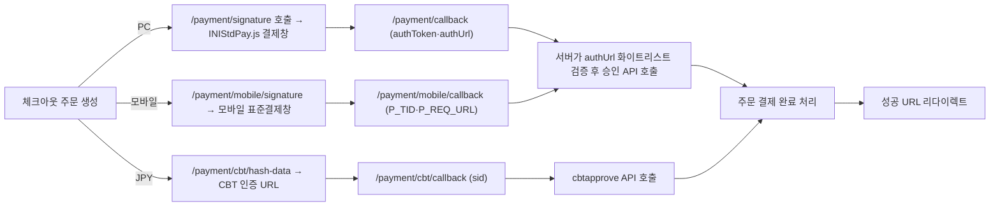

# 그누보드7 KG 이니시스 플러그인

**그누보드7 플러그인 · sirsoft-pay_kginicis**
KG 이니시스 표준결제를 sirsoft-ecommerce 에 연결하는 결제 플러그인

<!-- @generated:badges START — ext:docgen 이 갱신. 이 블록 안은 직접 수정하지 않는다 -->
<p align="center">
  
  
  
  
  
</p>
<!-- @generated:badges END -->

---

[소개](#소개) · [주요 기능](#주요-기능) · [동작 방식](#동작-방식) · [요구 사항](#요구-사항) · [설치](#설치) · [관리자 설정](#관리자-설정) · [사용 방법](#사용-방법) · [다른 확장과의 연동](#다른-확장과의-연동) · [문서](#문서) · [트러블슈팅](#트러블슈팅) · [변경 이력](#변경-이력) · [라이선스](#라이선스)

---

## 소개

<!-- @intent START -->
KG 이니시스 표준결제를 그누보드7 `sirsoft-ecommerce` 모듈에 연결하는 결제 플러그인입니다. PC 결제는
`INIStdPay.js` 표준결제창을, 모바일 결제는 모바일 표준결제창으로 이동한 뒤 서버 승인 API로
최종 승인하는 흐름을 씁니다. 일본 엔(JPY) 결제는 별도의 KG 이니시스 CBT(JPPG) 흐름을 씁니다.

이 플러그인은 결제 자체의 상태(주문·결제 성공/실패/취소)를 소유하지 않습니다 — 그 상태는
`sirsoft-ecommerce`의 주문·결제 테이블에 있고, 이 플러그인은 "그 상태를 KG 이니시스 API 와
어떻게 주고받는가"만 책임집니다. 그래서 이 플러그인은 소유 테이블/모델이 하나도 없습니다
(§data-model.md).
<!-- @intent END -->

## 주요 기능

<!-- @intent START -->
| 영역 | 설명 |
|---|---|
| 결제수단 | 신용카드, 계좌이체, 가상계좌, 휴대폰결제 |
| 간편결제 | 삼성페이, L.pay, 카카오페이 버튼 주입 (다른 PG가 기본이어도 노출 가능) |
| 가상계좌 | 발급 + PC/모바일 입금통보 처리 |
| 에스크로 | 결제, 배송 등록, 구매결정, 구매거절확인 연동 |
| 결제 취소 | 전액/부분취소, PG 취소 확인 시점 별도 활동 로그(PG 응답 시각·취소 TID) |
| 영수증 | 주문 완료/마이페이지 영수증 버튼, 현금영수증 발급/취소(이커머스 공용 프로바이더) |
| 관리자 확장 | 주문 상세 거래 조회, 에스크로 처리 UI |
| 일본 결제(CBT) | 인증/승인, 테스트 상품 생성, 연결 진단 |
| 보안 | 승인 URL 화이트리스트, 콜백 재처리 방지, 타임스탬프 신선도 검증 |
<!-- @intent END -->

## 동작 방식

<!-- @intent START -->


승인 후 로컬 처리가 실패하면 PC/모바일은 각각 netCancel/취소 API로, CBT는 CBT 전용 취소
API로 자동 취소를 시도합니다(자동 취소까지 실패하면 수동 취소가 필요하다는 오류 로그를
남깁니다) — "PG 는 승인됐는데 우리 시스템은 실패"라는 상태가 남지 않도록 하기 위함입니다.

가상계좌는 결제창에서 발급되면 주문이 입금대기 상태로 유지되다가, KG 이니시스가 입금통보
URL로 결과를 POST 하면 거래번호 재처리·금액 검증 후 결제 완료 처리됩니다. PC/모바일 입금통보는
URL이 다르지만 같은 IP 화이트리스트 미들웨어를 거칩니다.

일본 CBT 는 카드/PayPay는 즉시 승인 후 완료 처리되고, 편의점(CVS) 결제는 입금대기로 저장된 뒤
`/payment/cbt/cvs-notify` 수신 시 완료 처리됩니다. JPY 주문은 일본 결제 설정이 완료된 경우에만
CBT 결제창으로 진입하며, 설정이 부족하면 한국 표준결제로 대체하지 않고 결제 자체를 중단합니다.
<!-- @intent END -->

## 요구 사항

<!-- @generated:requirements START — ext:docgen 이 갱신. 이 블록 안은 직접 수정하지 않는다 -->
| 항목 | 값 |
|---|---|
| 그누보드7 코어 | `>=7.0.10` |
| PHP | `^8.2` |
| 의존 모듈 | `sirsoft-ecommerce` `>=1.1.0` |
| 외부 스크립트 호스트 | `stgstdpay.inicis.com`, `stdpay.inicis.com` |
<!-- @generated:requirements END -->

<!-- @intent START -->
| 항목 | 필요한 것 |
|---|---|
| 운영 환경 | HTTPS 도메인, 올바른 `APP_URL`, KG 이니시스 가맹점 계약 정보 |
| PC 결제 | MID, signKey |
| 모바일 결제 | MID, 모바일 hash key |
| 취소/거래조회/현금영수증 | INIAPI key, INIAPI IV |
| 일본 CBT | 별도 일본 결제 MID, CBT hash key |

서버에서 KG 이니시스 결제/INIAPI/CBT 호스트로 HTTPS outbound 요청이 가능해야 합니다. CBT
테스트 환경 `devcbt.inicis.com`은 KG 이니시스 측에 서버 egress IP 등록이 필요할 수 있습니다.
<!-- @intent END -->

## 설치

<!-- @generated:install START — ext:docgen 이 갱신. 이 블록 안은 직접 수정하지 않는다 -->
```bash
# 번들 설치 (코어에 동봉된 소스에서 설치)
php artisan plugin:install sirsoft-pay_kginicis

# 활성화
php artisan plugin:activate sirsoft-pay_kginicis

# 업데이트 (번들 소스 기준 강제 반영)
php artisan plugin:update sirsoft-pay_kginicis --force
```

저장소: https://github.com/gnuboard/g7-plugin-sirsoft-pay_kginicis
<!-- @generated:install END -->

설치·활성화 후 이커머스 결제 설정에서 PG 제공자를 "KG 이니시스"로 선택해야 실제로 결제
흐름에 연결됩니다 — 활성화만으로는 체크아웃 화면에 나타나지 않습니다.

## 관리자 설정

<!-- @generated:settings-summary START — ext:docgen 이 갱신. 이 블록 안은 직접 수정하지 않는다 -->
| 키 | 의미 | 기본값 |
|---|---|---|
| `is_test_mode` | 테스트 모드 | `true` |
| `test_mid` | 테스트 가맹점 ID (MID) | `INIpayTest` |
| `test_sign_key` | 테스트 사인키 | `SU5JTElURV9UUklQTEVERVNfS0VZU1RS` |
| `test_iniapi_key` | 테스트 INIAPI 키 | `ItEQKi3rY7uvDS8l` |
| `test_iniapi_iv` | 테스트 INIAPI IV | `HYb3yQ4f65QL89==` |
| `live_mid` | 라이브 가맹점 ID (MID) | - |
| `live_sign_key` | 라이브 사인키 | - |
| `live_iniapi_key` | 라이브 INIAPI 키 | - |
| `live_iniapi_iv` | 라이브 INIAPI IV | - |
| `test_mobile_hash_key` | 테스트 모바일 해시키 | `3CB8183A4BE283555ACC8363C0360223` |
| `live_mobile_hash_key` | 라이브 모바일 해시키 | - |
| `use_escrow` | 에스크로 결제 활성화 | `false` |
| `japan_enabled` | 일본 결제 활성화 | `false` |
| `japan_restrict_jpy_payment_methods` | JPY 주문 결제수단 제한 | `false` |
| `test_japan_sign_key` | 테스트 일본 CBT 해시키 | `5AL5Djb1Ipualn0F` |
| `live_japan_mid` | 라이브 일본 MID | - |
| `live_japan_sign_key` | 라이브 일본 CBT 해시키 | - |
| `japan_merchant_name` | 일본 결제 가맹점명 | `サンプルストア` |
| `japan_merchant_name_kana` | 일본 결제 가맹점명 Kana | `サンプルストア` |
| `japan_merchant_name_alphabet` | 일본 결제 가맹점명 영문 | `Sample Store` |
| `japan_merchant_name_short` | 일본 결제 가맹점 약칭 | `サンプル` |
| `japan_contact_name` | 일본 결제 문의처명 | `サポート窓口` |
| `japan_contact_email` | 일본 결제 문의 이메일 | `support@example.com` |
| `japan_contact_phone` | 일본 결제 문의 전화번호 | `0120-123-456` |
| `japan_contact_opening_hours` | 일본 결제 문의 영업시간 | `10:00-18:00` |
| `redirect_success_url` | 결제 성공 리다이렉트 URL | `{shopBase}/orders/{orderId}/complete` |
| `redirect_fail_url` | 결제 실패 리다이렉트 URL | `{shopBase}/checkout` |
| `easy_pay_allow_with_other_pg` | 타 PG와 사용가능함 | `false` |
| `easy_pay_samsung_pay` | KG이니시스 삼성페이 사용 | `false` |
| `easy_pay_naverpay` | KG이니시스 네이버페이 사용 | `false` |
| `easy_pay_show_brand_button` | 간편결제 브랜드 버튼 표시 | `false` |
| `easy_pay_lpay` | KG이니시스 L.pay 사용 | `false` |
| `easy_pay_kakaopay` | KG이니시스 카카오페이 사용 | `false` |
| `use_credit_point` | 신용카드 포인트 사용 | `false` |

개발자용 상세(타입·검증·저장 위치)는 [설정 스키마](docs/settings.md#설정-스키마) 를 보세요.
<!-- @generated:settings-summary END -->

<!-- @intent START -->
테스트 모드에서는 실제 카드 승인/출금 알림이 발생할 수 있으며, 테스트 거래는 매일
23:00~23:50 사이 자동 취소될 수 있습니다 — **테스트 모드 주문을 실제로 배송하지 마세요.**
운영 키(라이브 사인키·INIAPI 키/IV·모바일/CBT 해시키)는 외부에 노출하지 말고, 배포 전
테스트 모드가 의도한 값인지 반드시 확인하세요.

라이브 MID는 `SIR` 접두사 없이 입력해도 플러그인이 자동 보정합니다. 에스크로는 PC의
`acceptmethod`에 `useescrow`를, 모바일은 `P_RESERVED`에 `useescrow=Y`를 추가하는 방식으로
켜집니다. 일본 결제를 운영 모드로 켜려면 라이브 일본 MID/CBT 해시키와 실제 JPPG 가맹점
표시 정보가 필요합니다 — 기본 샘플값이 남아 있으면 설정 저장 단계에서 차단됩니다.

**콜백/통보 URL 등록** — KG 이니시스 가맹점 관리자에 아래 URL을 실제 운영 도메인으로 등록합니다.

| 용도 | URL |
|---|---|
| PC 결제 결과 Return URL | `https://{도메인}/plugins/sirsoft-pay_kginicis/payment/callback` |
| PC 가상계좌 입금통보 URL | `https://{도메인}/plugins/sirsoft-pay_kginicis/payment/vbank-notify` |
| 모바일 결제 결과 `P_NEXT_URL` | `https://{도메인}/plugins/sirsoft-pay_kginicis/payment/mobile/callback` |
| 모바일 가상계좌 입금통보 URL | `https://{도메인}/plugins/sirsoft-pay_kginicis/payment/mobile/vbank-notify` |
| CBT 콜백 URL | `https://{도메인}/plugins/sirsoft-pay_kginicis/payment/cbt/callback` |
| CBT 편의점 입금 NOTI URL | `https://{도메인}/plugins/sirsoft-pay_kginicis/payment/cbt/cvs-notify` |
| 에스크로 구매결정 화면 | `https://{도메인}/plugins/sirsoft-pay_kginicis/payment/escrow-confirm/{orderNumber}` |

가상계좌 입금통보 URL은 KG 이니시스 서버가 직접 호출하므로 운영 환경에서 IP 화이트리스트가
적용됩니다(`203.238.37.15`, `39.115.212.9`, `118.129.210.25`, `183.109.71.153` — 운영 전
KG 이니시스 최신 연동 가이드로 다시 확인하세요). `local`/`testing` 환경에서는 개발·테스트를
위해 이 제한을 우회합니다.
<!-- @intent END -->

## 사용 방법

<!-- @intent START -->
**결제 취소/부분취소**: 관리자가 주문 취소를 요청(`cancel_pg=true`)하면 코어가
`sirsoft-ecommerce.payment.refund` 필터 훅을 발화하고, 이 플러그인의 `PaymentRefundListener`
가 KG 이니시스 취소/부분취소 API를 호출합니다(전액취소는 `cancelPrice=null` +
`totalAmount=null`, 부분취소는 취소 금액 + 원래 결제금액). 배송비가 포함된 주문은 전체취소 시
배송비도 함께 환불 레코드에 반영되고, 쿠폰이 적용된 주문은 실결제금액(쿠폰 차감 후)이 PG
취소 금액으로 전달됩니다. 부분취소로 쿠폰 최소 주문금액 조건을 더 이상 충족하지 못하면
코어가 취소 자체를 거부(422)해 PG 호출이 아예 발생하지 않습니다. KG 이니시스 API 호출이
실패하면 주문 상태 변경이 롤백됩니다.

**에스크로 처리**: 에스크로 결제 완료 후 관리자 주문 상세에서 배송 등록을 호출할 수 있고,
사용자는 에스크로 구매결정 화면에서 구매확인을 진행합니다. 구매거절이 발생한 주문은 관리자
주문 상세에서 구매거절확인을 호출할 수 있습니다.

**CBT 연결 진단**: 일본 결제 테스트가 실패하면 관리자 CBT 연결 진단(§API)에서 서버 egress
IP와 `devcbt.inicis.com` 443 연결 상태를 먼저 확인합니다.

전체 API 목록(사용자/관리자)은 [docs/api/](docs/api/README.md) 를, 발행/구독 훅 목록은
[docs/extension-points.md](docs/extension-points.md) 를 참고하세요.
<!-- @intent END -->

## 다른 확장과의 연동

<!-- @generated:integrations START — ext:docgen 이 갱신. 이 블록 안은 직접 수정하지 않는다 -->
**이 확장이 의존하는 확장**

| 확장 | 유형 | 버전 제약 | 번들 |
|---|---|---|---|
| `sirsoft-ecommerce` | 모듈 | `>=1.1.0` | ✅ |

**이 확장에 의존하는 확장** (이 확장을 비활성화하면 함께 영향을 받습니다)

없음.
<!-- @generated:integrations END -->

<!-- @intent START -->
`RegisterPgProviderListener`가 이 플러그인을 이커머스의 PG 제공자 레지스트리에, `RegisterCashReceiptProviderListener`
가 현금영수증 프로바이더 레지스트리에 각각 등록합니다 — PG 결제사 선택과 현금영수증 발급사
선택은 서로 독립적이라, 다른 PG를 쓰면서도 KG 이니시스로 현금영수증만 발급하는 조합이
가능합니다.
<!-- @intent END -->

## 문서

<!-- @generated:docs-index START — ext:docgen 이 갱신. 이 블록 안은 직접 수정하지 않는다 -->
| 문서 | 내용 | 상태 |
|---|---|---|
| [docs/README.md](docs/README.md) | 문서 통합 목차와 실측 집계 | ✅ |
| [docs/architecture.md](docs/architecture.md) | 설계 의도·계층 지도·디렉토리 맵 | ✅ |
| [docs/extension-points.md](docs/extension-points.md) | 발행/구독 훅·미들웨어·채널·스케줄 | ✅ |
| [docs/data-model.md](docs/data-model.md) | 모델·소유 테이블·마이그레이션·Enum | ✅ |
| [docs/settings.md](docs/settings.md) | 설정 스키마·권한·메뉴·라우트·의존 관계 | ✅ |
| [docs/frontend.md](docs/frontend.md) | 레이아웃·액션 핸들러·전역 진입점·에셋 | ✅ |
| [docs/editor-spec.md](docs/editor-spec.md) | 레이아웃 편집기에 선언한 팔레트·컨트롤·샘플 데이터 | ✅ |
| [docs/api/](docs/api/README.md) | API 레퍼런스 (엔드포인트별 파라미터·응답 필드) | ✅ |
| [CHANGELOG.md](CHANGELOG.md) | 변경 이력 | ✅ |
<!-- @generated:docs-index END -->

## 트러블슈팅

<!-- @intent START -->
| 증상 | 원인 | 조치 |
|---|---|---|
| 가상계좌 입금통보가 반영되지 않음 | 운영 환경 IP 화이트리스트에 KG 이니시스 통보 서버 IP가 없음 | 최신 연동 가이드의 통보 서버 IP로 화이트리스트를 갱신 |
| 결제 승인 후 주문이 실패 상태로 남음 | 로컬 후속 처리 실패 후 자동 취소(망취소/취소 API)까지 실패 | 오류 로그의 안내대로 수동 취소 진행 — PG 승인은 이미 됐을 수 있음 |
| 일본 결제창이 안 열리고 결제가 중단됨 | 일본 결제 설정(라이브 MID/해시키/가맹점 정보) 미완료 | 설정을 완료하거나, 완료 전까지는 JPY 주문을 받지 않음 — 한국 표준결제로 자동 대체되지 않음 |
| CBT 테스트가 계속 실패함 | 서버 egress IP 미등록 또는 방화벽으로 443 포트 차단 | 관리자 CBT 연결 진단 실행 후 KG 이니시스에 서버 IP 등록 요청 |
| 결제 성공했는데 간편결제 버튼 클릭 시 오류 | KG 이니시스 계약이 없는 결제수단/간편결제를 활성화 | 계약이 완료된 결제수단만 관리자 설정에서 활성화 |
<!-- @intent END -->

## 변경 이력

[CHANGELOG.md](CHANGELOG.md)

## 라이선스

MIT
