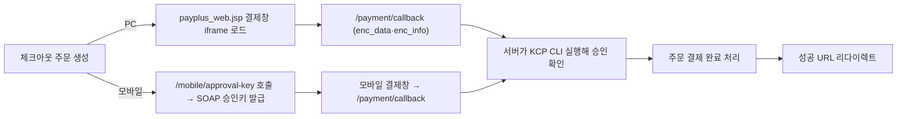

# 그누보드7 NHN KCP 플러그인

**그누보드7 플러그인 · sirsoft-pay_nhnkcp**
NHN KCP Standard Pay 결제를 sirsoft-ecommerce 에 연결하는 결제 플러그인

<!-- @generated:badges START — ext:docgen 이 갱신. 이 블록 안은 직접 수정하지 않는다 -->
<p align="center">
  
  
  
  
  
</p>
<!-- @generated:badges END -->

---

[소개](#소개) · [주요 기능](#주요-기능) · [동작 방식](#동작-방식) · [요구 사항](#요구-사항) · [설치](#설치) · [관리자 설정](#관리자-설정) · [사용 방법](#사용-방법) · [다른 확장과의 연동](#다른-확장과의-연동) · [문서](#문서) · [트러블슈팅](#트러블슈팅) · [변경 이력](#변경-이력) · [라이선스](#라이선스)

---

## 소개

<!-- @intent START -->
NHN KCP Standard Pay 결제를 그누보드7 `sirsoft-ecommerce` 모듈에 연결하는 결제 플러그인입니다. PC
결제는 `payplus_web.jsp` 결제창 + 서버의 KCP CLI 승인 모듈을, 모바일 결제는 SmartPhone Pay
SOAP 승인키 발급 + 모바일 결제창을 씁니다.

`sirsoft-pay_kginicis`와 마찬가지로 이 플러그인은 결제 자체의 상태(주문·결제 성공/실패/취소)를
소유하지 않습니다 — 그 상태는 `sirsoft-ecommerce`의 주문·결제 테이블에 있고, 이 플러그인은
"그 상태를 KCP CLI/SOAP API 와 어떻게 주고받는가"만 책임집니다(§data-model.md). 다른 PG
플러그인과 구별되는 이 플러그인만의 특징은 PC 결제 최종 승인이 HTTP API 호출이 아니라
**서버에서 실행하는 CLI 바이너리**라는 점입니다 — KCP 가 표준결제 승인 로직을 컴파일된
실행파일로만 배포하기 때문입니다.
<!-- @intent END -->

## 주요 기능

<!-- @intent START -->
| 영역 | 설명 |
|---|---|
| 결제수단 | 신용카드, 계좌이체, 가상계좌, 휴대폰결제 |
| 간편결제 | PAYCO, 네이버페이, 네이버페이 포인트, 카카오페이, Apple Pay 버튼 주입 |
| PC 결제 | `payplus_web.jsp` 표준결제창 + 서버 KCP CLI 승인 |
| 모바일 결제 | SmartPhone Pay SOAP 승인키 발급 + 모바일 결제창 |
| 가상계좌 | 발급, 입금통보, 테스트 모드 모의입금 |
| 에스크로 | 결제, 배송 등록, 공통통보(구매확인/구매취소/구매취소확인/배송시작) |
| 결제 취소 | 전액/부분취소, PG 취소 확인 시점 별도 활동 로그(PG 응답 시각·취소 거래번호) |
| 영수증 | 주문 완료/마이페이지 영수증, 현금영수증 조회 버튼 |
| 관리자 확장 | 주문 상세 KCP 거래 정보 표시, KCP 실행 환경(CLI/SOAP) 점검 |
<!-- @intent END -->

## 동작 방식

<!-- @intent START -->


PC 결제 승인은 `NhnKcpApiService`가 OS 를 판별해 `pp_cli`/`pp_cli_x64`/`pp_cli_exe.exe` 중
하나를 `exec()`로 실행하는 방식입니다. 모든 CLI 인자는 `assertSafeCliValue()`로 위험
문자·제어문자를 사전 거부한 뒤 `escapeshellarg()`로 quoting 합니다 — KCP 응답값을 검증 없이
셸 명령에 넣으면 명령 삽입(command injection) 통로가 됩니다. `PreventsReplayCallback`
트레이트가 콜백 진입 시점에 동일 거래번호가 이미 결제완료 상태인지 확인해 중복 처리를
막습니다.

가상계좌는 결제창에서 발급되면 주문이 입금대기 상태로 유지되다가, KCP 가 입금통보 URL로
결과를 POST 하면 금액 검증 후 결제 완료 처리됩니다. 에스크로는 KCP 공통통보의 `tx_cd`/
`cl_status` 조합을 해석해 구매확인/구매취소/구매취소확인/배송시작 4가지 훅으로 분기
발화합니다.
<!-- @intent END -->

## 요구 사항

<!-- @generated:requirements START — ext:docgen 이 갱신. 이 블록 안은 직접 수정하지 않는다 -->
| 항목 | 값 |
|---|---|
| 그누보드7 코어 | `>=7.0.10` |
| PHP | `^8.2` |
| 의존 모듈 | `sirsoft-ecommerce` `>=1.1.0` |
| 외부 스크립트 호스트 | `testpay.kcp.co.kr`, `pay.kcp.co.kr` |
<!-- @generated:requirements END -->

<!-- @intent START -->
| 항목 | 필요한 것 |
|---|---|
| PC 결제 | PHP `exec()` 사용 가능, KCP CLI 바이너리, `pub.key` |
| 모바일 결제 | PHP SOAP 확장, KCP WSDL 파일 |
| 운영 환경 | HTTPS 도메인, 올바른 `APP_URL`, KCP 가맹점 계약 정보 |

`bin/` 디렉토리에는 아래 파일이 필요합니다.

```text
bin/pp_cli
bin/pp_cli_x64
bin/pp_cli_exe.exe
bin/pub.key
bin/KCPPaymentService.wsdl
bin/real_KCPPaymentService.wsdl
```

Linux 서버에서는 현재 OS 아키텍처에 맞는 CLI 파일에 실행 권한이 필요합니다.

```bash
chmod 755 plugins/sirsoft-pay_nhnkcp/bin/pp_cli
chmod 755 plugins/sirsoft-pay_nhnkcp/bin/pp_cli_x64
```

관리자 설정 화면의 시스템 점검 API 와 결제 hot path 의 자가 복구(`ensureCliExecutable()`)가
실행 권한을 자동 복구할 수 있지만, 서버 권한 정책에 따라 직접 조치가 필요할 수 있습니다.
<!-- @intent END -->

## 설치

<!-- @generated:install START — ext:docgen 이 갱신. 이 블록 안은 직접 수정하지 않는다 -->
```bash
# 번들 설치 (코어에 동봉된 소스에서 설치)
php artisan plugin:install sirsoft-pay_nhnkcp

# 활성화
php artisan plugin:activate sirsoft-pay_nhnkcp

# 업데이트 (번들 소스 기준 강제 반영)
php artisan plugin:update sirsoft-pay_nhnkcp --force
```

저장소: https://github.com/gnuboard/g7-plugin-sirsoft-pay_nhnkcp
<!-- @generated:install END -->

설치·활성화 후 이커머스 결제 설정에서 PG 제공자를 "NHN KCP"로 선택해야 실제로 결제 흐름에
연결됩니다 — 활성화만으로는 체크아웃 화면에 나타나지 않습니다.

## 관리자 설정

<!-- @generated:settings-summary START — ext:docgen 이 갱신. 이 블록 안은 직접 수정하지 않는다 -->
| 키 | 의미 | 기본값 |
|---|---|---|
| `is_test_mode` | 테스트 모드 | `true` |
| `test_site_cd` | 테스트 사이트 코드 (site_cd) | `T0000` |
| `test_site_key` | 테스트 사이트 키 (site_key) | - |
| `live_site_cd` | 라이브 사이트 코드 (site_cd) | - |
| `live_site_key` | 라이브 사이트 키 (site_key) | - |
| `redirect_success_url` | 결제 성공 리다이렉트 URL | `{shopBase}/orders/{orderId}/complete` |
| `redirect_fail_url` | 결제 실패 리다이렉트 URL | `{shopBase}/checkout` |
| `use_escrow` | 에스크로 결제 활성화 | `false` |
| `escrow_test_site_cd` | 테스트 에스크로 사이트 코드 | - |
| `vbank_expire_days` | 가상계좌 입금 만료(일) | `3` |
| `easy_pay_allow_with_other_pg` | - | `false` |
| `easy_pay_payco` | - | `false` |
| `easy_pay_naverpay` | - | `false` |
| `easy_pay_naverpay_point` | - | `false` |
| `easy_pay_kakaopay` | - | `false` |
| `easy_pay_applepay` | - | `false` |

개발자용 상세(타입·검증·저장 위치)는 [설정 스키마](docs/settings.md#설정-스키마) 를 보세요.
<!-- @generated:settings-summary END -->

<!-- @intent START -->
라이브 사이트 키는 외부에 노출하지 마세요. 배포 전 테스트 모드가 의도한 값인지 반드시
확인하세요.

**콜백 및 통보 URL 등록** — KCP 가맹점 관리자에 아래 URL을 실제 운영 도메인으로 등록합니다.

| 용도 | URL |
|---|---|
| 결제 결과 Return URL | `https://{도메인}/plugins/sirsoft-pay_nhnkcp/payment/callback` |
| 가상계좌 입금통보 URL | `https://{도메인}/plugins/sirsoft-pay_nhnkcp/payment/vbank-notify` |
| 에스크로 공통통보 URL | `https://{도메인}/plugins/sirsoft-pay_nhnkcp/payment/escrow-common-notify` |

결제 결과 Return URL은 브라우저가 POST하는 경로이므로 IP 제한을 적용하지 않습니다. 가상계좌
입금통보와 에스크로 공통통보는 KCP 서버가 직접 호출하므로 운영 모드에서 아래 IP
화이트리스트를 적용합니다(테스트 모드에서는 개발·KCP testadmin 모의입금을 위해 우회).

| IP |
|----|
| `203.238.36.58` |
| `203.238.36.160` |
| `203.238.36.161` |
| `203.238.36.173` |
| `203.238.36.178` |
| `103.215.144.173` |
| `103.215.144.174` |
| `103.215.145.30` |
| `210.122.72.173` |

운영 전 KCP 가맹점 관리자와 최신 연동 가이드의 통보 서버 IP를 다시 확인하세요.
<!-- @intent END -->

## 사용 방법

<!-- @intent START -->
**결제 취소/부분취소**: 관리자가 주문 취소를 요청(`cancel_pg=true`)하면 코어가
`sirsoft-ecommerce.payment.refund` 필터 훅을 발화하고, 이 플러그인의 `PaymentRefundListener`
가 KCP 취소 API를 호출합니다(전액취소는 `isPartial=false`, 부분취소는 `isPartial=true` +
원래 결제금액). 배송비가 포함된 주문은 전체취소 시 배송비도 함께 환불 레코드에 반영되고,
쿠폰이 적용된 주문은 실결제금액(쿠폰 차감 후)이 PG `cancelAmt`로 전달됩니다. 부분취소로
쿠폰 최소 주문금액 조건을 더 이상 충족하지 못하면 코어가 취소 자체를 거부(422)해 PG 호출이
아예 발생하지 않습니다. KCP API 호출이 실패하면 주문 상태 변경이 롤백됩니다.

**에스크로 처리**: 에스크로를 활성화하면 결제 요청에 `escw_used=Y`, `pay_mod=O`를
전달합니다. 에스크로 결제 완료 후 관리자 주문 상세에서 운송장번호와 택배사를 입력해 KCP
배송 등록을 호출할 수 있습니다. KCP 공통통보는 아래 이벤트를 처리합니다.

| tx_cd | 조건 | 처리 |
|-------|------|------|
| `TX02` | `cl_status=2` | 구매확인 훅 실행 |
| `TX02` | `cl_status=8` | 구매취소 훅 실행 |
| `TX02` | `cl_status=3` | 구매취소 확인 훅 실행 |
| `TX03` | - | 배송시작 훅 실행 |

**가상계좌 모의입금**: 테스트 모드에서는 마이페이지 주문 상세에 KCP testadmin 모의입금
폼이 표시될 수 있습니다.

전체 API 목록(사용자/관리자)은 [docs/api/](docs/api/README.md) 를, 발행/구독 훅 목록은
[docs/extension-points.md](docs/extension-points.md) 를 참고하세요.
<!-- @intent END -->

## 다른 확장과의 연동

<!-- @generated:integrations START — ext:docgen 이 갱신. 이 블록 안은 직접 수정하지 않는다 -->
**이 확장이 의존하는 확장**

| 확장 | 유형 | 버전 제약 | 번들 |
|---|---|---|---|
| `sirsoft-ecommerce` | 모듈 | `>=1.1.0` | ✅ |

**이 확장에 의존하는 확장** (이 확장을 비활성화하면 함께 영향을 받습니다)

없음.
<!-- @generated:integrations END -->

<!-- @intent START -->
`RegisterPgProviderListener`가 이 플러그인을 이커머스의 PG 제공자 레지스트리에,
`RegisterEasyPayMethodsListener`가 간편결제 결제수단 레지스트리에 각각 등록합니다 — PG
결제사 선택과 간편결제 노출은 서로 독립적이라, 다른 PG가 기본값이어도 KCP 간편결제 버튼을
체크아웃 화면에 노출하는 조합이 가능합니다(`easy_pay_allow_with_other_pg`).
<!-- @intent END -->

## 문서

<!-- @generated:docs-index START — ext:docgen 이 갱신. 이 블록 안은 직접 수정하지 않는다 -->
| 문서 | 내용 | 상태 |
|---|---|---|
| [docs/README.md](docs/README.md) | 문서 통합 목차와 실측 집계 | ✅ |
| [docs/architecture.md](docs/architecture.md) | 설계 의도·계층 지도·디렉토리 맵 | ✅ |
| [docs/extension-points.md](docs/extension-points.md) | 발행/구독 훅·미들웨어·채널·스케줄 | ✅ |
| [docs/data-model.md](docs/data-model.md) | 모델·소유 테이블·마이그레이션·Enum | ✅ |
| [docs/settings.md](docs/settings.md) | 설정 스키마·권한·메뉴·라우트·의존 관계 | ✅ |
| [docs/frontend.md](docs/frontend.md) | 레이아웃·액션 핸들러·전역 진입점·에셋 | ✅ |
| [docs/editor-spec.md](docs/editor-spec.md) | 레이아웃 편집기에 선언한 팔레트·컨트롤·샘플 데이터 | ✅ |
| [docs/api/](docs/api/README.md) | API 레퍼런스 (엔드포인트별 파라미터·응답 필드) | ✅ |
| [CHANGELOG.md](CHANGELOG.md) | 변경 이력 | ✅ |
<!-- @generated:docs-index END -->

## 트러블슈팅

<!-- @intent START -->
| 증상 | 원인 | 조치 |
|---|---|---|
| 결제 승인 시 res_cd=9502 오류 | `plugin:update` 가 CLI 바이너리 실행 권한을 0664 로 되돌림 | 관리자 설정 화면의 시스템 점검을 실행하거나 `chmod 755` 로 직접 복구 |
| 가상계좌 입금통보가 반영되지 않음 | 운영 환경 IP 화이트리스트에 KCP 통보 서버 IP가 없음 | 최신 연동 가이드의 통보 서버 IP로 화이트리스트를 갱신 |
| 결제 요청이 CLI 인자 오류로 거부됨 | 주문번호·인코딩 데이터 등에 위험 문자/제어문자 포함 | `assertSafeCliValue()`가 의도적으로 거부한 것 — 원인 값을 정제하지 말고 왜 그런 값이 만들어졌는지 상위 데이터를 확인 |
| 모바일 결제 승인키 발급 실패 | PHP SOAP 확장 미설치 또는 WSDL 파일 누락 | `php -m`으로 soap 확장 확인, `bin/*.wsdl` 존재 확인 |
| 결제 성공했는데 간편결제 버튼 클릭 시 오류 | KCP 계약이 없는 결제수단/간편결제를 활성화 | 계약이 완료된 결제수단만 관리자 설정에서 활성화 |
<!-- @intent END -->

## 변경 이력

[CHANGELOG.md](CHANGELOG.md)

## 라이선스

MIT
