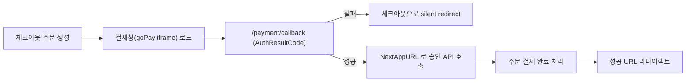

# 그누보드7 나이스페이먼츠 플러그인

**그누보드7 플러그인 · sirsoft-pay_nicepayments**
나이스페이먼츠 결제를 sirsoft-ecommerce 에 연결하는 결제 플러그인

<!-- @generated:badges START — ext:docgen 이 갱신. 이 블록 안은 직접 수정하지 않는다 -->
<p align="center">
  
  
  
  
  
</p>
<!-- @generated:badges END -->

---

[소개](#소개) · [주요 기능](#주요-기능) · [동작 방식](#동작-방식) · [요구 사항](#요구-사항) · [설치](#설치) · [관리자 설정](#관리자-설정) · [사용 방법](#사용-방법) · [다른 확장과의 연동](#다른-확장과의-연동) · [문서](#문서) · [트러블슈팅](#트러블슈팅) · [변경 이력](#변경-이력) · [라이선스](#라이선스)

---

## 소개

<!-- @intent START -->
나이스페이먼츠(NicePayments) 표준결제를 그누보드7 `sirsoft-ecommerce` 모듈에 연결하는 결제
플러그인입니다. 결제 승인은 **인증→승인 2단계**로 나뉩니다 — 결제창(`goPay` iframe
팝업/모바일 폼)이 먼저 인증 결과를 서버로 보내고, 서버가 그 결과를 받아 별도 승인 API를
호출해야 최종 완료됩니다.

이 플러그인은 결제 자체의 상태(주문·결제 성공/실패/취소)를 소유하지 않습니다 — 그 상태는
`sirsoft-ecommerce`의 주문·결제 테이블에 있고, 이 플러그인은 "그 상태를 나이스페이먼츠
API 와 어떻게 주고받는가"만 책임집니다. 그래서 이 플러그인은 소유 테이블/모델이 하나도
없습니다(§data-model.md).
<!-- @intent END -->

## 주요 기능

<!-- @intent START -->
| 영역 | 설명 |
|---|---|
| 결제수단 | 신용카드, 계좌이체, 가상계좌, 휴대폰결제 |
| 간편결제 | 네이버페이, 카카오페이, 삼성페이, 애플페이, PAYCO, 11pay, SSG페이, L.pay 버튼 주입 |
| 승인 방식 | 결제창 인증 + 서버 승인 API 2단계 |
| 가상계좌 | 발급 + 입금통보 처리 |
| 에스크로 | 배송 등록, 거래 조회 |
| 결제 취소 | 전액/부분취소, PG 취소 확인 시점 별도 활동 로그(PG 응답 시각·취소 TID), 실패 시 `refund_failed` 훅 |
| 영수증 | 주문 완료/마이페이지 영수증 버튼 |
| 관리자 확장 | 주문 상세 거래 조회, 에스크로 배송 등록 UI |
| 과세 처리 | 주문의 세금/부가세/면세 금액 자동 반영 |
<!-- @intent END -->

## 동작 방식

<!-- @intent START -->


결제창에서 사용자가 취소하거나 PG 가 인증을 거부하면(`AuthResultCode != '0000'`) 아직
승인 API 호출 전이므로 일반 오류 메시지를 띄우지 않고 체크아웃으로 조용히 리다이렉트합니다
— 운영 가시성은 로그(`auth_result_code`/`auth_result_msg`)로 보존합니다. 2단계(승인) 이후의
실패(서명/MID/금액 불일치)는 `?error=` 쿼리로 명시적으로 안내합니다.

가상계좌는 결제창에서 발급되면 주문이 입금대기 상태로 유지되다가, 나이스페이먼츠가 입금통보
URL로 결과를 POST 하면 결제 완료 처리됩니다.
<!-- @intent END -->

## 요구 사항

<!-- @generated:requirements START — ext:docgen 이 갱신. 이 블록 안은 직접 수정하지 않는다 -->
| 항목 | 값 |
|---|---|
| 그누보드7 코어 | `>=7.0.10` |
| PHP | `^8.2` |
| 의존 모듈 | `sirsoft-ecommerce` `>=1.1.0` |
| 외부 스크립트 호스트 | `web.nicepay.co.kr` |
<!-- @generated:requirements END -->

<!-- @intent START -->
| 항목 | 필요한 것 |
|---|---|
| 운영 환경 | HTTPS 도메인, 올바른 `APP_URL`, 나이스페이먼츠 가맹점 계약 정보 |
| PC/모바일 결제 | MID, 가맹점 키 |

서버에서 나이스페이먼츠 API 호스트로 HTTPS outbound 요청이 가능해야 합니다.
<!-- @intent END -->

## 설치

<!-- @generated:install START — ext:docgen 이 갱신. 이 블록 안은 직접 수정하지 않는다 -->
```bash
# 번들 설치 (코어에 동봉된 소스에서 설치)
php artisan plugin:install sirsoft-pay_nicepayments

# 활성화
php artisan plugin:activate sirsoft-pay_nicepayments

# 업데이트 (번들 소스 기준 강제 반영)
php artisan plugin:update sirsoft-pay_nicepayments --force
```

저장소: https://github.com/gnuboard/g7-plugin-sirsoft-pay_nicepayments
<!-- @generated:install END -->

설치·활성화 후 이커머스 결제 설정에서 PG 제공자를 "나이스페이먼츠"로 선택해야 실제로 결제
흐름에 연결됩니다 — 활성화만으로는 체크아웃 화면에 나타나지 않습니다.

## 관리자 설정

<!-- @generated:settings-summary START — ext:docgen 이 갱신. 이 블록 안은 직접 수정하지 않는다 -->
| 키 | 의미 | 기본값 |
|---|---|---|
| `is_test_mode` | 테스트 모드 | `true` |
| `test_mid` | 테스트 가맹점 ID (MID) | `nicepay00m` |
| `test_merchant_key` | 테스트 가맹점 키 | `EYzu8jGGMfqaDEp76gSckuvnaHHu+bC4opsSN6lHv3b2lurNYkVXrZ7Z1AoqQnXI3eLuaUFyoRNC6FkrzVjceg==` |
| `live_mid` | 라이브 가맹점 ID (MID) | - |
| `live_merchant_key` | 라이브 가맹점 키 | - |
| `redirect_success_url` | 결제 성공 리다이렉트 URL | `{shopBase}/orders/{orderId}/complete` |
| `redirect_fail_url` | 결제 실패 리다이렉트 URL | `{shopBase}/checkout` |
| `use_escrow` | 에스크로 결제 사용 | `false` |
| `easy_pay_allow_with_other_pg` | 타 PG와 사용가능함 | `false` |
| `easy_pay_naverpay` | 네이버페이 간편결제 | `false` |
| `easy_pay_kakaopay` | 카카오페이 간편결제 | `false` |
| `easy_pay_samsungpay` | 삼성페이 간편결제 | `false` |
| `easy_pay_applepay` | 애플페이 간편결제 | `false` |
| `easy_pay_payco` | PAYCO 간편결제 | `false` |
| `easy_pay_skpay` | 11pay (SK페이) 간편결제 | `false` |
| `easy_pay_ssgpay` | SSG페이 간편결제 | `false` |
| `easy_pay_lpay` | L.pay 간편결제 | `false` |

개발자용 상세(타입·검증·저장 위치)는 [설정 스키마](docs/settings.md#설정-스키마) 를 보세요.
<!-- @generated:settings-summary END -->

<!-- @intent START -->
테스트 모드에서는 실제 카드 승인/출금 알림이 발생할 수 있으며, 테스트 계정 결제는 당일
23:30경 일괄 자동 취소될 수 있습니다 — **테스트 모드 주문을 실제로 배송하지 마세요.** 라이브
가맹점 키는 외부에 노출하지 마세요.

**웹훅(가상계좌 입금 통보)** — 나이스페이먼츠 관리자에 아래 URL을 실제 운영 도메인으로
등록합니다.

```text
https://your-domain.com/plugins/sirsoft-pay_nicepayments/payment/vbank-notify
```

가상계좌 입금 통보는 나이스페이먼츠 서버가 직접 호출하므로 아래 IP 화이트리스트가
적용됩니다(로컬/테스트 환경에서는 자동 우회).

| IP |
|----|
| `121.133.126.10` |
| `121.133.126.11` |
| `211.33.136.39` |
<!-- @intent END -->

## 사용 방법

<!-- @intent START -->
**결제 취소/부분취소**: 관리자가 주문 취소를 요청(`cancel_pg=true`)하면 코어가
`sirsoft-ecommerce.payment.refund` 필터 훅을 발화하고, `PaymentRefundListener`가
나이스페이먼츠 취소 API를 호출합니다(전액취소 `isPartial=0`/부분취소 `isPartial=1`).
배송비가 포함된 주문은 전체취소 시 배송비도 함께 환불 레코드에 반영되고, 쿠폰이 적용된
주문은 실결제금액(쿠폰 차감 후)이 PG `cancelAmt`로 전달됩니다. 부분취소로 쿠폰 최소
주문금액 조건을 더 이상 충족하지 못하면 코어가 취소 자체를 거부(422)해 PG 호출이 아예
발생하지 않습니다. 가상계좌 입금 완료 건은 환불 계좌 정보가 필요해 일반 취소 API가 아닌
별도 어드민 환불 계좌 API 경로로 처리됩니다.

**에스크로 배송 등록**: 관리자 주문 상세에서 운송장번호·택배사를 입력해 나이스페이먼츠
배송 등록을 호출할 수 있습니다.

**거래 단건 조회**: `NicePaymentsApiService::queryTransaction(string $tid): array`로 거래
상태를 조회할 수 있습니다.

전체 API 목록(사용자/관리자)은 [docs/api/](docs/api/README.md) 를, 발행/구독 훅 목록은
[docs/extension-points.md](docs/extension-points.md) 를 참고하세요.
<!-- @intent END -->

## 다른 확장과의 연동

<!-- @generated:integrations START — ext:docgen 이 갱신. 이 블록 안은 직접 수정하지 않는다 -->
**이 확장이 의존하는 확장**

| 확장 | 유형 | 버전 제약 | 번들 |
|---|---|---|---|
| `sirsoft-ecommerce` | 모듈 | `>=1.1.0` | ✅ |

**이 확장에 의존하는 확장** (이 확장을 비활성화하면 함께 영향을 받습니다)

없음.
<!-- @generated:integrations END -->

<!-- @intent START -->
`RegisterPgProviderListener`가 이 플러그인을 이커머스의 PG 제공자 레지스트리에,
`RegisterEasyPayMethodsListener`가 간편결제 결제수단 레지스트리에 각각 등록합니다 — PG
결제사 선택과 간편결제 노출은 서로 독립적이라, 다른 PG가 기본값이어도 나이스페이먼츠
간편결제 버튼을 체크아웃 화면에 노출하는 조합이 가능합니다(`easy_pay_allow_with_other_pg`).
<!-- @intent END -->

## 문서

<!-- @generated:docs-index START — ext:docgen 이 갱신. 이 블록 안은 직접 수정하지 않는다 -->
| 문서 | 내용 | 상태 |
|---|---|---|
| [docs/README.md](docs/README.md) | 문서 통합 목차와 실측 집계 | ✅ |
| [docs/architecture.md](docs/architecture.md) | 설계 의도·계층 지도·디렉토리 맵 | ✅ |
| [docs/extension-points.md](docs/extension-points.md) | 발행/구독 훅·미들웨어·채널·스케줄 | ✅ |
| [docs/data-model.md](docs/data-model.md) | 모델·소유 테이블·마이그레이션·Enum | ✅ |
| [docs/settings.md](docs/settings.md) | 설정 스키마·권한·메뉴·라우트·의존 관계 | ✅ |
| [docs/frontend.md](docs/frontend.md) | 레이아웃·액션 핸들러·전역 진입점·에셋 | ✅ |
| [docs/editor-spec.md](docs/editor-spec.md) | 레이아웃 편집기에 선언한 팔레트·컨트롤·샘플 데이터 | ✅ |
| [docs/api/](docs/api/README.md) | API 레퍼런스 (엔드포인트별 파라미터·응답 필드) | ✅ |
| [CHANGELOG.md](CHANGELOG.md) | 변경 이력 | ✅ |
<!-- @generated:docs-index END -->

## 트러블슈팅

<!-- @intent START -->
| 증상 | 원인 | 조치 |
|---|---|---|
| 결제창에서 취소했는데 오류 화면이 뜸 | `AuthResultCode != '0000'` 분기가 silent redirect 대신 오류를 노출하도록 잘못 수정됨 | §동작 방식의 의도된 동작(조용히 체크아웃 복귀)으로 되돌리고 로그로만 확인 |
| 가상계좌 입금통보가 반영되지 않음 | 운영 환경 IP 화이트리스트에 나이스페이먼츠 통보 서버 IP가 없음 | 위 IP 목록으로 화이트리스트를 갱신 |
| 결제 승인 후 주문이 실패 상태로 남음 | 인증은 성공했지만 승인 API 호출 또는 로컬 후속 처리 실패 | 오류 로그 확인 — PG 승인은 이미 됐을 수 있으므로 수동 확인 필요 |
| 부분취소가 실패하고 422 응답 | 부분취소로 쿠폰 최소 주문금액 조건 미충족 | 코어가 의도적으로 거부한 것 — 쿠폰 조건을 다시 충족하거나 전액취소 |
| 결제 성공했는데 간편결제 버튼 클릭 시 오류 | 나이스페이먼츠 계약이 없는 결제수단/간편결제를 활성화 | 계약이 완료된 결제수단만 관리자 설정에서 활성화 |
<!-- @intent END -->

## 변경 이력

[CHANGELOG.md](CHANGELOG.md)

## 라이선스

MIT
