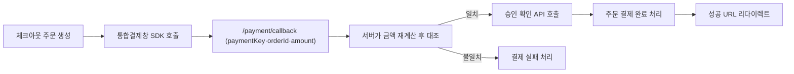

# 그누보드7 토스페이먼츠 플러그인

**그누보드7 플러그인 · sirsoft-tosspayments**
토스페이먼츠 결제 게이트웨이 (통합결제창 연동)

<!-- @generated:badges START — ext:docgen 이 갱신. 이 블록 안은 직접 수정하지 않는다 -->
<p align="center">
  
  
  
  
  
</p>
<!-- @generated:badges END -->

---

[소개](#소개) · [주요 기능](#주요-기능) · [동작 방식](#동작-방식) · [요구 사항](#요구-사항) · [설치](#설치) · [관리자 설정](#관리자-설정) · [사용 방법](#사용-방법) · [다른 확장과의 연동](#다른-확장과의-연동) · [문서](#문서) · [트러블슈팅](#트러블슈팅) · [변경 이력](#변경-이력) · [라이선스](#라이선스)

---

## 소개

<!-- @intent START -->
토스페이먼츠 통합결제창 결제를 그누보드7 `sirsoft-ecommerce` 모듈에 연결하는 결제 플러그인입니다.
승인은 브라우저 리다이렉트 기반입니다 — 결제창(SDK)이 결제를 처리한 뒤 브라우저를 콜백
URL로 돌려보내고, 서버가 그 파라미터로 승인 확인 API를 호출합니다.

이 플러그인은 결제창형(통합결제창 카드 하나)과 주문서형(개별 토스 결제수단 버튼) 두 UI
모드를 지원합니다. 결제 자체의 상태(주문·결제 성공/실패/취소)는 소유하지 않습니다 — 그
상태는 `sirsoft-ecommerce`의 주문·결제 테이블에 있고, 이 플러그인은 "그 상태를
토스페이먼츠 API 와 어떻게 주고받는가"만 책임집니다. 그래서 이 플러그인은 소유
테이블/모델이 하나도 없습니다(§data-model.md).
<!-- @intent END -->

## 주요 기능

<!-- @intent START -->
| 영역 | 설명 |
|---|---|
| 승인 방식 | 통합결제창 SDK + 브라우저 리다이렉트 콜백 + 서버 승인 확인 |
| UI 모드 | 결제창형(단일 카드) / 주문서형(개별 결제수단 버튼) 전환 |
| 결제수단 | 카드, 가상계좌, 계좌이체, 휴대폰, 토스페이, 카카오페이, 네이버페이, 페이코, 삼성페이 |
| 가상계좌 | 발급 + 웹훅 입금통보(secret 대조로 위조 방지) |
| 에스크로 | 3-상태(끔/켬/구매자선택) |
| 현금영수증 | 카드/계좌이체 발급·취소 프로바이더 등록 |
| 결제 취소 | 전액/부분취소, 실패 시 별도 훅 |
| 설정 저장 검증 | 가상계좌 유효시간·에스크로 값 서버측 범위 강제 |
<!-- @intent END -->

## 동작 방식

<!-- @intent START -->


가상계좌가 발급되면 승인 확인 응답에만 실리는 secret 값을 저장해 두었다가, 토스가 입금
웹훅을 보내면 그 secret 을 대조해 위조를 막습니다 — 토스는 notify IP 목록이나 서명을
제공하지 않아 이 방식이 공식적으로 제시되는 유일한 검증 수단입니다.
<!-- @intent END -->

## 요구 사항

<!-- @generated:requirements START — ext:docgen 이 갱신. 이 블록 안은 직접 수정하지 않는다 -->
| 항목 | 값 |
|---|---|
| 그누보드7 코어 | `>=7.0.10` |
| PHP | `^8.2` |
| 의존 모듈 | `sirsoft-ecommerce` `>=1.1.0` |
| 외부 스크립트 호스트 | `js.tosspayments.com` |
<!-- @generated:requirements END -->

## 설치

<!-- @generated:install START — ext:docgen 이 갱신. 이 블록 안은 직접 수정하지 않는다 -->
```bash
# 번들 설치 (코어에 동봉된 소스에서 설치)
php artisan plugin:install sirsoft-tosspayments

# 활성화
php artisan plugin:activate sirsoft-tosspayments

# 업데이트 (번들 소스 기준 강제 반영)
php artisan plugin:update sirsoft-tosspayments --force
```

저장소: https://github.com/gnuboard/g7-plugin-sirsoft-tosspayments
<!-- @generated:install END -->

## 관리자 설정

<!-- @generated:settings-summary START — ext:docgen 이 갱신. 이 블록 안은 직접 수정하지 않는다 -->
| 키 | 의미 | 기본값 |
|---|---|---|
| `is_test_mode` | 테스트 모드 | `true` |
| `test_client_key` | 테스트 클라이언트 키 | - |
| `test_secret_key` | 테스트 시크릿 키 | - |
| `live_client_key` | 라이브 클라이언트 키 | - |
| `live_secret_key` | 라이브 시크릿 키 | - |
| `redirect_success_url` | 결제 성공 리다이렉트 URL | `{shopBase}/orders/{orderId}/complete` |
| `redirect_fail_url` | 결제 실패 리다이렉트 URL | `{shopBase}/checkout` |
| `order_sheet_mode` | 주문서형 결제 | `false` |
| `method_card` | 카드 | `true` |
| `method_virtual_account` | 가상계좌 | `false` |
| `method_transfer` | 계좌이체 | `false` |
| `method_mobile_phone` | 휴대폰 | `false` |
| `method_tosspay` | 토스페이 | `false` |
| `method_kakaopay` | 카카오페이 | `false` |
| `method_naverpay` | 네이버페이 | `false` |
| `method_payco` | 페이코 | `false` |
| `method_samsungpay` | 삼성페이 | `false` |
| `vbank_valid_hours` | 가상계좌 입금기한(시간) | `24` |
| `vbank_cash_receipt_type` | 가상계좌 현금영수증 유형 | - |
| `use_escrow` | 에스크로 사용 | `off` |
| `webhook_secret_verify` | 웹훅 secret 검증 | `true` |

개발자용 상세(타입·검증·저장 위치)는 [설정 스키마](docs/settings.md#설정-스키마) 를 보세요.
<!-- @generated:settings-summary END -->

<!-- @intent START -->
`order_sheet_mode`를 켜야 `method_*` 개별 결제수단 플래그가 체크아웃 화면에 실제로
반영됩니다 — 꺼둔 상태(기본값)에서는 `method_*` 값을 바꿔도 통합결제창이 결제수단을
전부 처리하므로 화면에 변화가 없습니다. 라이브 키(클라이언트 키·시크릿 키)는 외부에
노출하지 마세요.

**웹훅 URL 등록** — 토스페이먼츠 개발자센터에 아래 URL을 실제 운영 도메인으로 등록합니다.

```text
https://your-domain.com/plugins/sirsoft-tosspayments/webhook/deposit
```

`webhook_secret_verify`(기본값 켜짐)를 끄면 이 웹훅의 위조 방지 수단이 사라지므로 특별한
이유가 없는 한 켜둡니다.
<!-- @intent END -->

## 사용 방법

<!-- @intent START -->
**결제창형으로 시작하기**: 별도 설정 없이 활성화만 하면 통합결제창 카드 하나로 카드·계좌이체·
가상계좌·휴대폰결제가 전부 처리됩니다. 간편결제(토스페이/카카오페이/네이버페이 등)를
개별 버튼으로 노출하고 싶다면 `order_sheet_mode`를 켜고 해당 `method_*` 플래그를
활성화하세요.

**결제 취소/부분취소**: 관리자가 주문 취소를 요청(`cancel_pg=true`)하면 코어가
`sirsoft-ecommerce.payment.refund` 필터 훅을 발화하고, `PaymentRefundListener`가
토스페이먼츠 취소 API를 호출합니다. `after_cancel`은 취소 API 가 **성공했을 때만**
발화합니다 — 실패하면 `TossPaymentsApiException`이 던져지고 코어가 이를 받아 취소 요청
자체를 실패로 응답합니다(이 플러그인에는 나이스페이먼츠의 `refund_failed` 같은 별도
실패 훅이 없습니다).

**가상계좌 확인**: 테스트 모드에서 가상계좌 웹훅이 도착하지 않으면 §웹훅 URL 등록이
완료됐는지, `webhook_secret_verify`가 켜져 있다면 저장된 secret 이 정상 발급됐는지
확인합니다.

전체 API 목록은 [docs/api/](docs/api/README.md) 를, 발행/구독 훅 목록은
[docs/extension-points.md](docs/extension-points.md) 를 참고하세요.
<!-- @intent END -->

## 다른 확장과의 연동

<!-- @generated:integrations START — ext:docgen 이 갱신. 이 블록 안은 직접 수정하지 않는다 -->
**이 확장이 의존하는 확장**

| 확장 | 유형 | 버전 제약 | 번들 |
|---|---|---|---|
| `sirsoft-ecommerce` | 모듈 | `>=1.1.0` | ✅ |

**이 확장에 의존하는 확장** (이 확장을 비활성화하면 함께 영향을 받습니다)

없음.
<!-- @generated:integrations END -->

## 문서

<!-- @generated:docs-index START — ext:docgen 이 갱신. 이 블록 안은 직접 수정하지 않는다 -->
| 문서 | 내용 | 상태 |
|---|---|---|
| [docs/README.md](docs/README.md) | 문서 통합 목차와 실측 집계 | ✅ |
| [docs/architecture.md](docs/architecture.md) | 설계 의도·계층 지도·디렉토리 맵 | ✅ |
| [docs/extension-points.md](docs/extension-points.md) | 발행/구독 훅·미들웨어·채널·스케줄 | ✅ |
| [docs/data-model.md](docs/data-model.md) | 모델·소유 테이블·마이그레이션·Enum | ✅ |
| [docs/settings.md](docs/settings.md) | 설정 스키마·권한·메뉴·라우트·의존 관계 | ✅ |
| [docs/frontend.md](docs/frontend.md) | 레이아웃·액션 핸들러·전역 진입점·에셋 | ✅ |
| [docs/editor-spec.md](docs/editor-spec.md) | 레이아웃 편집기에 선언한 팔레트·컨트롤·샘플 데이터 | ✅ |
| [docs/api/](docs/api/README.md) | API 레퍼런스 (엔드포인트별 파라미터·응답 필드) | ✅ |
| [CHANGELOG.md](CHANGELOG.md) | 변경 이력 | ✅ |
<!-- @generated:docs-index END -->

## 트러블슈팅

<!-- @intent START -->
| 증상 | 원인 | 조치 |
|---|---|---|
| 결제는 성공했는데 체크아웃으로 실패 리다이렉트됨 | 콜백 `amount`가 서버 재계산 금액과 불일치 | 의도된 안전장치 — 쿠폰/재고 변경 등으로 주문 금액이 결제 시점과 달라졌는지 확인 |
| 가상계좌 입금통보가 반영되지 않음 | 웹훅 URL 미등록, 또는 secret 불일치로 조용히 무시됨 | §웹훅 URL 등록 확인 + 로그의 `deposit webhook secret mismatch` 경고 확인 |
| 주문서형으로 켰는데 개별 결제수단 버튼이 안 보임 | `order_sheet_mode`는 켰지만 해당 `method_*` 플래그 비활성 | 노출하려는 결제수단의 `method_*`를 개별로 활성화 |
| 설정 저장 시 422 오류 | `vbank_valid_hours` 범위(1~2160) 또는 `use_escrow` 값(`off`/`on`/`buyer_choice`) 위반 | `ValidateTossSettingsListener`가 의도적으로 차단한 것 — 값을 허용 범위로 수정 |
| 결제 성공했는데 간편결제 버튼 클릭 시 오류 | 토스페이먼츠 계약이 없는 결제수단을 활성화 | 계약이 완료된 결제수단만 관리자 설정에서 활성화 |
<!-- @intent END -->

## 변경 이력

[CHANGELOG.md](CHANGELOG.md)

## 라이선스

MIT
