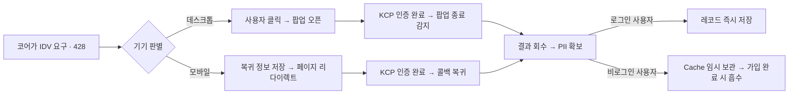

# 그누보드7 NHN KCP 휴대폰 본인확인 플러그인

**그누보드7 플러그인 · sirsoft-verification_nhnkcp**
NHN KCP 휴대폰 본인확인(V2 REST)을 그누보드7 코어 IDV 인프라에 Provider 로 등록하는 플러그인

<!-- @generated:badges START — ext:docgen 이 갱신. 이 블록 안은 직접 수정하지 않는다 -->
<p align="center">
  
  
  
  
</p>
<!-- @generated:badges END -->

---

[소개](#소개) · [주요 기능](#주요-기능) · [동작 방식](#동작-방식) · [요구 사항](#요구-사항) · [설치](#설치) · [관리자 설정](#관리자-설정) · [사용 방법](#사용-방법) · [다른 확장과의 연동](#다른-확장과의-연동) · [문서](#문서) · [트러블슈팅](#트러블슈팅) · [변경 이력](#변경-이력) · [라이선스](#라이선스)

---

## 소개

<!-- @intent START -->
NHN KCP 휴대폰 본인확인을 그누보드7 코어의 본인인증(IDV) 체계에 연결하는 플러그인입니다.
`sirsoft-verification_kginicis`와 같은 부류(코어 표준 인터페이스 구현)지만 다른 벤더이며,
운영자는 둘 중 하나 또는 둘 다 설치해 사용할 수 있습니다.

이 플러그인만의 특징은 인증 화면 진입 방식이 기기별로 갈린다는 점입니다 — 데스크톱은
팝업, 모바일은 전체 페이지 리다이렉트를 씁니다. 모바일 브라우저는 팝업 UX 가 나쁘고
문자 인증 같은 앱 전환이 얽히면 팝업 컨텍스트가 끊기기 쉽기 때문입니다.

kginicis 와 마찬가지로 이 플러그인은 실제 개인식별정보(PII)를 직접 보관하며, 결제 PG
플러그인들과 달리 `sirsoft-ecommerce`를 비롯한 어떤 확장에도 의존하지 않습니다.
<!-- @intent END -->

## 주요 기능

<!-- @intent START -->
| 영역 | 설명 |
|---|---|
| 본인확인 | NHN KCP 휴대폰 본인확인 팝업(데스크톱)/리다이렉트(모바일) |
| 성인인증 | 만 19세 이상 여부만 확인하는 별도 purpose |
| 중복가입 차단 | DI 또는 CI 기준으로 동일인 재가입 차단 (선택) |
| 게스트 처리 | 비로그인 사용자의 본인확인 결과를 임시 보관 후 가입 완료 시 흡수 |
| 개인정보 정리 | 사용자 탈퇴/삭제 시 보관 중인 PII 레코드 자동 파기 |
| 마이페이지 | 본인확인 완료 상태 카드 노출 |
| 관리자 설정 | 테스트/라이브 모드 전환, 중복가입 판정 기준 설정 |
<!-- @intent END -->

## 동작 방식

<!-- @intent START -->


데스크톱 팝업은 반드시 사용자 클릭 이벤트 안에서 열립니다 — 비동기 콜백 이후에 열면
브라우저 팝업 차단기에 걸립니다. 모바일 리다이렉트는 이 제약이 없는 대신, 복귀 후
원래 상태를 되살리기 위한 정보를 브라우저에 임시 저장합니다.
<!-- @intent END -->

## 요구 사항

<!-- @generated:requirements START — ext:docgen 이 갱신. 이 블록 안은 직접 수정하지 않는다 -->
| 항목 | 값 |
|---|---|
| 그누보드7 코어 | `>=7.0.6` |
| PHP | `^8.2` |
<!-- @generated:requirements END -->

## 설치

<!-- @generated:install START — ext:docgen 이 갱신. 이 블록 안은 직접 수정하지 않는다 -->
```bash
# 번들 설치 (코어에 동봉된 소스에서 설치)
php artisan plugin:install sirsoft-verification_nhnkcp

# 활성화
php artisan plugin:activate sirsoft-verification_nhnkcp

# 업데이트 (번들 소스 기준 강제 반영)
php artisan plugin:update sirsoft-verification_nhnkcp --force
```

저장소: https://github.com/gnuboard/g7-plugin-sirsoft-verification_nhnkcp
<!-- @generated:install END -->

## 관리자 설정

<!-- @generated:settings-summary START — ext:docgen 이 갱신. 이 블록 안은 직접 수정하지 않는다 -->
| 키 | 의미 | 기본값 |
|---|---|---|
| `is_test_mode` | 테스트 모드 | `true` |
| `test_site_cd` | 테스트 사이트코드 | `AO7F3` |
| `test_enc_key` | 테스트 암호화 키 | `c2a22fa3ebe4698075bcac6b433d52e351c881b02fb83488d4283a43385b1f8e` |
| `live_site_cd` | 운영 사이트코드 | - |
| `live_enc_key` | 운영 암호화 키 | - |
| `web_siteid` | 웹사이트 ID | - |
| `duplicate_field` | 중복 판정 필드 | `di` |
| `duplicate_block_enabled` | 중복 가입 차단 | `true` |

개발자용 상세(타입·검증·저장 위치)는 [설정 스키마](docs/settings.md#설정-스키마) 를 보세요.
<!-- @generated:settings-summary END -->

<!-- @intent START -->
`live_site_cd`는 저장 시 `SM` 프리픽스가 자동으로 붙으므로 프리픽스 없이 입력해도 됩니다.
`live_site_cd`/`live_enc_key`는 `is_test_mode`를 끄는(라이브 모드) 순간부터 필수가
됩니다 — 테스트 모드에서는 비워둘 수 있습니다. `web_siteid`는 테스트/라이브 모드 공통으로
쓰이는 웹사이트 식별자입니다. `duplicate_field`(`di` 또는 `ci`)와
`duplicate_block_enabled`는 다른 IDV provider(예: `sirsoft-verification_kginicis`)와
별개로 이 provider 를 통해 확인한 사용자에게만 적용됩니다. 라이브 암호화 키는 외부에
노출하지 마세요.
<!-- @intent END -->

## 사용 방법

<!-- @intent START -->
**활성화하기**: 플러그인을 활성화하면 자동으로 코어 IDV provider 목록에 등록됩니다.
별도 화면 배치 작업 없이 코어가 이미 정의한 IDV 강제 지점(회원가입 등)에서 즉시
동작합니다.

**중복가입 차단 켜기**: 동일인이 여러 계정을 만드는 것을 막고 싶다면
`duplicate_block_enabled`를 켜고 `duplicate_field`로 DI/CI 중 판정 기준을 고릅니다.

**모바일 동작 확인**: 데스크톱에서는 정상인데 모바일에서만 인증이 실패한다면 리다이렉트
복귀 경로(`redirectStash`)가 원인일 가능성이 높습니다 — §트러블슈팅을 확인하세요.

전체 API 목록은 [docs/api/](docs/api/README.md) 를, 발행/구독 훅 목록은
[docs/extension-points.md](docs/extension-points.md) 를 참고하세요.
<!-- @intent END -->

## 다른 확장과의 연동

<!-- @generated:integrations START — ext:docgen 이 갱신. 이 블록 안은 직접 수정하지 않는다 -->
**이 확장이 의존하는 확장**

없음 — 코어만으로 동작합니다.

**이 확장에 의존하는 확장** (이 확장을 비활성화하면 함께 영향을 받습니다)

없음.
<!-- @generated:integrations END -->

## 문서

<!-- @generated:docs-index START — ext:docgen 이 갱신. 이 블록 안은 직접 수정하지 않는다 -->
| 문서 | 내용 | 상태 |
|---|---|---|
| [docs/README.md](docs/README.md) | 문서 통합 목차와 실측 집계 | ✅ |
| [docs/architecture.md](docs/architecture.md) | 설계 의도·계층 지도·디렉토리 맵 | ✅ |
| [docs/extension-points.md](docs/extension-points.md) | 발행/구독 훅·미들웨어·채널·스케줄 | ✅ |
| [docs/data-model.md](docs/data-model.md) | 모델·소유 테이블·마이그레이션·Enum | ✅ |
| [docs/settings.md](docs/settings.md) | 설정 스키마·권한·메뉴·라우트·의존 관계 | ✅ |
| [docs/frontend.md](docs/frontend.md) | 레이아웃·액션 핸들러·전역 진입점·에셋 | ✅ |
| [docs/editor-spec.md](docs/editor-spec.md) | 레이아웃 편집기에 선언한 팔레트·컨트롤·샘플 데이터 | ✅ |
| [docs/api/](docs/api/README.md) | API 레퍼런스 (엔드포인트별 파라미터·응답 필드) | ✅ |
| [CHANGELOG.md](CHANGELOG.md) | 변경 이력 | ✅ |
<!-- @generated:docs-index END -->

## 트러블슈팅

<!-- @intent START -->
| 증상 | 원인 | 조치 |
|---|---|---|
| 데스크톱에서 인증 버튼을 눌러도 팝업이 안 뜸 | 브라우저 팝업 차단기 | `startAuth`가 클릭 이벤트 핸들러 안에서 직접 호출되는지 확인 |
| 모바일에서만 인증 완료 후 원래 화면으로 돌아오지 않음 | 리다이렉트 복귀 정보(`sessionStorage`의 `g7.identity.redirectStash`)가 유실됨 | 리다이렉트 도중 다른 탭/앱으로 완전히 전환되어 세션 스토리지가 초기화됐는지 확인 (동일 브라우저 탭 안에서 왕복해야 함) |
| 설정 저장 시 422 오류 | 라이브 모드인데 `live_site_cd`/`live_enc_key` 미입력 | `is_test_mode`를 켜거나 라이브 자격증명을 입력 |
| 이미 가입된 사용자인데 중복 오류 없이 재가입됨 | `duplicate_block_enabled`가 꺼져 있거나 `duplicate_field` 기준이 실제 판정과 다름 | 관리자 설정에서 두 값을 확인 |
| 탈퇴한 사용자의 본인확인 정보가 남아있는 것으로 보임 | 정리 리스너 실행 여부를 별도로 확인하지 않음 | `CleanKcpRecordOnUserWithdraw`/`CleanKcpRecordOnUserDelete` 정상 등록 여부를 훅 캐시에서 확인 |
<!-- @intent END -->

## 변경 이력

[CHANGELOG.md](CHANGELOG.md)

## 라이선스

MIT
