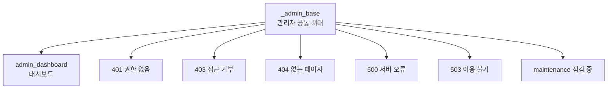

# 그누보드7 Hello Admin Template

**그누보드7 템플릿 · gnuboard7-hello_admin_template**
그누보드7 학습용 최소 Admin 템플릿 스켈레톤

<!-- @generated:badges START — ext:docgen 이 갱신. 이 블록 안은 직접 수정하지 않는다 -->
<p align="center">
  
  
  
  
</p>
<!-- @generated:badges END -->

---

[소개](#소개) · [주요 기능](#주요-기능) · [동작 방식](#동작-방식) · [요구 사항](#요구-사항) · [설치](#설치) · [제공 컴포넌트](#제공-컴포넌트) · [사용 방법](#사용-방법) · [다른 확장과의 연동](#다른-확장과의-연동) · [문서](#문서) · [트러블슈팅](#트러블슈팅) · [변경 이력](#변경-이력) · [라이선스](#라이선스)

---

## 소개

<!-- @intent START -->
그누보드7 **관리자 템플릿이 어떻게 생겼는지 보여주는 학습용 샘플**입니다. 실제 운영에 쓰기
위한 것이 아니라, "관리자 템플릿은 최소한 무엇을 갖춰야 하는가" 를 보이는 것이 목적입니다.

담긴 것은 화면 부품 8개, 공통 뼈대 하나, 대시보드 한 장, 그리고 **오류 화면 6종**입니다.
오류 화면은 선택이 아니라 필수입니다 — 없으면 오류가 생겼을 때 방문자에게 아무것도 보이지
않습니다.

관리자 화면의 템플릿 목록에는 나타나지 않습니다(학습용이 운영 목록에 섞이지 않도록). 명령줄로
설치·활성화할 수 있으며, 활성화하면 관리자 화면이 이 최소 템플릿으로 바뀝니다 — 기본 템플릿과
나란히 비교해 보면 무엇이 필수이고 무엇이 그 템플릿의 선택인지 드러납니다.
<!-- @intent END -->

## 주요 기능

<!-- @intent START -->
| 영역 | 설명 |
|---|---|
| 화면 부품 | 가장 기본적인 8개 (영역·버튼·제목 3종·링크·글자·이미지) |
| 공통 뼈대 | 모든 화면이 물려받는 관리자 기본 골격 |
| 대시보드 | 관리자 첫 화면 예시 한 장 |
| 오류 화면 | 401·403·404·500·503·점검 중 6종 |
| 다국어 | 한국어·영어 공통 문구 |
| 테스트 | 화면이 실제로 그려지는지 확인하는 렌더링 테스트 예시 |
<!-- @intent END -->

## 동작 방식

<!-- @intent START -->


모든 화면이 하나의 공통 뼈대를 물려받습니다. 그래서 오류 화면에서도 관리자 화면의 골격이
유지되고, 뼈대를 한 번 고치면 전 화면에 반영됩니다.

오류 화면 6종은 오류가 났을 때 시스템이 직접 찾아 부르는 화면입니다. 하나라도 없으면 그
상황에서 아무것도 보이지 않으므로, 화면이 한 장뿐인 템플릿에도 6종은 있어야 합니다.
<!-- @intent END -->

## 요구 사항

<!-- @generated:requirements START — ext:docgen 이 갱신. 이 블록 안은 직접 수정하지 않는다 -->
| 항목 | 값 |
|---|---|
| 그누보드7 코어 | `>=7.0.10` |
| PHP | `^8.2` |
<!-- @generated:requirements END -->

## 설치

<!-- @generated:install START — ext:docgen 이 갱신. 이 블록 안은 직접 수정하지 않는다 -->
```bash
# 번들 설치 (코어에 동봉된 소스에서 설치)
php artisan template:install gnuboard7-hello_admin_template

# 활성화
php artisan template:activate gnuboard7-hello_admin_template

# 업데이트 (번들 소스 기준 강제 반영)
php artisan template:update gnuboard7-hello_admin_template --force
```
<!-- @generated:install END -->

## 제공 컴포넌트

<!-- @generated:settings-summary START — ext:docgen 이 갱신. 이 블록 안은 직접 수정하지 않는다 -->
컴포넌트 8개 (루트: `src/components`).

| 분류 | 개수 |
|---|---|
| `basic` | 8개 |
<!-- @generated:settings-summary END -->

<!-- @intent START -->
관리자 화면을 그리는 데 쓰는 **부품 8개**입니다. 기본 관리자 템플릿이 100개가 넘는 부품을 갖는
것과 비교하면, 이 샘플이 얼마나 최소한만 담고 있는지 알 수 있습니다.

부품 목록은 **모듈과의 계약**이기도 합니다. 모듈이 관리자 화면 조각을 만들 때 이 템플릿에 없는
부품(예: 표 형태의 목록 부품)을 쓰면, 그 조각은 이 템플릿에서 그려지지 않습니다. 그래서 모듈이
어느 템플릿에서든 동작하려면 정해진 **필수 부품**만 써야 합니다.

이 템플릿으로 바꿔 보면 그 규칙을 지키지 않은 화면이 드러납니다 — 어떤 모듈 화면이 깨진다면 그
화면이 특정 템플릿의 고유 부품에 기대고 있다는 뜻입니다.
<!-- @intent END -->

## 사용 방법

<!-- @intent START -->
**설치해 보기**: 관리자 목록에 나타나지 않으므로 명령줄로 설치합니다.

```bash
php artisan template:install gnuboard7-hello_admin_template
php artisan template:activate gnuboard7-hello_admin_template
```

활성화하면 관리자 화면이 이 최소 템플릿으로 바뀝니다. 원래 템플릿으로 되돌리려면 그 템플릿을
다시 활성화하면 됩니다.

**모듈 호환성 확인용으로 쓰기**: 만들고 있는 모듈의 관리자 화면이 특정 템플릿에만 의존하지
않는지 확인할 때 유용합니다. 이 템플릿으로 바꿔서 화면이 깨진다면 그 화면이 필수 부품 밖의
것을 쓰고 있다는 뜻입니다.

**새 관리자 템플릿의 출발점으로 쓰기**: 이 디렉토리를 복제한 뒤 식별자를 바꾸고 학습용 표시를
지우면 새 템플릿이 됩니다. 부품과 화면을 필요한 만큼 더해 나가면 됩니다.
<!-- @intent END -->

## 다른 확장과의 연동

<!-- @generated:integrations START — ext:docgen 이 갱신. 이 블록 안은 직접 수정하지 않는다 -->
**이 확장이 의존하는 확장**

없음 — 코어만으로 동작합니다.

**이 확장에 의존하는 확장** (이 확장을 비활성화하면 함께 영향을 받습니다)

없음.
<!-- @generated:integrations END -->

## 문서

<!-- @generated:docs-index START — ext:docgen 이 갱신. 이 블록 안은 직접 수정하지 않는다 -->
| 문서 | 내용 | 상태 |
|---|---|---|
| [docs/README.md](docs/README.md) | 문서 통합 목차와 실측 집계 | ✅ |
| [docs/architecture.md](docs/architecture.md) | 설계 의도·계층 지도·디렉토리 맵 | ✅ |
| [docs/components.md](docs/components.md) | 템플릿이 제공하는 컴포넌트 | ✅ |
| [docs/layouts.md](docs/layouts.md) | 레이아웃 목록과 라우트 매핑 | ✅ |
| [docs/handlers.md](docs/handlers.md) | 템플릿 전용 핸들러와 부트스트랩 | ✅ |
| [docs/editor-spec.md](docs/editor-spec.md) | 레이아웃 편집기에 선언한 팔레트·컨트롤·샘플 데이터 | ✅ |
| [CHANGELOG.md](CHANGELOG.md) | 변경 이력 | ✅ |
<!-- @generated:docs-index END -->

## 트러블슈팅

<!-- @intent START -->
| 증상 | 원인 | 조치 |
|---|---|---|
| 관리자 템플릿 목록에 이 템플릿이 없음 | 학습용이라 목록에서 제외됨 | 정상입니다. 명령줄로 설치·활성화합니다 |
| 활성화했더니 일부 모듈 화면이 비어 보임 | 그 화면이 이 템플릿에 없는 부품을 사용 | 정상입니다. 모듈이 필수 부품만 쓰도록 고치거나 원래 템플릿으로 되돌립니다 |
| 화면이 아무것도 안 그려짐 | 빌드 결과물이 없거나 오래됨 | 템플릿을 다시 빌드하고 반영합니다 |
| 오류가 났는데 아무 화면도 안 보임 | 해당 오류 화면이 없음 | 오류 화면 6종이 모두 있는지 확인합니다 |
| 복제해서 만든 템플릿이 목록에 안 보임 | 복제본에 학습용 표시가 남아 있음 | 복제본의 `hidden` 표시를 지웁니다 |
<!-- @intent END -->

## 변경 이력

[CHANGELOG.md](CHANGELOG.md)

## 라이선스

MIT
