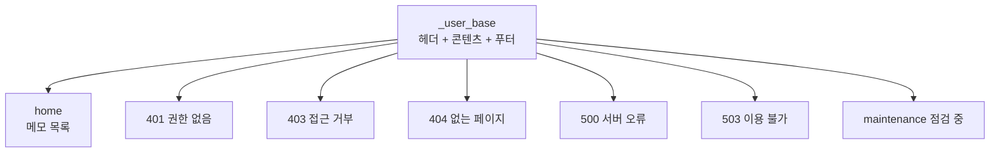
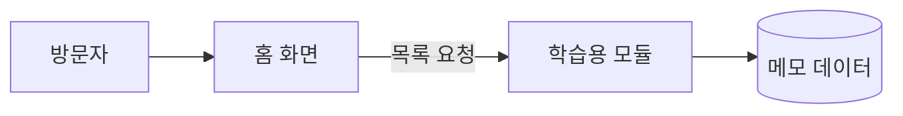

# 그누보드7 Hello 사용자 템플릿

**그누보드7 템플릿 · gnuboard7-hello_user_template**
학습용 최소 샘플 사용자 템플릿 (Basic 8개 컴포넌트)

<!-- @generated:badges START — ext:docgen 이 갱신. 이 블록 안은 직접 수정하지 않는다 -->
<p align="center">
  
  
  
  
  
</p>
<!-- @generated:badges END -->

---

[소개](#소개) · [주요 기능](#주요-기능) · [동작 방식](#동작-방식) · [요구 사항](#요구-사항) · [설치](#설치) · [제공 컴포넌트](#제공-컴포넌트) · [사용 방법](#사용-방법) · [다른 확장과의 연동](#다른-확장과의-연동) · [문서](#문서) · [트러블슈팅](#트러블슈팅) · [변경 이력](#변경-이력) · [라이선스](#라이선스)

---

## 소개

<!-- @intent START -->
그누보드7 **사용자 템플릿이 어떻게 생겼는지 보여주는 학습용 샘플**입니다. 실제 운영에 쓰기
위한 것이 아니라, "방문자 화면 템플릿은 최소한 무엇을 갖춰야 하는가" 와 "모듈의 데이터를 화면에
어떻게 연결하는가" 를 보이는 것이 목적입니다.

담긴 것은 화면 부품 8개, 공통 뼈대 하나, 홈 화면 한 장, 그리고 **오류 화면 6종**입니다.
홈 화면은 학습용 모듈의 메모 목록을 불러와 보여줍니다 — **모듈은 데이터를, 템플릿은 화면을**
담당하는 그누보드7 의 기본 구조를 가장 짧게 보여주는 예시입니다.

관리자 화면의 템플릿 목록에는 나타나지 않습니다(학습용이 운영 목록에 섞이지 않도록). 명령줄로
설치·활성화할 수 있으며, 학습용 모듈이 함께 설치되어 있어야 홈 화면에 목록이 나옵니다.
<!-- @intent END -->

## 주요 기능

<!-- @intent START -->
| 영역 | 설명 |
|---|---|
| 화면 부품 | 가장 기본적인 8개 (영역·버튼·제목 3종·링크·글자·이미지) |
| 공통 뼈대 | 모든 화면이 물려받는 방문자 기본 골격 (헤더 + 콘텐츠 + 푸터) |
| 홈 화면 | 학습용 모듈의 메모 목록을 불러와 표시 |
| 오류 화면 | 401·403·404·500·503·점검 중 6종 |
| 다국어 | 한국어·영어 공통 문구 |
| 테스트 | 데이터를 모의로 넣고 화면이 그려지는지 확인하는 예시 |
<!-- @intent END -->

## 동작 방식

<!-- @intent START -->


모든 화면이 하나의 공통 뼈대를 물려받습니다. 오류 화면에서도 사이트 골격이 유지되고, 뼈대를
한 번 고치면 전 화면에 반영됩니다.



홈 화면은 자기 데이터를 갖지 않고 모듈에 요청해서 받아옵니다. 그래서 템플릿을 바꿔도 데이터는
그대로 남고, 같은 데이터를 다른 디자인으로 보여줄 수 있습니다.
<!-- @intent END -->

## 요구 사항

<!-- @generated:requirements START — ext:docgen 이 갱신. 이 블록 안은 직접 수정하지 않는다 -->
| 항목 | 값 |
|---|---|
| 그누보드7 코어 | `>=7.0.10` |
| PHP | `^8.2` |
| 의존 모듈 | `gnuboard7-hello_module` `>=0.1.0` |
<!-- @generated:requirements END -->

## 설치

<!-- @generated:install START — ext:docgen 이 갱신. 이 블록 안은 직접 수정하지 않는다 -->
```bash
# 번들 설치 (코어에 동봉된 소스에서 설치)
php artisan template:install gnuboard7-hello_user_template

# 활성화
php artisan template:activate gnuboard7-hello_user_template

# 업데이트 (번들 소스 기준 강제 반영)
php artisan template:update gnuboard7-hello_user_template --force
```
<!-- @generated:install END -->

## 제공 컴포넌트

<!-- @generated:settings-summary START — ext:docgen 이 갱신. 이 블록 안은 직접 수정하지 않는다 -->
컴포넌트 8개 (루트: `src/components`).

| 분류 | 개수 |
|---|---|
| `basic` | 8개 |
<!-- @generated:settings-summary END -->

<!-- @intent START -->
방문자 화면을 그리는 데 쓰는 **부품 8개**입니다. 기본 사용자 템플릿이 79개를 갖는 것과
비교하면 이 샘플이 얼마나 최소한만 담고 있는지 알 수 있습니다.

부품 목록은 **다른 확장과의 계약**이기도 합니다. 모듈이나 플러그인이 이 템플릿의 화면에 조각을
끼워 넣을 때 여기 없는 부품을 쓰면 그 조각은 그려지지 않습니다.

전체 목록과 사용법은 [docs/components.md](docs/components.md) 에 있습니다.
<!-- @intent END -->

## 사용 방법

<!-- @intent START -->
**설치해 보기**: 학습용 모듈을 먼저 설치한 뒤 이 템플릿을 설치합니다.

```bash
php artisan module:install gnuboard7-hello_module
php artisan module:activate gnuboard7-hello_module
php artisan template:install gnuboard7-hello_user_template
php artisan template:activate gnuboard7-hello_user_template
```

활성화하면 사이트 첫 화면이 이 최소 템플릿으로 바뀌고, 관리자에서 등록한 메모가 홈 화면에
목록으로 나옵니다. 원래 템플릿으로 되돌리려면 그 템플릿을 다시 활성화하면 됩니다.

**모듈 데이터를 화면에 연결하는 법 배우기**: 홈 화면 파일(`layouts/home.json`)의 데이터 요청
선언을 보면, 어떤 주소에서 무엇을 받아 화면 어디에 넣는지가 한눈에 들어옵니다. 새 템플릿을
만들 때 이 선언 형태를 그대로 따라 쓰면 됩니다.

**새 사용자 템플릿의 출발점으로 쓰기**: 이 디렉토리를 복제한 뒤 식별자를 바꾸고 학습용 표시를
지우면 새 템플릿이 됩니다. 부품과 화면을 필요한 만큼 더해 나가면 됩니다.
<!-- @intent END -->

## 다른 확장과의 연동

<!-- @generated:integrations START — ext:docgen 이 갱신. 이 블록 안은 직접 수정하지 않는다 -->
**이 확장이 의존하는 확장**

| 확장 | 유형 | 버전 제약 | 번들 |
|---|---|---|---|
| `gnuboard7-hello_module` | 모듈 | `>=0.1.0` | ✅ |

**이 확장에 의존하는 확장** (이 확장을 비활성화하면 함께 영향을 받습니다)

없음.
<!-- @generated:integrations END -->

## 문서

<!-- @generated:docs-index START — ext:docgen 이 갱신. 이 블록 안은 직접 수정하지 않는다 -->
| 문서 | 내용 | 상태 |
|---|---|---|
| [docs/README.md](docs/README.md) | 문서 통합 목차와 실측 집계 | ✅ |
| [docs/architecture.md](docs/architecture.md) | 설계 의도·계층 지도·디렉토리 맵 | ✅ |
| [docs/components.md](docs/components.md) | 템플릿이 제공하는 컴포넌트 | ✅ |
| [docs/layouts.md](docs/layouts.md) | 레이아웃 목록과 라우트 매핑 | ✅ |
| [docs/handlers.md](docs/handlers.md) | 템플릿 전용 핸들러와 부트스트랩 | ✅ |
| [docs/editor-spec.md](docs/editor-spec.md) | 레이아웃 편집기에 선언한 팔레트·컨트롤·샘플 데이터 | ✅ |
| [CHANGELOG.md](CHANGELOG.md) | 변경 이력 | ✅ |
<!-- @generated:docs-index END -->

## 트러블슈팅

<!-- @intent START -->
| 증상 | 원인 | 조치 |
|---|---|---|
| 관리자 템플릿 목록에 이 템플릿이 없음 | 학습용이라 목록에서 제외됨 | 정상입니다. 명령줄로 설치·활성화합니다 |
| 홈 화면에 메모 목록이 비어 있음 | 학습용 모듈이 설치·활성화되지 않았거나 메모가 없음 | 모듈을 활성화하고 관리자에서 메모를 몇 건 등록합니다 |
| 화면이 아무것도 안 그려짐 | 빌드 결과물이 없거나 오래됨 | 템플릿을 다시 빌드하고 반영합니다 |
| 오류가 났는데 아무 화면도 안 보임 | 해당 오류 화면이 없음 | 오류 화면 6종이 모두 있는지 확인합니다 |
| 복제해서 만든 템플릿이 목록에 안 보임 | 복제본에 학습용 표시가 남아 있음 | 복제본의 `hidden` 표시를 지웁니다 |
| 새로 고칠 때마다 화면이 나오다 안 나오다 함 | 화면 부품 등록이 로드 순서를 탐 | 부품 등록에 재시도를 두는 형태(관리자 샘플 참고)로 고칩니다 |
<!-- @intent END -->

## 변경 이력

[CHANGELOG.md](CHANGELOG.md)

## 라이선스

MIT
