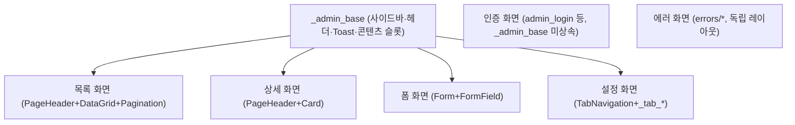

# 그누보드7 Admin Basic 템플릿

**그누보드7 템플릿 · sirsoft-admin_basic**
그누보드7 기본 관리자 템플릿

<!-- @generated:badges START — ext:docgen 이 갱신. 이 블록 안은 직접 수정하지 않는다 -->
<p align="center">
  
  
  
  
</p>
<!-- @generated:badges END -->

---

[소개](#소개) · [주요 기능](#주요-기능) · [동작 방식](#동작-방식) · [요구 사항](#요구-사항) · [설치](#설치) · [제공 컴포넌트](#제공-컴포넌트) · [사용 방법](#사용-방법) · [다른 확장과의 연동](#다른-확장과의-연동) · [문서](#문서) · [트러블슈팅](#트러블슈팅) · [변경 이력](#변경-이력) · [라이선스](#라이선스)

---

## 소개

<!-- @intent START -->
그누보드7 이 기본 제공하는 관리자(admin) 템플릿입니다. 코어 관리자 화면뿐 아니라 설치된 모든
모듈/플러그인의 관리자 화면이 이 템플릿의 컴포넌트와 베이스 레이아웃을 그대로 사용합니다 —
확장을 설치하면 그 확장의 관리자 UI 도 자동으로 이 템플릿의 디자인(사이드바·헤더·색상·다크
모드)을 따릅니다.

이 템플릿은 사용자(방문자)용 화면을 그리지 않습니다 — 방문자 화면은 `sirsoft-basic` 템플릿의
몫입니다. 또한 완전히 다른 디자인의 관리자 화면이 필요하면 이 템플릿을 고치는 대신 같은
컴포넌트 계약(필수 컴포넌트 35개)을 구현하는 새 admin 템플릿을 만드는 것이 원칙입니다 — 그래야
기존 확장들의 관리자 화면이 새 템플릿에서도 깨지지 않습니다.
<!-- @intent END -->

## 주요 기능

<!-- @intent START -->
| 영역 | 설명 |
|---|---|
| 관리자 셸 | 사이드바(계층형 메뉴, 접힘 지원)·헤더·다크 모드·다국어 전환을 갖춘 공통 화면 골격(`_admin_base`) |
| 컴포넌트 125개 | HTML 래핑 39개(basic) + UI 패턴 캡슐화 80개(composite) + 페이지 구조 5개(layout) + 모달 1개 |
| 필수 컴포넌트 계약 | 35개 컴포넌트만 사용하면 다른 admin 템플릿으로 교체해도 화면이 보장되는 모듈 호환성 기준 |
| 레이아웃 145개 | 대시보드·사용자·역할·메뉴·설정·확장 관리·스케줄·활동/알림 로그 등 코어 관리자 화면 전체 |
| 확장 관리 UI | 모듈/플러그인/템플릿 설치·활성화·업데이트·삭제와 레이아웃 편집기(코드 편집 + 실시간 미리보기) |
| 본인인증(IDV) 챌린지 | 관리자 민감 작업에 걸리는 본인인증 화면 |
<!-- @intent END -->

## 동작 방식

<!-- @intent START -->


인증 화면(로그인/비밀번호 찾기·재설정)과 에러 화면은 의도적으로 `_admin_base` 를 상속하지
않습니다 — 로그인 전이거나 정상 화면 렌더링 자체가 불가능한 상황이라 사이드바·헤더 같은
"이미 로그인된 관리자" 전제의 UI 를 보여줄 수 없기 때문입니다.
<!-- @intent END -->

## 요구 사항

<!-- @generated:requirements START — ext:docgen 이 갱신. 이 블록 안은 직접 수정하지 않는다 -->
| 항목 | 값 |
|---|---|
| 그누보드7 코어 | `>=7.0.10` |
| PHP | `^8.2` |
<!-- @generated:requirements END -->

## 설치

<!-- @generated:install START — ext:docgen 이 갱신. 이 블록 안은 직접 수정하지 않는다 -->
```bash
# 번들 설치 (코어에 동봉된 소스에서 설치)
php artisan template:install sirsoft-admin_basic

# 활성화
php artisan template:activate sirsoft-admin_basic

# 업데이트 (번들 소스 기준 강제 반영)
php artisan template:update sirsoft-admin_basic --force
```

저장소: https://github.com/gnuboard/g7-template-sirsoft-admin_basic
<!-- @generated:install END -->

## 제공 컴포넌트

<!-- @generated:settings-summary START — ext:docgen 이 갱신. 이 블록 안은 직접 수정하지 않는다 -->
컴포넌트 125개 (루트: `src/components`).

| 분류 | 개수 |
|---|---|
| `basic` | 39개 |
| `composite` | 80개 |
| `layout` | 5개 |
| `modals` | 1개 |
<!-- @generated:settings-summary END -->

<!-- @intent START -->
운영자가 직접 켜고 끄는 설정 항목은 없습니다 — 이 표는 확장(모듈/플러그인) 개발자가 레이아웃을
만들 때 참고하는 컴포넌트 인벤토리입니다. 전체 목록·Props 상세는
[docs/components.md](docs/components.md) 와 코어
[component-props.md](../../../docs/frontend/component-props.md) 를 참고하세요.
<!-- @intent END -->

## 사용 방법

<!-- @intent START -->
**새 확장의 관리자 화면 만들기**: 확장의 `resources/layouts/admin/*.json` 에서
`"extends": "_admin_base"` 로 베이스를 상속하고, `slots.content` 에 필수 컴포넌트만으로 화면을
구성합니다. 필수 컴포넌트 목록 밖의 컴포넌트를 쓰면 다른 admin 템플릿으로 교체됐을 때 그
화면만 깨집니다.

**사이드바 메뉴 등록**: 확장이 `getAdminMenus()` 로 메뉴를 선언하면 이 템플릿의 `AdminSidebar`
가 자동으로 계층에 반영합니다 — 이 템플릿을 직접 수정할 필요가 없습니다.

**레이아웃 실시간 편집**: `/admin/templates/sirsoft-admin_basic/edit` 에서 레이아웃 편집기로
관리자 화면 자체를 코드 편집 + 실시간 미리보기로 수정할 수 있습니다(운영 환경에서는 신중하게
사용).
<!-- @intent END -->

## 다른 확장과의 연동

<!-- @generated:integrations START — ext:docgen 이 갱신. 이 블록 안은 직접 수정하지 않는다 -->
**이 확장이 의존하는 확장**

없음 — 코어만으로 동작합니다.

**이 확장에 의존하는 확장** (이 확장을 비활성화하면 함께 영향을 받습니다)

없음.
<!-- @generated:integrations END -->

<!-- @intent START -->
formal 의존성이 양쪽 다 "없음"인 것은 이 템플릿이 코어만으로 동작하기 때문이지만, 실질적으로는
**모든 번들 모듈/플러그인의 관리자 화면**이 이 템플릿의 필수 컴포넌트·`_admin_base` 계약에
암묵적으로 의존합니다. 이 의존은 manifest 로 선언되지 않습니다 — 어느 admin 템플릿이든 같은
계약(필수 컴포넌트 35개)만 구현하면 되므로, 확장이 "이 템플릿"이 아니라 "이 계약"에 의존하는
형태이기 때문입니다. 이 템플릿의 필수 컴포넌트 Props 를 바꿀 때 영향 범위를 이 템플릿
자신의 `dependencies` 목록으로는 알 수 없다는 뜻이며, 실제로는 활성 모듈/플러그인 전수의
관리자 레이아웃을 확인해야 합니다.
<!-- @intent END -->

## 문서

<!-- @generated:docs-index START — ext:docgen 이 갱신. 이 블록 안은 직접 수정하지 않는다 -->
| 문서 | 내용 | 상태 |
|---|---|---|
| [docs/README.md](docs/README.md) | 문서 통합 목차와 실측 집계 | ✅ |
| [docs/architecture.md](docs/architecture.md) | 설계 의도·계층 지도·디렉토리 맵 | ✅ |
| [docs/components.md](docs/components.md) | 템플릿이 제공하는 컴포넌트 | ✅ |
| [docs/layouts.md](docs/layouts.md) | 레이아웃 목록과 라우트 매핑 | ✅ |
| [docs/handlers.md](docs/handlers.md) | 템플릿 전용 핸들러와 부트스트랩 | ✅ |
| [docs/editor-spec.md](docs/editor-spec.md) | 레이아웃 편집기에 선언한 팔레트·컨트롤·샘플 데이터 | ✅ |
| [CHANGELOG.md](CHANGELOG.md) | 변경 이력 | ✅ |
<!-- @generated:docs-index END -->

## 트러블슈팅

<!-- @intent START -->
| 증상 | 원인 | 조치 |
|---|---|---|
| 사이드바 메뉴 아이콘이 안 보임 | `Icon` 컴포넌트로 렌더 시도(API 는 FontAwesome 클래스 문자열을 내려줌) | `I` 컴포넌트로 교체 (`docs/components.md` "AdminSidebar 상세" 참고) |
| 다른 admin 템플릿으로 교체 후 특정 확장 화면이 깨짐 | 그 확장이 필수 컴포넌트 목록 밖의 컴포넌트를 사용 | 그 확장의 레이아웃을 필수 컴포넌트(35개)만으로 재작성하거나, 새 템플릿에 같은 컴포넌트를 구현 |
| 사이드바 접힘 상태가 새로고침 후 풀림 | localStorage 접근 실패(시크릿 모드 등) 또는 부트스트랩 순서 문제 | `initSidebar()` 가 템플릿 부트스트랩에서 호출되는지 확인 (`src/index.ts`) |
| 로그인 화면에 다크 모드/언어 전환이 적용 안 됨 | 로그인 화면은 `_admin_base` 를 상속하지 않아 초기화 경로가 다름 | `admin_login.json` 자체의 초기화 액션을 확인 — `_admin_base` 수정으로는 반영되지 않는다 |
<!-- @intent END -->

## 변경 이력

[CHANGELOG.md](CHANGELOG.md)

## 라이선스

MIT
